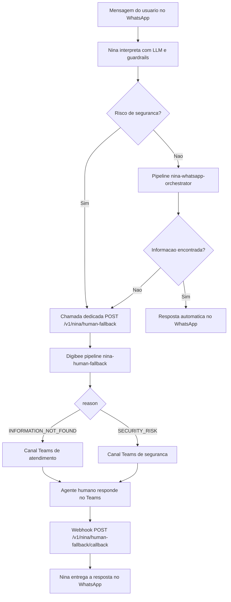

# Integracao Digibee com Sistemas Corporativos

TODOs:

- [x] Adicionar fluxo de interação humana (via Teams) quando a nina não conseguir encontrar informações no sistema ou identificar algo de risco de segurança (fallback), com chamada específica
- [ ] Adicionar fluxo de criação de tickets no ITSM no webhook de envio de mensagem, também adicionar um fluxo quando a nina responder essa mensagem(ou humano)
- [ ] (adicionar no roadmap) Adicionar na integração do portal de pedidos o fluxo o usuário vai fazer o upload de um pdf ou uma foto de pedido e já é criado automaticamente no sistema. adicionar fallbacks para arquivos inválidos ou corrompidos e imagens não nítidas. IA extrai informações identifica se já tem pedido criado ou não e confirma com o usuário a criação.
- [ ] Adicionar fluxo de preparação para visita. rtv manda mensagem tipo "vou visitar cliente tal amanhã". O sistema responde com: Para a preparação de uma visita, são importantes informações como a data da última visita, anotações e registros anteriores, além do histórico de pedidos do cliente.
- [ ] Estudar riscos de integração entre esses sistemas
- [ ] Validar quem é o rtv com 3 primeiros dígitos do cpf
- [ ] Crira outro doc com os detalhes técnicos de integrações


Este documento descreve a arquitetura de integracao entre o **Digibee** e os sistemas:

- **WhatsApp** (canal de entrada do usuario)
- **Nina (Microsoft Copilot)** (bot com IA para interpretacao e orquestracao)
- **Lecom** (cadastro de clientes)
- **Portal de Pedidos** (input e acompanhamento de pedidos)
- **TOTVS / Datasul** (ERP Brasil)
- **Tarken** (solicitacao e analise de limite de credito)
- **LoogAI** (acompanhamento da data de entrega)
- **Nina / ITSM** (gestao de tickets e chamados)
- **Microsoft Teams** (canal de fallback humano: atendimento e alerta de seguranca)

## Principio arquitetural obrigatorio

**Toda requisicao de negocio deve passar pelo Digibee**, que e o hub oficial de integracao, governanca, seguranca, observabilidade e orquestracao.

### Documentacao oficial (Digibee)
- API Trigger (exposicao de pipelines via REST): https://docs.digibee.com/documentation/connectors-and-triggers/triggers/web-protocols/api
- REST V2 Connector (consumo de APIs externas): https://docs.digibee.com/documentation/connectors-and-triggers/connectors/web-protocols/rest-v2
- Consumers / API Keys e Basic Auth: https://docs.digibee.com/documentation/developer-guide/pt-br/platform-administration/settings/api-keys-consumers

---

## Fluxograma de Integracao (Mermaid)

```mermaid
flowchart LR
    USER[Usuario]
    WPP[WhatsApp]
    NINA[Nina - Microsoft Copilot]
    LLM[LLM Provider - OpenAI]
    DIGI[Digibee]

    LECOM[Lecom]
    PORTAL[Portal de Pedidos]
    TOTVS[TOTVS / Datasul]
    TARKEN[Tarken]
    LOOGAI[LoogAI]
    ITSM[Nina / ITSM]
    TEAMS[Microsoft Teams]

    USER -->|Mensagem em linguagem natural| WPP
    WPP -->|Webhook de entrada| NINA

    NINA -->|Prompt de classificacao e extracao| LLM
    LLM -->|Intencao, entidades, risco e plano de consulta| NINA

    NINA -->|Requisicao estruturada: intencao + entidades + contexto| DIGI
    NINA -->|Chamada dedicada: escalate_to_human| DIGI

    DIGI -->|Consulta/atualizacao de cadastro| LECOM
    DIGI -->|Criacao/consulta de pedido| PORTAL
    DIGI -->|ERP: cliente/pedido/financeiro| TOTVS
    DIGI -->|Analise de credito| TARKEN
    DIGI -->|Tracking e ETA| LOOGAI
    DIGI -->|Abertura/atualizacao de chamado| ITSM
    DIGI -->|Escalonamento humano (fallback)| TEAMS

    LECOM --> DIGI
    PORTAL --> DIGI
    TOTVS --> DIGI
    TARKEN --> DIGI
    LOOGAI --> DIGI
    ITSM --> DIGI
    TEAMS -->|Resposta do agente humano| DIGI

    DIGI -->|Payload consolidado com dados de negocio| NINA
    DIGI -->|Resultado do handoff humano| NINA
    NINA -->|Prompt para composicao da resposta final| LLM
    LLM -->|Resposta natural estruturada para o canal| NINA
    NINA -->|Resposta em linguagem natural| WPP
    WPP -->|Mensagem final| USER
```

---

## 1) WhatsApp - Canal Conversacional

### Modulos na arquitetura
- **Webhook de entrada** para receber mensagens do usuario.
- **Camada de entrega** para envio da resposta final.
- **Correlacao de conversa** para manter contexto por numero/sessao.

### APIs envolvidas
- API oficial do provedor WhatsApp (Cloud API/BSP).
- Endpoint de webhook exposto para Nina (ou middleware de canais).
- Endpoint de envio de mensagem para retorno ao usuario.

### Documentacao oficial
- WhatsApp Cloud API (visao geral): https://developers.facebook.com/docs/whatsapp/cloud-api/
- WhatsApp Messages API (envio de mensagens): https://developers.facebook.com/docs/whatsapp/cloud-api/reference/messages
- WhatsApp Service Messages (janela de atendimento e formato de payload): https://developers.facebook.com/docs/whatsapp/cloud-api/guides/send-messages/

### Autenticacao
- Token de acesso da API do provedor WhatsApp.
- Validacao de assinatura de webhook.
- TLS obrigatorio.

### Informacoes trafegadas
- Texto da mensagem do usuario.
- Metadados de conversa (numero, id da conversa, timestamp).
- Resposta final gerada pela Nina com dados consolidados do Digibee.
- Mensagem de encaminhamento humano ou resposta do agente no Teams (fallback).

---

## 2) Nina (Microsoft Copilot) - Orquestracao com IA

### Modulos na arquitetura
- **NLU/LLM** para interpretar intencao e extrair entidades.
- **Planner de acoes** para decidir quais consultas executar.
- **Compositor de resposta** para gerar retorno em linguagem natural.
- **Guardrails** para mascarar dados sensiveis, detectar risco de seguranca e aplicar politica de uso.
- **Fallback humano** para escalonar ao Microsoft Teams quando nao houver dados ou houver risco de seguranca.

### APIs envolvidas
- Endpoint de inferencia da Nina/Copilot.
- API de inferencia da **OpenAI** como provider LLM (ex.: Responses API/Chat Completions).
- Endpoint de chamada para o Digibee (sincrono ou assincrono) - pipeline `nina-whatsapp-orchestrator`.
- **Endpoint dedicado de fallback humano** no Digibee - pipeline `nina-human-fallback` (`escalate_to_human`).
- Endpoint de callback para resposta consolidada, quando aplicavel.
- Endpoint de callback do handoff humano (resposta do agente no Teams).

### Documentacao oficial
- Microsoft Copilot Studio (documentacao principal): https://learn.microsoft.com/en-us/microsoft-copilot-studio/
- Copilot Studio - estrategias de integracao: https://learn.microsoft.com/en-us/microsoft-copilot-studio/guidance/integrations
- Copilot Studio - autenticacao: https://learn.microsoft.com/en-us/microsoft-copilot-studio/configuration-end-user-authentication
- Copilot Studio - handoff para agente humano: https://learn.microsoft.com/en-us/microsoft-copilot-studio/advanced-hand-off
- Copilot Studio - handoff generico (`handoff.initiate`): https://learn.microsoft.com/en-us/microsoft-copilot-studio/configure-generic-handoff
- OpenAI API Reference (endpoint e schemas): https://developers.openai.com/api/reference/
- OpenAI Responses API (criacao de resposta): https://developers.openai.com/api/reference/resources/responses/methods/create/

### Autenticacao
- OAuth2/JWT entre Nina e servicos corporativos.
- Chave tecnica para chamadas ao Digibee.
- Controle de escopo por acao (consulta, atualizacao, abertura de chamado, `escalate_to_human`).

### Informacoes trafegadas
- Intencao detectada (ex.: "consultar pedido", "solicitar limite", "abrir chamado", "escalate_to_human").
- Entidades extraidas (CNPJ, numero do pedido, codigo do cliente, ticket).
- Sinal de risco de seguranca e motivo do fallback (`INFORMATION_NOT_FOUND` ou `SECURITY_RISK`).
- Resultado consolidado retornado pelo Digibee.
- Resposta textual final para o usuario no WhatsApp (automatica ou proveniente do agente humano).

### Chamadas explicitas da Nina e fluxo de entrada/saida
1. **Entrada (WhatsApp -> Nina)**
   - `input_text`: mensagem em linguagem natural.
   - `channel_context`: telefone, sessao, timestamp, idioma.

2. **Nina -> LLM (OpenAI) - Interpretacao**
   - Envia prompt com contexto da conversa e politicas de seguranca.
   - Recebe `intent`, `entities`, `confidence`, `required_systems` e, quando aplicavel, `securityRisk`.

3. **Nina -> Digibee - Orquestracao**
   - Envia payload estruturado com intencao e entidades.
   - Recebe resposta consolidada com dados dos sistemas corporativos.

4. **Nina -> Digibee - Fallback humano (chamada dedicada, nao reutiliza o orquestrador)**
   - Usada somente quando a Nina nao encontra informacao no sistema **ou** identifica risco de seguranca.
   - Pipeline exclusivo: `nina-human-fallback`, acao `escalate_to_human`.
   - Digibee notifica o agente humano no Microsoft Teams e devolve o protocolo do handoff.

5. **Nina -> LLM (OpenAI) - Composicao da resposta**
   - Envia dados consolidados retornados pelo Digibee (negocio ou status do handoff).
   - Recebe texto final, objetivo e adequado ao canal WhatsApp.

6. **Saida (Nina -> WhatsApp -> Usuario)**
   - Mensagem final com resposta de negocio, confirmacao de encaminhamento humano ou resposta do agente no Teams.

---

## 3) Lecom - Cadastro de Clientes

### Modulos no Digibee
- **Pipeline de Cadastro de Clientes**.
- Transformacao de payload (normalizacao de CPF/CNPJ, endereco, contatos).
- Validacoes de consistencia cadastral e duplicidade.

### APIs envolvidas
- Lecom API para criacao/atualizacao de cadastro.
- Conectores HTTP/API do Digibee.
- Sincronizacao complementar com TOTVS/Datasul.

### Documentacao oficial
- Lecom Open API - introducao: https://lecomsa.readme.io/reference/getting-started-with-your-api
- Lecom Open API v6: https://lecomsa.readme.io/v6.0/reference/getting-started-with-your-api

### Autenticacao
- OAuth2 Client Credentials (preferencial).
- API Key quando necessario.
- TLS ponta a ponta.

### Informacoes trafegadas
- Dados cadastrais e fiscais.
- Enderecos, contatos e parametros comerciais.
- Status de integracao e protocolo de processamento.

---

## 4) Portal de Pedidos - Input e Acompanhamento

> Observacao: como o Portal de Pedidos e uma ferramenta interna com documentacao limitada, foi adotado um padrao de integracao REST/JSON.

### Modulos no Digibee
- **Pipeline de Entrada de Pedidos**.
- Validacao comercial/fiscal.
- Orquestracao com ERP, credito e logistica.

### APIs envolvidas
- Endpoint de criacao/alteracao de pedido.
- Endpoint de consulta de status de pedido.
- Integracao com TOTVS, Tarken e LoogAI para enriquecimento.

### Autenticacao
- JWT corporativo ou OAuth2.
- mTLS opcional para trafego interno.
- Rate limit por consumidor.

### Informacoes trafegadas
- Cabecalho do pedido e itens.
- Condicao comercial, impostos e descontos.
- Status operacional, financeiro e logistico.

---

## 5) TOTVS / Datasul - ERP Brasil

### Modulos no Digibee
- **Pipeline ERP Core**.
- Conector ERP para clientes, pedidos e faturamento.
- Retentativas, fila de reprocesso e rastreabilidade.

### APIs envolvidas
- Servicos de cadastro de clientes.
- Servicos de pedido de venda e faturamento.
- Servicos de consulta financeira.

### Documentacao oficial
- TOTVS Developers - API Reference: https://api.totvs.com.br/referencelist
- TOTVS Datasul - desenvolvimento de APIs (TDN): https://tdn.totvs.com/display/public/LDT/Desenvolvimento+de+APIs+para+o+produto+Datasul
- TOTVS Central - guia de integracao REST no Datasul: https://centraldeatendimento.totvs.com/hc/pt-br/articles/16461753523863-Framework-Linha-Datasul-FRW-Documenta%C3%A7%C3%A3o-para-Integra%C3%A7%C3%A3o-e-utiliza%C3%A7%C3%A3o-de-APIs-REST

### Autenticacao
- Token de aplicacao, usuario tecnico ou gateway interno.
- HTTPS/TLS obrigatorio.
- Correlation/request-id para auditoria.

### Informacoes trafegadas
- Cadastro mestre de clientes.
- Status de pedido (digitado, liberado, faturado, cancelado).
- Titulos, saldo e bloqueios financeiros.

---

## 6) Tarken - Solicitacao e Analise de Limite de Credito

### Modulos no Digibee
- **Pipeline de Credito**.
- Montagem de dossie de analise.
- Fallback para analise manual em contingencia.

### APIs envolvidas
- API de solicitacao de analise de credito.
- API de consulta de resultado.
- API de revalidacao de limite.

### Autenticacao
- OAuth2 Client Credentials ou API Key assinada.
- TLS e mascaramento de dados sensiveis em logs.
- Timeout/circuit breaker para resiliencia.

### Informacoes trafegadas
- Documentos e identificacao do cliente.
- Valor solicitado, prazo e risco.
- Score, limite aprovado, validade e justificativa.

---

## 7) LoogAI - Acompanhamento da Data de Entrega

### Modulos no Digibee
- **Pipeline Logistico**.
- Consulta de tracking por pedido/NF.
- Normalizacao de eventos e ETA.

### APIs envolvidas
- API de tracking logistico.
- API/eventos de entrega (coletado, em transito, entregue, ocorrencia).
- Webhook de atualizacao de ETA (quando disponivel).

### Autenticacao
- Token de API com renovacao periodica.
- Validacao de assinatura de webhook.
- TLS obrigatorio.

### Informacoes trafegadas
- Status atual de entrega e historico de eventos.
- Data prevista de entrega (ETA).
- Ocorrencias e justificativas de atraso.

---

## 8) Nina / ITSM - Gestao de Tickets e Chamados

### Modulos no Digibee
- **Pipeline de Suporte ITSM**.
- Roteamento por tipo de incidente.
- Enriquecimento com dados de pedido, credito e logistica.

### APIs envolvidas
- ITSM REST API para abertura/atualizacao/encerramento.
- Webhooks para notificacoes de mudanca de status.
- Endpoint de diagnostico de integracoes.

### Autenticacao
- Bearer Token (OAuth2/JWT).
- Chave tecnica para webhooks.
- Escopos por perfil de operacao.

### Informacoes trafegadas
- ID do ticket, categoria, prioridade, SLA, responsavel.
- Evidencias tecnicas do erro e contexto de negocio.
- Historico de tratativas e status.

---

## 9) Microsoft Teams - Fallback Humano (chamada dedicada)

Quando a Nina **nao encontrar informacoes no sistema** ou **identificar risco de seguranca**, ela **nao reutiliza** o pipeline `nina-whatsapp-orchestrator`. Ela dispara uma **chamada especifica** para o Digibee, que escala a conversa a um humano no Microsoft Teams.

### Quando acionar (regras de fallback)

| Motivo (`reason`) | Quando ocorre | Canal Teams | Experiencia do usuario no WhatsApp |
|---|---|---|---|
| `INFORMATION_NOT_FOUND` | Consulta sem resultado, dados insuficientes, baixa confianca da LLM, sistema indisponivel ou `integrationStatus` sem dado utilizavel | Canal de atendimento humano | Informa que a solicitacao foi encaminhada a um atendente e que a resposta voltara no mesmo chat |
| `SECURITY_RISK` | Tentativa de acesso indevido, injecao de prompt, extracao de dado sensivel, violacao de guardrail ou operacao fora do escopo do RTV | Canal de seguranca (prioritario) | Mensagem generica, **sem expor o motivo de seguranca** |

O fallback de seguranca pode ocorrer **antes** da orquestracao (risco detectado na interpretacao) ou **durante** a consulta (Digibee identifica acesso cruzado, documento de outro cliente, etc.). O fallback de informacao ocorre **depois** da orquestracao, quando nao ha dado utilizavel para responder.

### Chamada especifica da Nina

```
POST /v1/nina/human-fallback
pipeline: nina-human-fallback
action: escalate_to_human
```

Essa chamada e exclusiva. Nao deve ser embutida em `query_order_credit_delivery` nem em qualquer outra acao do orquestrador.

| Campo | Descricao |
|---|---|
| `reason` | `INFORMATION_NOT_FOUND` ou `SECURITY_RISK` |
| `severity` | `LOW`, `MEDIUM`, `HIGH`, `CRITICAL` (obrigatorio em risco de seguranca) |
| `conversationContext` | Identidade do usuario, sessao WhatsApp, ultima mensagem e historico resumido |
| `attemptedQuery` | Intencao, entidades e sistemas ja consultados |
| `securitySignals` | Presente somente em `SECURITY_RISK` (tipo de risco, trecho sinalizado, politica violada) |
| `userSafeMessageHint` | Texto sugerido para o WhatsApp, sem detalhe interno de seguranca |

### Modulos no Digibee
- **Pipeline `nina-human-fallback`** (API Trigger dedicado).
- Roteamento por `reason` para o canal Teams correto.
- Montagem de Adaptive Card com contexto da conversa para o agente humano.
- Correlacao `handoffId` <-> sessao WhatsApp.
- Webhook de retorno quando o humano responde, assume ou encerra o atendimento.
- Mascaramento de dados sensiveis em logs e no card de seguranca.

### APIs envolvidas
- API Trigger Digibee: `POST /v1/nina/human-fallback`.
- Microsoft Graph - envio de mensagem em canal/chat (Adaptive Card).
- Bot Framework Connector (mensagens proativas ao agente, quando o bot estiver instalado no time).
- Webhook Digibee de callback: `POST /v1/nina/human-fallback/callback` (resposta do humano).
- Evento Copilot Studio `handoff.initiate` (quando o transfer node for usado na Nina).

### Documentacao oficial
- Copilot Studio - handoff para agente humano: https://learn.microsoft.com/en-us/microsoft-copilot-studio/advanced-hand-off
- Copilot Studio - handoff generico: https://learn.microsoft.com/en-us/microsoft-copilot-studio/configure-generic-handoff
- Microsoft Graph - visao geral de mensagens no Teams: https://learn.microsoft.com/en-us/graph/teams-messaging-overview
- Microsoft Graph - enviar mensagem em canal: https://learn.microsoft.com/en-us/graph/api/channel-post-messages
- Teams - mensagens proativas: https://learn.microsoft.com/en-us/microsoftteams/platform/bots/how-to/conversations/send-proactive-messages
- Teams - Adaptive Cards: https://learn.microsoft.com/en-us/microsoftteams/platform/task-modules-and-cards/cards/cards-reference

### Autenticacao
- OAuth2/JWT da Nina para o API Trigger `nina-human-fallback` (escopo exclusivo `escalate_to_human`).
- Azure AD (app registration) para Microsoft Graph / Bot Framework, consumido pelo REST V2 do Digibee.
- Validacao de assinatura no webhook de callback do Teams.
- TLS obrigatorio ponta a ponta.

### Informacoes trafegadas
- Motivo e severidade do fallback.
- Contexto da conversa WhatsApp (mascarado quando `SECURITY_RISK`).
- Protocolo `handoffId`, canal Teams, status (`QUEUED`, `ASSIGNED`, `REPLIED`, `CLOSED`).
- Texto da resposta humana a ser entregue no WhatsApp.
- Evidencia de risco (somente no canal de seguranca, nunca no WhatsApp).

### Fluxo do fallback



### Contrato da chamada dedicada (Nina -> Digibee)

```http
POST /v1/nina/human-fallback
Content-Type: application/json
Authorization: Bearer {nina-jwt}
X-Correlation-Id: corr-20260909-0002
```

```json
{
  "pipeline": "nina-human-fallback",
  "action": "escalate_to_human",
  "correlationId": "corr-20260909-0002",
  "channel": "whatsapp",
  "reason": "INFORMATION_NOT_FOUND",
  "severity": "MEDIUM",
  "conversationContext": {
    "userId": "5511999999999",
    "messageId": "wamid.HBgL...",
    "sessionId": "sess-8891",
    "locale": "pt-BR",
    "lastUserText": "Qual o status do pedido 99999?"
  },
  "attemptedQuery": {
    "intent": "order_status",
    "confidence": 0.91,
    "entities": {
      "orderNumber": "99999"
    },
    "requiredSystems": [
      "totvs_datasul",
      "portal_pedidos"
    ],
    "digibeeOutcome": {
      "overall": "NOT_FOUND",
      "warnings": [
        "Pedido 99999 nao localizado no ERP nem no Portal de Pedidos"
      ]
    }
  },
  "userSafeMessageHint": "Nao encontrei esse pedido nos sistemas. Encaminhei sua solicitacao para um atendente, que responde neste mesmo chat."
}
```

Exemplo com risco de seguranca:

```json
{
  "pipeline": "nina-human-fallback",
  "action": "escalate_to_human",
  "correlationId": "corr-20260909-0003",
  "channel": "whatsapp",
  "reason": "SECURITY_RISK",
  "severity": "HIGH",
  "conversationContext": {
    "userId": "5511888888888",
    "messageId": "wamid.HBgL...",
    "sessionId": "sess-9902",
    "locale": "pt-BR",
    "lastUserText": "[redacted]"
  },
  "securitySignals": {
    "type": "CROSS_CUSTOMER_DATA_ACCESS",
    "policy": "rtv_may_only_access_own_portfolio",
    "triggeredBy": "guardrail",
    "details": "Solicitacao de dados de cliente fora da carteira do RTV autenticado"
  },
  "userSafeMessageHint": "Nao consigo concluir essa solicitacao agora. Encaminhei para um especialista, que retorna neste chat."
}
```

### Resposta imediata do Digibee para a Nina

```json
{
  "correlationId": "corr-20260909-0002",
  "handoffId": "HO-20260909-4412",
  "status": "QUEUED",
  "reason": "INFORMATION_NOT_FOUND",
  "teams": {
    "channel": "nina-atendimento-humano",
    "messageId": "1545592942033",
    "threadId": "19:abc@thread.tacv2"
  },
  "userSafeMessage": "Nao encontrei esse pedido nos sistemas. Encaminhei sua solicitacao para um atendente, que responde neste mesmo chat.",
  "awaitHumanReply": true
}
```

### Digibee -> Microsoft Graph (Adaptive Card no Teams)

```http
POST https://graph.microsoft.com/v1.0/teams/{team-id}/channels/{channel-id}/messages
Authorization: Bearer {graph-token}
Content-Type: application/json
```

```json
{
  "subject": "Nina fallback HO-20260909-4412 | INFORMATION_NOT_FOUND",
  "body": {
    "contentType": "html",
    "content": "Nova solicitacao humana da Nina. Use o card para assumir e responder."
  },
  "attachments": [
    {
      "contentType": "application/vnd.microsoft.card.adaptive",
      "content": {
        "type": "AdaptiveCard",
        "$schema": "http://adaptivecards.io/schemas/adaptive-card.json",
        "version": "1.5",
        "body": [
          {
            "type": "TextBlock",
            "weight": "Bolder",
            "text": "Fallback humano - informacao nao encontrada"
          },
          {
            "type": "FactSet",
            "facts": [
              { "title": "Handoff", "value": "HO-20260909-4412" },
              { "title": "Usuario WhatsApp", "value": "5511999999999" },
              { "title": "Intencao", "value": "order_status" },
              { "title": "Pedido", "value": "99999" },
              { "title": "Sistemas consultados", "value": "totvs_datasul, portal_pedidos" }
            ]
          },
          {
            "type": "Input.Text",
            "id": "agentReply",
            "isMultiline": true,
            "placeholder": "Resposta que sera enviada ao usuario no WhatsApp"
          }
        ],
        "actions": [
          { "type": "Action.Submit", "title": "Assumir", "data": { "action": "assign", "handoffId": "HO-20260909-4412" } },
          { "type": "Action.Submit", "title": "Responder no WhatsApp", "data": { "action": "reply", "handoffId": "HO-20260909-4412" } },
          { "type": "Action.Submit", "title": "Encerrar", "data": { "action": "close", "handoffId": "HO-20260909-4412" } }
        ]
      }
    }
  ]
}
```

### Callback do humano (Teams -> Digibee -> Nina)

```http
POST /v1/nina/human-fallback/callback
Content-Type: application/json
X-Correlation-Id: corr-20260909-0002
```

```json
{
  "handoffId": "HO-20260909-4412",
  "action": "reply",
  "agent": {
    "id": "agente.silva@empresa.com",
    "displayName": "Agente Silva"
  },
  "replyToUser": {
    "text": "O pedido 99999 nao existe na base. Confirme o numero ou informe o CNPJ do cliente para eu localizar."
  }
}
```

A Nina usa `replyToUser.text` para enviar a mensagem no WhatsApp, mantendo a mesma sessao. O usuario nao precisa mudar de canal.

---

## Fluxo Conversacional com IA (WhatsApp + Nina + Digibee)

1. **Usuario envia mensagem em linguagem natural no WhatsApp**  
   Exemplo: "Qual a previsao de entrega do pedido 12345 e meu limite de credito?"

2. **Nina (Copilot) chama a LLM (OpenAI) para interpretar a mensagem**  
   Extrai intencao, entidades (pedido, cliente, cnpj, etc.), quais sistemas consultar e sinais de risco de seguranca.

3. **Se houver risco de seguranca, a Nina NAO chama o orquestrador**  
   Dispara a **chamada dedicada** `POST /v1/nina/human-fallback` com `reason=SECURITY_RISK` e informa o usuario com mensagem generica.

4. **Se nao houver risco, a Nina chama o Digibee como camada unica de integracao**  
   Envia uma requisicao estruturada com os dados de entrada e nao consulta sistemas diretamente.

5. **Digibee orquestra as chamadas necessarias**  
   - TOTVS/Datasul para status ERP/pedido  
   - Tarken para limite de credito  
   - LoogAI para previsao de entrega  
   - Lecom para dados cadastrais (se necessario)  
   - ITSM para abertura/consulta de chamado (se solicitado)

6. **Digibee consolida os resultados**  
   Normaliza campos, trata erros e devolve payload canonico para Nina.

7. **Se a informacao nao for encontrada, a Nina dispara o mesmo endpoint dedicado de fallback**  
   `POST /v1/nina/human-fallback` com `reason=INFORMATION_NOT_FOUND`. O Digibee escala um humano no Teams. A Nina avisa o usuario no WhatsApp que um atendente assumiu.

8. **Se houver dados, a Nina chama novamente a LLM (OpenAI) para compor a resposta final**  
   Usa o payload consolidado do Digibee para gerar texto claro e contextualizado.

9. **WhatsApp entrega a resposta ao usuario**  
   Inclui resposta automatica, confirmacao de encaminhamento humano ou texto enviado pelo agente no Teams.

---

## Exemplos de Payload (Nina <-> LLM / Nina <-> Digibee fallback)

### 1) Nina -> LLM (OpenAI) - Interpretacao da mensagem

```json
{
  "provider": "openai",
  "operation": "intent_and_entity_extraction",
  "correlationId": "corr-20260907-0001",
  "channel": "whatsapp",
  "locale": "pt-BR",
  "input": {
    "userId": "5511999999999",
    "messageId": "wamid.HBgL...",
    "text": "Qual a previsao de entrega do pedido 12345 e meu limite de credito?"
  },
  "context": {
    "conversationState": {
      "lastIntent": "order_tracking",
      "openTicket": false
    },
    "allowedIntents": [
      "order_status",
      "delivery_eta",
      "credit_limit",
      "customer_registration",
      "open_ticket",
      "escalate_to_human"
    ],
    "securityPolicies": [
      "rtv_may_only_access_own_portfolio",
      "mask_sensitive_data",
      "block_prompt_injection"
    ]
  },
  "responseFormat": {
    "type": "json_schema",
    "schemaName": "nina_intent_v1"
  }
}
```

### 2) LLM -> Nina - Resultado da interpretacao

```json
{
  "correlationId": "corr-20260907-0001",
  "intent": "delivery_eta_and_credit_limit",
  "confidence": 0.96,
  "entities": {
    "orderNumber": "12345",
    "customerDocument": null,
    "requestedTopics": [
      "delivery_eta",
      "credit_limit"
    ]
  },
  "requiredSystems": [
    "totvs_datasul",
    "tarken",
    "loogai"
  ],
  "securityRisk": {
    "detected": false
  },
  "digibeeRequest": {
    "pipeline": "nina-whatsapp-orchestrator",
    "action": "query_order_credit_delivery",
    "input": {
      "orderNumber": "12345"
    }
  }
}
```

Exemplo de interpretacao com risco de seguranca (a Nina deve ir direto para a chamada dedicada, sem orquestrar sistemas):

```json
{
  "correlationId": "corr-20260909-0003",
  "intent": "escalate_to_human",
  "confidence": 0.99,
  "entities": {},
  "requiredSystems": [],
  "securityRisk": {
    "detected": true,
    "type": "CROSS_CUSTOMER_DATA_ACCESS",
    "policy": "rtv_may_only_access_own_portfolio"
  },
  "digibeeRequest": {
    "pipeline": "nina-human-fallback",
    "action": "escalate_to_human",
    "input": {
      "reason": "SECURITY_RISK",
      "severity": "HIGH"
    }
  }
}
```

### 3) Nina -> LLM (OpenAI) - Composicao da resposta final

```json
{
  "provider": "openai",
  "operation": "response_composition",
  "correlationId": "corr-20260907-0001",
  "channel": "whatsapp",
  "instructions": {
    "tone": "profissional e objetivo",
    "maxLength": 500,
    "maskSensitiveData": true
  },
  "digibeeOutput": {
    "pedido": {
      "numero": "12345",
      "statusErp": "LIBERADO"
    },
    "credito": {
      "status": "APROVADO",
      "limiteAprovado": 50000.0
    },
    "logistica": {
      "statusEntrega": "EM_TRANSITO",
      "previsaoEntrega": "2026-09-10"
    }
  },
  "responseFormat": {
    "type": "json_schema",
    "schemaName": "nina_outbound_message_v1"
  }
}
```

### 4) LLM -> Nina - Mensagem final estruturada para envio no WhatsApp

```json
{
  "correlationId": "corr-20260907-0001",
  "message": {
    "text": "Pedido 12345 esta liberado no ERP. Seu limite de credito foi aprovado em R$ 50.000,00. A entrega esta em transito com previsao para 10/09/2026.",
    "quickReplies": [
      "Ver detalhes do pedido",
      "Abrir chamado"
    ]
  },
  "metadata": {
    "usedSources": [
      "totvs_datasul",
      "tarken",
      "loogai"
    ],
    "containsSensitiveData": false
  }
}
```

### 5) Nina -> Digibee - Chamada dedicada de fallback humano (`escalate_to_human`)

Esta chamada **nao** usa o pipeline `nina-whatsapp-orchestrator`. E o contrato exclusivo para interacao humana via Teams.

```json
{
  "pipeline": "nina-human-fallback",
  "action": "escalate_to_human",
  "correlationId": "corr-20260909-0002",
  "channel": "whatsapp",
  "reason": "INFORMATION_NOT_FOUND",
  "severity": "MEDIUM",
  "conversationContext": {
    "userId": "5511999999999",
    "messageId": "wamid.HBgL...",
    "sessionId": "sess-8891",
    "lastUserText": "Qual o status do pedido 99999?"
  },
  "attemptedQuery": {
    "intent": "order_status",
    "entities": {
      "orderNumber": "99999"
    },
    "requiredSystems": [
      "totvs_datasul",
      "portal_pedidos"
    ]
  }
}
```

### 6) Digibee -> Nina - Protocolo do handoff (antes da resposta humana)

```json
{
  "correlationId": "corr-20260909-0002",
  "handoffId": "HO-20260909-4412",
  "status": "QUEUED",
  "reason": "INFORMATION_NOT_FOUND",
  "userSafeMessage": "Nao encontrei esse pedido nos sistemas. Encaminhei sua solicitacao para um atendente, que responde neste mesmo chat.",
  "awaitHumanReply": true
}
```

---

## Compilado Final - Como o Digibee Retorna as Informacoes

O Digibee recebe a solicitacao da Nina, executa integracoes com os sistemas necessarios e devolve um **objeto consolidado** para a Nina. Esse retorno pode conter:

- `cliente`: dados cadastrais e status no ERP.
- `pedido`: status comercial e financeiro.
- `credito`: score e limite aprovado na Tarken.
- `logistica`: status de transporte e ETA da LoogAI.
- `suporte`: ticket ITSM relacionado, quando houver.
- `humanFallback`: protocolo do handoff humano via Teams, quando a Nina acionar `escalate_to_human`.
- `integrationStatus`: sucesso parcial/total e mensagens de erro tratadas.

A Nina usa esse objeto para produzir a resposta em linguagem natural no WhatsApp, mantendo a experiencia conversacional, sem expor complexidade tecnica ao usuario final.

### Exemplo de payload consolidado (referencial)

```json
{
  "correlationId": "f0d6a3f3-66f8-4e14-bdf5-0ccdb7dbd77e",
  "channel": "whatsapp",
  "assistant": "nina-copilot",
  "cliente": {
    "idErp": "CLI12345",
    "cnpj": "00.000.000/0001-00",
    "statusCadastro": "ATIVO"
  },
  "pedido": {
    "numero": "12345",
    "statusErp": "LIBERADO",
    "valorTotal": 15230.55
  },
  "credito": {
    "provedor": "Tarken",
    "status": "APROVADO",
    "limiteAprovado": 50000.0,
    "score": 782
  },
  "logistica": {
    "provedor": "LoogAI",
    "statusEntrega": "EM_TRANSITO",
    "previsaoEntrega": "2026-09-10"
  },
  "suporte": {
    "ticketId": "INC-88421",
    "status": "EM_ANDAMENTO"
  },
  "humanFallback": {
    "triggered": false
  },
  "integrationStatus": {
    "overall": "SUCCESS",
    "warnings": []
  }
}
```

### Exemplo de payload consolidado quando o fallback humano e acionado

```json
{
  "correlationId": "corr-20260909-0002",
  "channel": "whatsapp",
  "assistant": "nina-copilot",
  "humanFallback": {
    "triggered": true,
    "handoffId": "HO-20260909-4412",
    "reason": "INFORMATION_NOT_FOUND",
    "status": "QUEUED",
    "teamsChannel": "nina-atendimento-humano",
    "awaitHumanReply": true
  },
  "integrationStatus": {
    "overall": "NOT_FOUND",
    "warnings": [
      "Pedido 99999 nao localizado. Escalonado para atendimento humano via Teams."
    ]
  }
}
```
