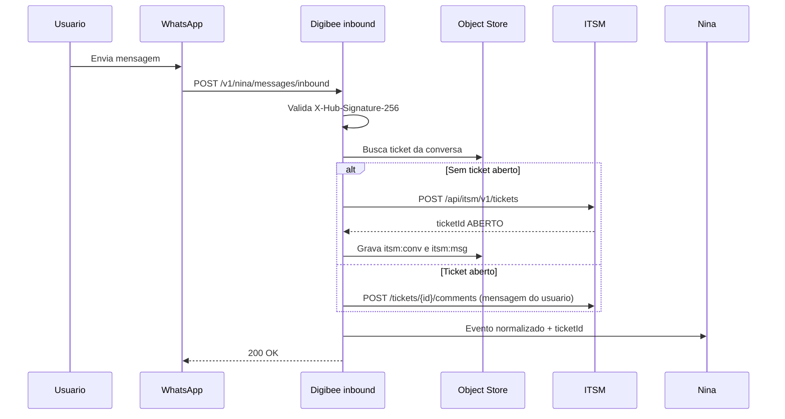
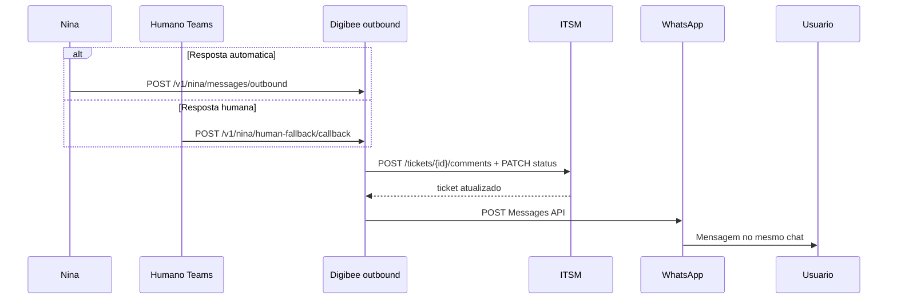
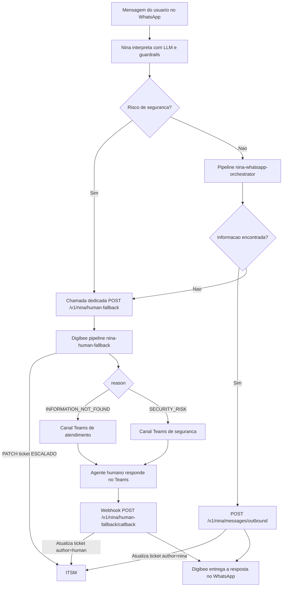
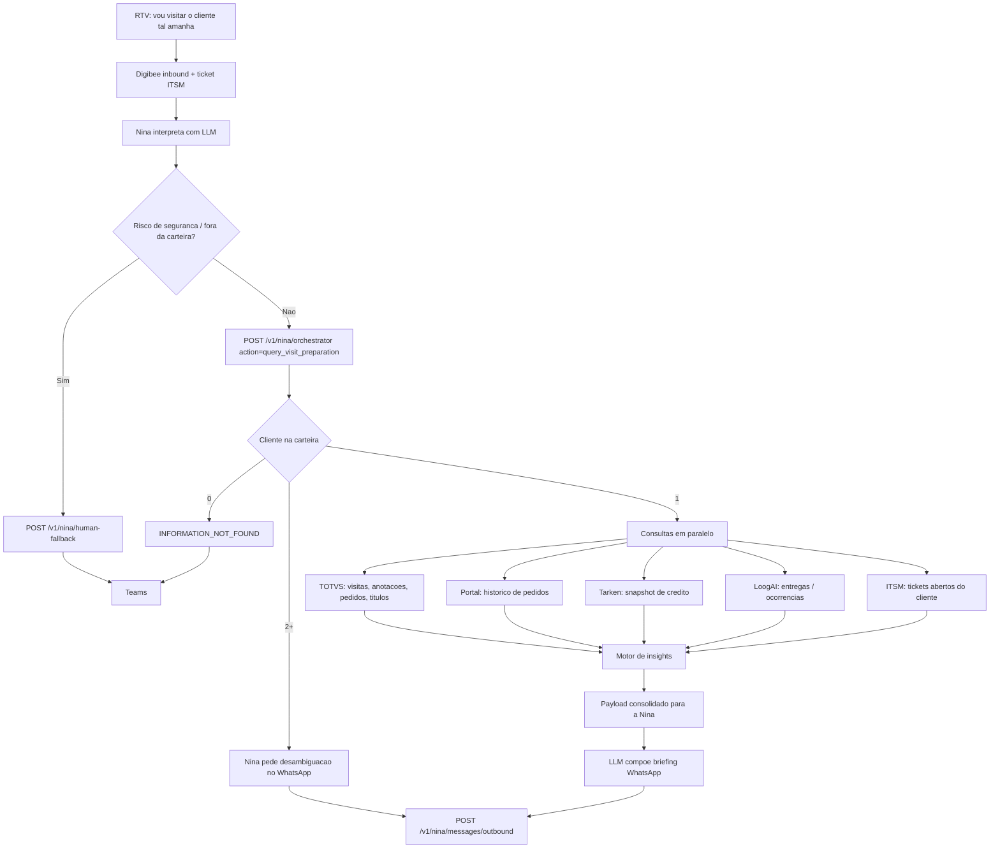
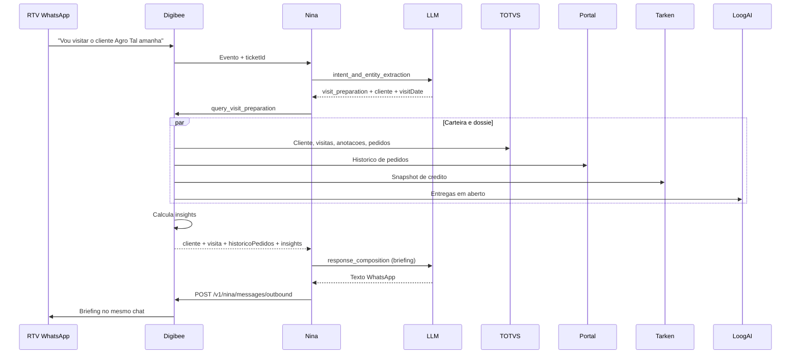

# Integracao Digibee com Sistemas Corporativos

TODOs:

- [x] Adicionar fluxo de interação humana (via Teams) quando a nina não conseguir encontrar informações no sistema ou identificar algo de risco de segurança (fallback), com chamada específica
- [x] Adicionar fluxo de criação de tickets no ITSM no webhook de envio de mensagem, também adicionar um fluxo atualizando o ticket quando a Nina (ou humano via Teams) responder essa mensagem
- [x] (adicionar no roadmap) Adicionar na integração do portal de pedidos o fluxo o usuário vai fazer o upload de um pdf ou uma foto de pedido e já é criado automaticamente no sistema. adicionar fallbacks para arquivos inválidos ou corrompidos e imagens não nítidas. IA extrai informações identifica se já tem pedido criado ou não e confirma com o usuário a criação.
- [x] Adicionar fluxo de preparação para visita. RTV manda mensagem tipo "vou visitar cliente tal amanhã". O sistema responde com data da última visita, anotações e registros anteriores, histórico de pedidos e insights do cliente para o RTV.
- [ ] Estudar riscos de integração entre esses sistemas
- [ ] Validar quem é o rtv com 3 primeiros dígitos do cpf
- [ ] Crira outro doc com os detalhes técnicos de integrações


Este documento descreve a arquitetura de integracao entre o **Digibee** e os sistemas:

- **WhatsApp** (canal de entrada do usuario)
- **Nina (Microsoft Copilot)** (bot com IA para interpretacao e orquestracao)
- **Lecom** (cadastro de clientes)
- **Portal de Pedidos** (input e acompanhamento de pedidos)
- **TOTVS / Datasul** (ERP Brasil)
- **Tarken** (solicitacao e analise de limite de credito)
- **LoogAI** (acompanhamento da data de entrega)
- **Nina / ITSM** (gestao de tickets e chamados)
- **Microsoft Teams** (canal de fallback humano; a resposta do agente atualiza o mesmo ticket ITSM)

## Principio arquitetural obrigatorio

**Toda requisicao de negocio deve passar pelo Digibee**, que e o hub oficial de integracao, governanca, seguranca, observabilidade e orquestracao.

### Documentacao oficial (Digibee)
- API Trigger (exposicao de pipelines via REST): https://docs.digibee.com/documentation/connectors-and-triggers/triggers/web-protocols/api
- REST V2 Connector (consumo de APIs externas): https://docs.digibee.com/documentation/connectors-and-triggers/connectors/web-protocols/rest-v2
- Consumers / API Keys e Basic Auth: https://docs.digibee.com/documentation/developer-guide/pt-br/platform-administration/settings/api-keys-consumers

---

## Fluxograma de Integracao (Mermaid)

```mermaid
flowchart LR
    USER[Usuario]
    WPP[WhatsApp]
    NINA[Nina - Microsoft Copilot]
    LLM[LLM Provider - OpenAI]
    DIGI[Digibee]

    LECOM[Lecom]
    PORTAL[Portal de Pedidos]
    TOTVS[TOTVS / Datasul]
    TARKEN[Tarken]
    LOOGAI[LoogAI]
    ITSM[Nina / ITSM]
    TEAMS[Microsoft Teams]

    USER -->|Mensagem em linguagem natural| WPP
    WPP -->|Webhook de entrada| DIGI
    DIGI -->|Cria/correlaciona ticket| ITSM
    DIGI -->|Evento normalizado + ticketId| NINA

    NINA -->|Prompt de classificacao e extracao| LLM
    LLM -->|Intencao, entidades, risco e plano de consulta| NINA

    NINA -->|Requisicao estruturada: intencao + entidades + ticketId| DIGI
    NINA -->|Chamada dedicada: escalate_to_human| DIGI

    DIGI -->|Consulta/atualizacao de cadastro| LECOM
    DIGI -->|Criacao/consulta de pedido| PORTAL
    DIGI -->|ERP: cliente/pedido/financeiro/visitas| TOTVS
    DIGI -->|Analise de credito| TARKEN
    DIGI -->|Tracking e ETA| LOOGAI
    DIGI -->|Consulta/enriquecimento do chamado| ITSM
    DIGI -->|Escalonamento humano (fallback)| TEAMS

    LECOM --> DIGI
    PORTAL --> DIGI
    TOTVS --> DIGI
    TARKEN --> DIGI
    LOOGAI --> DIGI
    ITSM --> DIGI
    TEAMS -->|Resposta do agente humano| DIGI

    DIGI -->|Payload consolidado com dados de negocio| NINA
    DIGI -->|Resultado do handoff humano| NINA
    NINA -->|Prompt para composicao da resposta final| LLM
    LLM -->|Resposta natural estruturada para o canal| NINA
    NINA -->|Resposta automatica| DIGI
    DIGI -->|Atualiza ticket com a resposta| ITSM
    DIGI -->|Mensagem final| WPP
    WPP -->|Mensagem final| USER
```

---

## 1) WhatsApp - Canal Conversacional

### Modulos na arquitetura
- **Webhook de entrada** (API Trigger no Digibee) para receber mensagens do usuario.
- **Side-effect ITSM na entrada**: abertura ou correlacao de ticket a cada mensagem enviada pelo usuario.
- **Camada de entrega** para envio da resposta final (Nina ou humano via Teams).
- **Side-effect ITSM na saida**: atualizacao do mesmo ticket com o texto e o autor da resposta.
- **Correlacao de conversa** para manter contexto por numero/sessao e o `ticketId` associado.

### APIs envolvidas
- API oficial do provedor WhatsApp (Cloud API/BSP).
- Endpoint de webhook exposto pelo Digibee (`POST /v1/nina/messages/inbound`) — nao pela Nina diretamente.
- Endpoint de envio da resposta da Nina (`POST /v1/nina/messages/outbound`).
- Endpoint de callback da resposta humana no Teams (`POST /v1/nina/human-fallback/callback`).

### Documentacao oficial
- WhatsApp Cloud API (visao geral): https://developers.facebook.com/docs/whatsapp/cloud-api/
- WhatsApp Messages API (envio de mensagens): https://developers.facebook.com/docs/whatsapp/cloud-api/reference/messages
- WhatsApp Service Messages (janela de atendimento e formato de payload): https://developers.facebook.com/docs/whatsapp/cloud-api/guides/send-messages/
- WhatsApp Webhooks (configuracao): https://developers.facebook.com/docs/whatsapp/cloud-api/guides/set-up-webhooks/
- WhatsApp messages webhook (payload de entrada): https://developers.facebook.com/docs/whatsapp/cloud-api/webhooks/components

### Autenticacao
- Token de acesso da API do provedor WhatsApp.
- Validacao de assinatura de webhook (`X-Hub-Signature-256`).
- TLS obrigatorio.

### Informacoes trafegadas
- Texto da mensagem do usuario.
- Metadados de conversa (numero, id da conversa, `messageId`/`wamid`, timestamp).
- `ticketId` ITSM correlacionado a sessao.
- Resposta final gerada pela Nina (ou pelo agente humano no Teams) com dados consolidados do Digibee.
- Briefing de preparacao para visita (ultima visita, anotacoes, historico de pedidos e insights).
- Mensagem de encaminhamento humano ou resposta do agente no Teams (fallback).

---

## 2) Nina (Microsoft Copilot) - Orquestracao com IA

### Modulos na arquitetura
- **NLU/LLM** para interpretar intencao e extrair entidades.
- **Planner de acoes** para decidir quais consultas executar (incluindo `query_visit_preparation` para briefing de visita).
- **Compositor de resposta** para gerar retorno em linguagem natural.
- **Guardrails** para mascarar dados sensiveis, detectar risco de seguranca e aplicar politica de uso.
- **Fallback humano** para escalonar ao Microsoft Teams quando nao houver dados ou houver risco de seguranca.

### APIs envolvidas
- Endpoint de inferencia da Nina/Copilot.
- API de inferencia da **OpenAI** como provider LLM (ex.: Responses API/Chat Completions).
- Endpoint de chamada para o Digibee (sincrono ou assincrono) - pipeline `nina-whatsapp-orchestrator`.
- Endpoint de envio da resposta (`POST /v1/nina/messages/outbound`) - pipeline `nina-itsm-ticket-update`.
- **Endpoint dedicado de fallback humano** no Digibee - pipeline `nina-human-fallback` (`escalate_to_human`).
- Endpoint de callback para resposta consolidada, quando aplicavel.
- Endpoint de callback do handoff humano (resposta do agente no Teams) - o mesmo pipeline atualiza o ticket ITSM.

### Documentacao oficial
- Microsoft Copilot Studio (documentacao principal): https://learn.microsoft.com/en-us/microsoft-copilot-studio/
- Copilot Studio - estrategias de integracao: https://learn.microsoft.com/en-us/microsoft-copilot-studio/guidance/integrations
- Copilot Studio - autenticacao: https://learn.microsoft.com/en-us/microsoft-copilot-studio/configuration-end-user-authentication
- Copilot Studio - handoff para agente humano: https://learn.microsoft.com/en-us/microsoft-copilot-studio/advanced-hand-off
- Copilot Studio - handoff generico (`handoff.initiate`): https://learn.microsoft.com/en-us/microsoft-copilot-studio/configure-generic-handoff
- OpenAI API Reference (endpoint e schemas): https://developers.openai.com/api/reference/
- OpenAI Responses API (criacao de resposta): https://developers.openai.com/api/reference/resources/responses/methods/create/

### Autenticacao
- OAuth2/JWT entre Nina e servicos corporativos.
- Chave tecnica para chamadas ao Digibee.
- Controle de escopo por acao (consulta, atualizacao, abertura de chamado, `query_visit_preparation`, `escalate_to_human`).

### Informacoes trafegadas
- Intencao detectada (ex.: "consultar pedido", "solicitar limite", "abrir chamado", "preparar visita", "escalate_to_human").
- Entidades extraidas (CNPJ, numero do pedido, codigo/nome do cliente, data da visita, ticket).
- Sinal de risco de seguranca e motivo do fallback (`INFORMATION_NOT_FOUND` ou `SECURITY_RISK`).
- Resultado consolidado retornado pelo Digibee, incluindo `suporte.ticketId`.
- Resposta textual final para o usuario no WhatsApp (automatica ou proveniente do agente humano).

### Chamadas explicitas da Nina e fluxo de entrada/saida
1. **Entrada (WhatsApp -> Digibee -> Nina)**
   - O webhook de envio da mensagem chega no Digibee (`POST /v1/nina/messages/inbound`).
   - Digibee cria ou correlaciona o ticket ITSM e encaminha `input_text`, `channel_context` e `ticketId` para a Nina.

2. **Nina -> LLM (OpenAI) - Interpretacao**
   - Envia prompt com contexto da conversa e politicas de seguranca.
   - Recebe `intent`, `entities`, `confidence`, `required_systems` e, quando aplicavel, `securityRisk`.
   - Na intencao `visit_preparation`, extrai o cliente e resolve data relativa ("amanha", "segunda") para ISO (`America/Sao_Paulo`).

3. **Nina -> Digibee - Orquestracao**
   - Envia payload estruturado com intencao, entidades e `ticketId`.
   - Recebe resposta consolidada com dados dos sistemas corporativos.

4. **Nina -> Digibee - Fallback humano (chamada dedicada, nao reutiliza o orquestrador)**
   - Usada somente quando a Nina nao encontra informacao no sistema **ou** identifica risco de seguranca.
   - Pipeline exclusivo: `nina-human-fallback`, acao `escalate_to_human`.
   - Digibee marca o ticket da conversa como `ESCALADO`, notifica o agente humano no Microsoft Teams e devolve o protocolo do handoff.

5. **Nina -> LLM (OpenAI) - Composicao da resposta**
   - Envia dados consolidados retornados pelo Digibee (negocio ou status do handoff).
   - Recebe texto final, objetivo e adequado ao canal WhatsApp.

6. **Saida (Nina -> Digibee -> WhatsApp)**
   - A Nina **nao** envia direto ao WhatsApp. Chama `POST /v1/nina/messages/outbound`.
   - Digibee atualiza o ticket ITSM com a resposta (`author=nina`) e so depois entrega a mensagem ao usuario.

7. **Saida humana (Teams -> Digibee -> WhatsApp)**
   - Se um agente humano responder no Teams, o callback `POST /v1/nina/human-fallback/callback` atualiza o **mesmo** ticket (`author=human`, `source=teams`) e entrega a mensagem no WhatsApp.

---

## 3) Lecom - Cadastro de Clientes

### Modulos no Digibee
- **Pipeline de Cadastro de Clientes**.
- Transformacao de payload (normalizacao de CPF/CNPJ, endereco, contatos).
- Validacoes de consistencia cadastral e duplicidade.

### APIs envolvidas
- Lecom API para criacao/atualizacao de cadastro.
- Conectores HTTP/API do Digibee.
- Sincronizacao complementar com TOTVS/Datasul.

### Documentacao oficial
- Lecom Open API - introducao: https://lecomsa.readme.io/reference/getting-started-with-your-api
- Lecom Open API v6: https://lecomsa.readme.io/v6.0/reference/getting-started-with-your-api

### Autenticacao
- OAuth2 Client Credentials (preferencial).
- API Key quando necessario.
- TLS ponta a ponta.

### Informacoes trafegadas
- Dados cadastrais e fiscais.
- Enderecos, contatos e parametros comerciais.
- Status de integracao e protocolo de processamento.

---

## 4) Portal de Pedidos - Input e Acompanhamento

> Observacao: como o Portal de Pedidos e uma ferramenta interna com documentacao limitada, foi adotado um padrao de integracao REST/JSON.

### Modulos no Digibee
- **Pipeline de Entrada de Pedidos**.
- Validacao comercial/fiscal.
- Orquestracao com ERP, credito e logistica.

### APIs envolvidas
- Endpoint de criacao/alteracao de pedido.
- Endpoint de consulta de status de pedido.
- Endpoint de historico de pedidos por cliente (carteira do RTV, janela recente).
- Integracao com TOTVS, Tarken e LoogAI para enriquecimento.

### Autenticacao
- JWT corporativo ou OAuth2.
- mTLS opcional para trafego interno.
- Rate limit por consumidor.

### Informacoes trafegadas
- Cabecalho do pedido e itens.
- Condicao comercial, impostos e descontos.
- Status operacional, financeiro e logistico.
- Historico recente de pedidos do cliente (usado no briefing de visita).

---

## 5) TOTVS / Datasul - ERP Brasil

### Modulos no Digibee
- **Pipeline ERP Core**.
- Conector ERP para clientes, pedidos, faturamento e historico comercial de visitas.
- Retentativas, fila de reprocesso e rastreabilidade.

### APIs envolvidas
- Servicos de cadastro de clientes.
- Servicos de pedido de venda e faturamento.
- Servicos de consulta financeira.
- Servicos de historico de visitas comerciais, anotacoes e registros do cliente (modulo comercial/SFA do Datasul, quando habilitado).

### Documentacao oficial
- TOTVS Developers - API Reference: https://api.totvs.com.br/referencelist
- TOTVS Datasul - desenvolvimento de APIs (TDN): https://tdn.totvs.com/display/public/LDT/Desenvolvimento+de+APIs+para+o+produto+Datasul
- TOTVS Central - guia de integracao REST no Datasul: https://centraldeatendimento.totvs.com/hc/pt-br/articles/16461753523863-Framework-Linha-Datasul-FRW-Documenta%C3%A7%C3%A3o-para-Integra%C3%A7%C3%A3o-e-utiliza%C3%A7%C3%A3o-de-APIs-REST

### Autenticacao
- Token de aplicacao, usuario tecnico ou gateway interno.
- HTTPS/TLS obrigatorio.
- Correlation/request-id para auditoria.

### Informacoes trafegadas
- Cadastro mestre de clientes.
- Status de pedido (digitado, liberado, faturado, cancelado).
- Titulos, saldo e bloqueios financeiros.
- Data da ultima visita, anotacoes e registros comerciais anteriores do cliente.

---

## 6) Tarken - Solicitacao e Analise de Limite de Credito

### Modulos no Digibee
- **Pipeline de Credito**.
- Montagem de dossie de analise.
- Fallback para analise manual em contingencia.

### APIs envolvidas
- API de solicitacao de analise de credito.
- API de consulta de resultado.
- API de revalidacao de limite.

### Autenticacao
- OAuth2 Client Credentials ou API Key assinada.
- TLS e mascaramento de dados sensiveis em logs.
- Timeout/circuit breaker para resiliencia.

### Informacoes trafegadas
- Documentos e identificacao do cliente.
- Valor solicitado, prazo e risco.
- Score, limite aprovado, validade e justificativa.

---

## 7) LoogAI - Acompanhamento da Data de Entrega

### Modulos no Digibee
- **Pipeline Logistico**.
- Consulta de tracking por pedido/NF.
- Normalizacao de eventos e ETA.

### APIs envolvidas
- API de tracking logistico.
- API/eventos de entrega (coletado, em transito, entregue, ocorrencia).
- Webhook de atualizacao de ETA (quando disponivel).

### Autenticacao
- Token de API com renovacao periodica.
- Validacao de assinatura de webhook.
- TLS obrigatorio.

### Informacoes trafegadas
- Status atual de entrega e historico de eventos.
- Data prevista de entrega (ETA).
- Ocorrencias e justificativas de atraso.

---

## 8) Nina / ITSM - Gestao de Tickets e Chamados

Toda mensagem enviada pelo usuario no WhatsApp gera (ou correlaciona) um ticket no ITSM. Toda resposta — da Nina ou de um humano via Microsoft Teams — atualiza esse mesmo ticket. A Nina **nao** chama o ITSM diretamente: abertura e atualizacao passam pelo Digibee.

### Modulos no Digibee
- **Pipeline `nina-whatsapp-inbound`** (webhook de envio de mensagem): cria ou correlaciona o ticket.
- **Pipeline `nina-itsm-ticket-update`**: atualiza o ticket quando a Nina responde (`outbound`) ou quando o humano responde no Teams (`human-fallback/callback`).
- **Object Store `nina-itsm-conversation`**: mapeia conversa (`channel` + `userId`) para `ticketId` aberto.
- Roteamento por tipo de incidente e enriquecimento com dados de pedido, credito e logistica.

### APIs envolvidas
- ITSM REST API para abertura/atualizacao/encerramento.
- API Trigger do webhook WhatsApp: `POST /v1/nina/messages/inbound`.
- API Trigger da resposta da Nina: `POST /v1/nina/messages/outbound`.
- API Trigger da resposta humana no Teams: `POST /v1/nina/human-fallback/callback` (reusa o callback do fallback; nao ha endpoint paralelo).
- Webhooks ITSM para notificacoes de mudanca de status (opcional, no sentido inverso).

### Documentacao oficial
- Digibee API Trigger: https://docs.digibee.com/documentation/connectors-and-triggers/triggers/web-protocols/api
- Digibee REST V2 (consumo da API ITSM): https://docs.digibee.com/documentation/connectors-and-triggers/connectors/web-protocols/rest-v2
- Digibee Object Store (correlacao conversa/ticket): https://docs.digibee.com/documentation/connectors-and-triggers/connectors/structured-data/object-store
- WhatsApp messages webhook: https://developers.facebook.com/docs/whatsapp/cloud-api/webhooks/components
- Microsoft Graph - postar mensagem em canal Teams: https://learn.microsoft.com/en-us/graph/api/channel-post-messages
- Copilot Studio - handoff para agente humano: https://learn.microsoft.com/en-us/microsoft-copilot-studio/advanced-hand-off

### Autenticacao
- Bearer Token (OAuth2/JWT) para a ITSM REST API.
- Validacao de assinatura do webhook WhatsApp (`X-Hub-Signature-256`).
- Chave tecnica / API Key nos API Triggers do Digibee.
- OAuth2 (Microsoft Graph) para notificar e receber resposta no Teams.
- Escopos por perfil de operacao (criar ticket, comentar, alterar status).

### Informacoes trafegadas
- ID do ticket, categoria, prioridade, SLA, responsavel.
- `messageId` (wamid), `conversationId`, autor da mensagem (`user` | `nina` | `human`).
- Texto da mensagem de entrada e da resposta.
- Evidencias tecnicas do erro e contexto de negocio.
- Historico de tratativas e status.

### Modelo de correlacao (1 conversa = 1 ticket aberto)

| Chave no Object Store | Uso |
| --- | --- |
| `itsm:msg:{messageId}` | Idempotencia: o mesmo `wamid` nao abre ticket duas vezes (retry do webhook). |
| `itsm:conv:{channel}:{userId}` | Ticket aberto da sessao (`ticketId`, `status`, `handoffId` opcional). |

Regras:
- Se nao existir ticket aberto para a conversa, o webhook **cria** um ticket (`ABERTO`).
- Se ja existir ticket aberto, o webhook **anexa um comentario** com a nova mensagem do usuario (nao cria duplicata).
- A resposta da Nina ou do humano **atualiza** o mesmo `ticketId`.
- Encerramento (`RESOLVIDO`) ocorre quando o humano fecha o atendimento (`action=close` no callback) ou quando a sessao expira.
- A intencao `open_ticket` **nao** abre um segundo chamado: consulta, prioriza ou reabre o ticket ja correlacionado a conversa.

### Maquina de status do ticket

```
ABERTO --> EM_ANDAMENTO   (Nina ou humano assumiu)
EM_ANDAMENTO --> AGUARDANDO_USUARIO  (resposta enviada no WhatsApp)
AGUARDANDO_USUARIO --> EM_ANDAMENTO  (usuario mandou nova mensagem)
EM_ANDAMENTO --> ESCALADO  (handoff para humano no Teams)
ESCALADO --> AGUARDANDO_USUARIO  (humano respondeu)
qualquer estado aberto --> RESOLVIDO
```

### Fluxo A — Criacao de ticket no webhook de envio de mensagem

Pipeline: `nina-whatsapp-inbound`  
Trigger: API Trigger `POST /v1/nina/messages/inbound`

1. WhatsApp Cloud API dispara o webhook `messages` (usuario enviou texto).
2. Digibee valida a assinatura e responde `200` rapidamente (o provedor reenvia se houver timeout).
3. Normaliza o payload (`from`, `wamid`, `text`, timestamp).
4. Consulta o Object Store:
   - se `itsm:msg:{wamid}` ja existe, ignora (idempotencia);
   - se `itsm:conv:whatsapp:{userId}` tem ticket aberto, usa esse `ticketId`;
   - senao, chama a ITSM REST API (`POST /api/itsm/v1/tickets`) e grava o mapeamento.
5. Anexa a mensagem do usuario como comentario do ticket (`author=user`, `source=whatsapp`).
6. Encaminha o evento normalizado para a Nina, ja com `ticketId`.

A falha na abertura do ticket **nao** bloqueia a conversa: o Digibee registra warning, segue para a Nina e tenta reprocessar a criacao (fila de reprocesso). O usuario nao deve ver erro tecnico.



### Fluxo B — Atualizacao do ticket na resposta (Nina ou humano via Teams)

Pipeline: `nina-itsm-ticket-update`  
Triggers:
- `POST /v1/nina/messages/outbound` (resposta automatica da Nina)
- `POST /v1/nina/human-fallback/callback` (resposta do agente no Teams)

1. A Nina devolve o texto final **para o Digibee**, nunca direto ao WhatsApp.
2. Digibee localiza o ticket pelo `ticketId` (preferencial) ou pela chave `itsm:conv:{channel}:{userId}`.
3. Atualiza o ITSM:
   - comentario/work note com o texto da resposta;
   - `author` = `nina` ou `human`;
   - `source` = `copilot` ou `teams`;
   - status `AGUARDANDO_USUARIO` (ou permanece `ESCALADO` se o handoff ainda estiver aberto sem reply).
4. Envia a mensagem ao usuario pela WhatsApp Messages API.
5. Grava no Object Store o `outboundMessageId` ligado ao ticket (rastreio de entrega).

Se a resposta vier de um humano no Teams:
- o agente responde no canal/thread notificado pelo Digibee (Adaptive Card ou reply na thread);
- o bot/callback do Teams chama o **mesmo** `POST /v1/nina/human-fallback/callback` ja documentado na secao 9;
- o Digibee aplica o contrato de atualizacao do ticket (`author=human`, `source=teams`) e entrega no WhatsApp da sessao original.



### Contratos HTTP (referenciais)

#### WhatsApp -> Digibee (webhook de envio de mensagem)

```http
POST /v1/nina/messages/inbound
Content-Type: application/json
X-Hub-Signature-256: sha256=...
```

O Digibee aceita o envelope nativo do WhatsApp e normaliza internamente. Campos minimos apos normalizacao:

```json
{
  "pipeline": "nina-whatsapp-inbound",
  "action": "ingest_user_message",
  "channel": "whatsapp",
  "correlationId": "corr-20260909-0100",
  "message": {
    "id": "wamid.HBgL...",
    "from": "5511999999999",
    "timestamp": "1749416383",
    "type": "text",
    "text": "Qual a previsao de entrega do pedido 12345 e meu limite de credito?"
  }
}
```

#### Digibee -> ITSM (criar ticket)

```http
POST /api/itsm/v1/tickets
Authorization: Bearer {itsm-token}
Content-Type: application/json
Idempotency-Key: wamid.HBgL...
```

```json
{
  "source": "whatsapp",
  "sourceMessageId": "wamid.HBgL...",
  "requester": {
    "channelUserId": "5511999999999"
  },
  "category": "CONVERSACIONAL",
  "priority": "MEDIUM",
  "shortDescription": "Mensagem WhatsApp de 5511999999999",
  "description": "Qual a previsao de entrega do pedido 12345 e meu limite de credito?",
  "channelContext": {
    "channel": "whatsapp",
    "conversationKey": "whatsapp:5511999999999"
  }
}
```

#### Digibee -> ITSM (anexar mensagem do usuario a ticket existente)

```http
POST /api/itsm/v1/tickets/INC-88421/comments
Authorization: Bearer {itsm-token}
Content-Type: application/json
```

```json
{
  "author": "user",
  "source": "whatsapp",
  "sourceMessageId": "wamid.HBgL...",
  "body": "Qual a previsao de entrega do pedido 12345 e meu limite de credito?",
  "visibility": "public"
}
```

#### Digibee -> Nina (evento ja com ticket)

```json
{
  "correlationId": "corr-20260909-0100",
  "channel": "whatsapp",
  "ticketId": "INC-88421",
  "ticketStatus": "ABERTO",
  "input": {
    "userId": "5511999999999",
    "messageId": "wamid.HBgL...",
    "text": "Qual a previsao de entrega do pedido 12345 e meu limite de credito?"
  }
}
```

#### Nina -> Digibee (resposta automatica, atualiza o ticket)

```http
POST /v1/nina/messages/outbound
Content-Type: application/json
X-Correlation-Id: corr-20260909-0100
```

```json
{
  "pipeline": "nina-itsm-ticket-update",
  "action": "reply_and_update_ticket",
  "correlationId": "corr-20260909-0100",
  "ticketId": "INC-88421",
  "author": "nina",
  "source": "copilot",
  "channel": "whatsapp",
  "userId": "5511999999999",
  "inReplyToMessageId": "wamid.HBgL...",
  "replyToUser": {
    "text": "Pedido 12345 esta liberado no ERP. Seu limite de credito foi aprovado em R$ 50.000,00. A entrega esta em transito com previsao para 10/09/2026."
  }
}
```

#### Digibee -> ITSM (atualizar ticket com a resposta)

```http
POST /api/itsm/v1/tickets/INC-88421/comments
Authorization: Bearer {itsm-token}
Content-Type: application/json
```

```json
{
  "author": "nina",
  "source": "copilot",
  "body": "Pedido 12345 esta liberado no ERP. Seu limite de credito foi aprovado em R$ 50.000,00. A entrega esta em transito com previsao para 10/09/2026.",
  "visibility": "public",
  "statusAfterComment": "AGUARDANDO_USUARIO"
}
```

No caso humano, `author` vira `human`, `source` vira `teams` e o comentario inclui o `agent.id`. O payload de entrada e o callback da secao 9 (`POST /v1/nina/human-fallback/callback`).

#### Digibee -> ITSM (PATCH de status)

```http
PATCH /api/itsm/v1/tickets/INC-88421
Authorization: Bearer {itsm-token}
Content-Type: application/json
```

```json
{
  "status": "AGUARDANDO_USUARIO",
  "lastReplyAuthor": "nina",
  "lastReplyAt": "2026-09-09T00:55:12Z"
}
```

### Resiliencia e observabilidade
- Idempotencia por `messageId` (entrada) e por `correlationId` + `ticketId` (saida).
- Retry com backoff no REST V2 para falhas 5xx/timeout do ITSM.
- Falha de ITSM nao impede entrega da mensagem ao usuario; gera alerta e item de reprocesso.
- Correlation/request-id unico (`correlationId`) em WhatsApp, Nina, Digibee, ITSM e Teams.

---

## 9) Microsoft Teams - Fallback Humano (chamada dedicada)

Quando a Nina **nao encontrar informacoes no sistema** ou **identificar risco de seguranca**, ela **nao reutiliza** o pipeline `nina-whatsapp-orchestrator`. Ela dispara uma **chamada especifica** para o Digibee, que escala a conversa a um humano no Microsoft Teams. O Digibee marca o ticket ITSM ja aberto no webhook de entrada como `ESCALADO`. Quando o humano responde, o callback `POST /v1/nina/human-fallback/callback` atualiza o **mesmo** ticket (`author=human`, `source=teams`) e entrega a mensagem no WhatsApp.

### Quando acionar (regras de fallback)

| Motivo (`reason`) | Quando ocorre | Canal Teams | Experiencia do usuario no WhatsApp |
|---|---|---|---|
| `INFORMATION_NOT_FOUND` | Consulta sem resultado, dados insuficientes, baixa confianca da LLM, sistema indisponivel ou `integrationStatus` sem dado utilizavel | Canal de atendimento humano | Informa que a solicitacao foi encaminhada a um atendente e que a resposta voltara no mesmo chat |
| `SECURITY_RISK` | Tentativa de acesso indevido, injecao de prompt, extracao de dado sensivel, violacao de guardrail ou operacao fora do escopo do RTV | Canal de seguranca (prioritario) | Mensagem generica, **sem expor o motivo de seguranca** |

O fallback de seguranca pode ocorrer **antes** da orquestracao (risco detectado na interpretacao) ou **durante** a consulta (Digibee identifica acesso cruzado, documento de outro cliente, etc.). O fallback de informacao ocorre **depois** da orquestracao, quando nao ha dado utilizavel para responder.

### Chamada especifica da Nina

```
POST /v1/nina/human-fallback
pipeline: nina-human-fallback
action: escalate_to_human
```

Essa chamada e exclusiva. Nao deve ser embutida em `query_order_credit_delivery` nem em qualquer outra acao do orquestrador.

| Campo | Descricao |
|---|---|
| `reason` | `INFORMATION_NOT_FOUND` ou `SECURITY_RISK` |
| `severity` | `LOW`, `MEDIUM`, `HIGH`, `CRITICAL` (obrigatorio em risco de seguranca) |
| `conversationContext` | Identidade do usuario, sessao WhatsApp, `ticketId` ITSM da conversa, ultima mensagem e historico resumido |
| `attemptedQuery` | Intencao, entidades e sistemas ja consultados |
| `securitySignals` | Presente somente em `SECURITY_RISK` (tipo de risco, trecho sinalizado, politica violada) |
| `userSafeMessageHint` | Texto sugerido para o WhatsApp, sem detalhe interno de seguranca |

### Modulos no Digibee
- **Pipeline `nina-human-fallback`** (API Trigger dedicado).
- Roteamento por `reason` para o canal Teams correto.
- Montagem de Adaptive Card com contexto da conversa e `ticketId` para o agente humano.
- Correlacao `handoffId` <-> sessao WhatsApp <-> `ticketId` ITSM.
- Webhook de retorno quando o humano responde, assume ou encerra o atendimento (atualiza o ticket ITSM).
- Mascaramento de dados sensiveis em logs e no card de seguranca.

### APIs envolvidas
- API Trigger Digibee: `POST /v1/nina/human-fallback`.
- Microsoft Graph - envio de mensagem em canal/chat (Adaptive Card).
- Bot Framework Connector (mensagens proativas ao agente, quando o bot estiver instalado no time).
- Webhook Digibee de callback: `POST /v1/nina/human-fallback/callback` (resposta do humano; dispara `nina-itsm-ticket-update`).
- Evento Copilot Studio `handoff.initiate` (quando o transfer node for usado na Nina).

### Documentacao oficial
- Copilot Studio - handoff para agente humano: https://learn.microsoft.com/en-us/microsoft-copilot-studio/advanced-hand-off
- Copilot Studio - handoff generico: https://learn.microsoft.com/en-us/microsoft-copilot-studio/configure-generic-handoff
- Microsoft Graph - visao geral de mensagens no Teams: https://learn.microsoft.com/en-us/graph/teams-messaging-overview
- Microsoft Graph - enviar mensagem em canal: https://learn.microsoft.com/en-us/graph/api/channel-post-messages
- Teams - mensagens proativas: https://learn.microsoft.com/en-us/microsoftteams/platform/bots/how-to/conversations/send-proactive-messages
- Teams - Adaptive Cards: https://learn.microsoft.com/en-us/microsoftteams/platform/task-modules-and-cards/cards/cards-reference

### Autenticacao
- OAuth2/JWT da Nina para o API Trigger `nina-human-fallback` (escopo exclusivo `escalate_to_human`).
- Azure AD (app registration) para Microsoft Graph / Bot Framework, consumido pelo REST V2 do Digibee.
- Validacao de assinatura no webhook de callback do Teams.
- TLS obrigatorio ponta a ponta.

### Informacoes trafegadas
- Motivo e severidade do fallback.
- Contexto da conversa WhatsApp (mascarado quando `SECURITY_RISK`).
- Protocolo `handoffId`, canal Teams, status (`QUEUED`, `ASSIGNED`, `REPLIED`, `CLOSED`).
- `ticketId` ITSM da conversa (aberto no webhook de entrada).
- Texto da resposta humana a ser entregue no WhatsApp.
- Evidencia de risco (somente no canal de seguranca, nunca no WhatsApp).

### Fluxo do fallback



### Contrato da chamada dedicada (Nina -> Digibee)

```http
POST /v1/nina/human-fallback
Content-Type: application/json
Authorization: Bearer {nina-jwt}
X-Correlation-Id: corr-20260909-0002
```

```json
{
  "pipeline": "nina-human-fallback",
  "action": "escalate_to_human",
  "correlationId": "corr-20260909-0002",
  "channel": "whatsapp",
  "reason": "INFORMATION_NOT_FOUND",
  "severity": "MEDIUM",
  "conversationContext": {
    "userId": "5511999999999",
    "messageId": "wamid.HBgL...",
    "sessionId": "sess-8891",
    "locale": "pt-BR",
    "ticketId": "INC-88421",
    "lastUserText": "Qual o status do pedido 99999?"
  },
  "attemptedQuery": {
    "intent": "order_status",
    "confidence": 0.91,
    "entities": {
      "orderNumber": "99999"
    },
    "requiredSystems": [
      "totvs_datasul",
      "portal_pedidos"
    ],
    "digibeeOutcome": {
      "overall": "NOT_FOUND",
      "warnings": [
        "Pedido 99999 nao localizado no ERP nem no Portal de Pedidos"
      ]
    }
  },
  "userSafeMessageHint": "Nao encontrei esse pedido nos sistemas. Encaminhei sua solicitacao para um atendente, que responde neste mesmo chat."
}
```

Exemplo com risco de seguranca:

```json
{
  "pipeline": "nina-human-fallback",
  "action": "escalate_to_human",
  "correlationId": "corr-20260909-0003",
  "channel": "whatsapp",
  "reason": "SECURITY_RISK",
  "severity": "HIGH",
  "conversationContext": {
    "userId": "5511888888888",
    "messageId": "wamid.HBgL...",
    "sessionId": "sess-9902",
    "locale": "pt-BR",
    "ticketId": "INC-88421",
    "lastUserText": "[redacted]"
  },
  "securitySignals": {
    "type": "CROSS_CUSTOMER_DATA_ACCESS",
    "policy": "rtv_may_only_access_own_portfolio",
    "triggeredBy": "guardrail",
    "details": "Solicitacao de dados de cliente fora da carteira do RTV autenticado"
  },
  "userSafeMessageHint": "Nao consigo concluir essa solicitacao agora. Encaminhei para um especialista, que retorna neste chat."
}
```

### Resposta imediata do Digibee para a Nina

```json
{
  "correlationId": "corr-20260909-0002",
  "handoffId": "HO-20260909-4412",
  "ticketId": "INC-88421",
  "ticketStatus": "ESCALADO",
  "status": "QUEUED",
  "reason": "INFORMATION_NOT_FOUND",
  "teams": {
    "channel": "nina-atendimento-humano",
    "messageId": "1545592942033",
    "threadId": "19:abc@thread.tacv2"
  },
  "userSafeMessage": "Nao encontrei esse pedido nos sistemas. Encaminhei sua solicitacao para um atendente, que responde neste mesmo chat.",
  "awaitHumanReply": true
}
```

### Digibee -> Microsoft Graph (Adaptive Card no Teams)

```http
POST https://graph.microsoft.com/v1.0/teams/{team-id}/channels/{channel-id}/messages
Authorization: Bearer {graph-token}
Content-Type: application/json
```

```json
{
  "subject": "Nina fallback HO-20260909-4412 | INFORMATION_NOT_FOUND",
  "body": {
    "contentType": "html",
    "content": "Nova solicitacao humana da Nina. Use o card para assumir e responder."
  },
  "attachments": [
    {
      "contentType": "application/vnd.microsoft.card.adaptive",
      "content": {
        "type": "AdaptiveCard",
        "$schema": "http://adaptivecards.io/schemas/adaptive-card.json",
        "version": "1.5",
        "body": [
          {
            "type": "TextBlock",
            "weight": "Bolder",
            "text": "Fallback humano - informacao nao encontrada"
          },
          {
            "type": "FactSet",
            "facts": [
              { "title": "Handoff", "value": "HO-20260909-4412" },
              { "title": "Ticket ITSM", "value": "INC-88421" },
              { "title": "Usuario WhatsApp", "value": "5511999999999" },
              { "title": "Intencao", "value": "order_status" },
              { "title": "Pedido", "value": "99999" },
              { "title": "Sistemas consultados", "value": "totvs_datasul, portal_pedidos" }
            ]
          },
          {
            "type": "Input.Text",
            "id": "agentReply",
            "isMultiline": true,
            "placeholder": "Resposta que sera enviada ao usuario no WhatsApp"
          }
        ],
        "actions": [
          { "type": "Action.Submit", "title": "Assumir", "data": { "action": "assign", "handoffId": "HO-20260909-4412" } },
          { "type": "Action.Submit", "title": "Responder no WhatsApp", "data": { "action": "reply", "handoffId": "HO-20260909-4412" } },
          { "type": "Action.Submit", "title": "Encerrar", "data": { "action": "close", "handoffId": "HO-20260909-4412" } }
        ]
      }
    }
  ]
}
```

### Callback do humano (Teams -> Digibee -> WhatsApp)

O callback **nao** e um endpoint novo: e o mesmo `POST /v1/nina/human-fallback/callback`. Alem de entregar a resposta no WhatsApp, o Digibee dispara o pipeline `nina-itsm-ticket-update` no mesmo `ticketId` aberto no webhook de entrada.

```http
POST /v1/nina/human-fallback/callback
Content-Type: application/json
X-Correlation-Id: corr-20260909-0002
```

```json
{
  "pipeline": "nina-itsm-ticket-update",
  "action": "reply_and_update_ticket",
  "handoffId": "HO-20260909-4412",
  "ticketId": "INC-88421",
  "author": "human",
  "source": "teams",
  "channel": "whatsapp",
  "userId": "5511999999999",
  "agent": {
    "id": "agente.silva@empresa.com",
    "displayName": "Agente Silva"
  },
  "replyToUser": {
    "text": "O pedido 99999 nao existe na base. Confirme o numero ou informe o CNPJ do cliente para eu localizar."
  }
}
```

O Digibee anexa o comentario no ITSM (`author=human`, `source=teams`), altera o status para `AGUARDANDO_USUARIO` (ou `RESOLVIDO` se `action=close`) e entrega `replyToUser.text` no WhatsApp da mesma sessao. O usuario nao precisa mudar de canal.

Quando `action=assign`, o ticket permanece `ESCALADO` e recebe work note de assumicao. Quando `action=close`, o ticket vai para `RESOLVIDO`.

---

## 10) Preparacao para Visita do RTV

Quando o RTV envia no WhatsApp uma mensagem do tipo **"vou visitar o cliente tal amanha"**, a Nina classifica a intencao `visit_preparation` e o Digibee monta um **briefing comercial** no mesmo chat. A resposta precisa ser util na rua: ultima visita, anotacoes, historico de pedidos e **insights do cliente** para orientar a conversa.

Essa e uma consulta composta. A Nina **nao** chama TOTVS, Portal, Tarken ou LoogAI diretamente. A acao exclusiva no orquestrador e `query_visit_preparation`.

### Frases de acionamento (exemplos)
- "Vou visitar o cliente Agro Tal amanha"
- "Me prepara para a visita na Cooperativa X hoje"
- "Briefing do cliente CLI12345 para visita na segunda"
- "Quero o dossie do cliente 00.000.000/0001-00, visito ele dia 15"

### O que a resposta deve conter

| Bloco | Origem | Conteudo para o RTV |
|---|---|---|
| Identificacao do cliente | Lecom + TOTVS | Nome, `idErp`, CNPJ mascarado, status cadastral, cidade |
| Data da visita planejada | Entidade extraida pela LLM | Texto original ("amanha") resolvido para data ISO (`America/Sao_Paulo`) |
| Ultima visita | TOTVS / Datasul (historico comercial) | Data, RTV da visita, objetivo, resultado |
| Anotacoes e registros anteriores | TOTVS (observacoes da visita e do cadastro) | Ultimas anotacoes comerciais, pendencias combinadas, registros de campo |
| Historico de pedidos | Portal de Pedidos + TOTVS | Pedidos recentes (cabecalho, valor, status, data) |
| Insights do cliente | Digibee (regras sobre o payload consolidado) | Alertas, oportunidades, saude comercial e pontos de pauta sugeridos |
| Contexto complementar | Tarken, LoogAI, ITSM | Limite/score, entregas em aberto ou com ocorrencia, tickets abertos do cliente |

A Nina **nao inventa** insight. O compositor so verbaliza o que veio no bloco `insights` do Digibee.

### Chamada da Nina

```
POST /v1/nina/orchestrator
pipeline: nina-whatsapp-orchestrator
action: query_visit_preparation
```

Essa acao **nao** reutiliza `query_order_credit_delivery`. Pedido unico e briefing de visita sao contratos diferentes: o briefing e por cliente, com janela de historico e motor de insights.

| Campo | Descricao |
|---|---|
| `customerName` | Nome informado pelo RTV (busca textual) |
| `customerDocument` | CNPJ/CPF quando informado |
| `customerCode` | Codigo ERP (`idErp`) quando informado |
| `visitDate` | Data planejada ja resolvida (ISO `YYYY-MM-DD`) |
| `visitDateRaw` | Texto original ("amanha", "segunda", "dia 15") |
| `rtvId` | Identidade do RTV da sessao (escopo da carteira) |
| `ticketId` | Ticket ITSM da conversa, aberto no webhook de entrada |
| `orderHistoryLimit` | Quantidade de pedidos recentes (padrao 8, maximo 15) |
| `visitHistoryLimit` | Quantidade de visitas/anotacoes recentes (padrao 5) |

### Modulos no Digibee
- **Acao `query_visit_preparation`** no pipeline `nina-whatsapp-orchestrator`.
- Resolucao do cliente na carteira do RTV (Lecom + TOTVS).
- Consulta de historico de visitas e anotacoes no TOTVS/Datasul.
- Consulta de historico de pedidos no Portal e no ERP.
- Enriquecimento com credito (Tarken), logistica (LoogAI) e tickets abertos do cliente (ITSM).
- **Motor de insights** (regras deterministas, sem LLM no Digibee): recencia, volume, mix, credito, atraso, gap de visita.
- Desambiguacao quando o nome do cliente bater em mais de um registro da carteira.

### APIs envolvidas
- API Trigger do orquestrador: `POST /v1/nina/orchestrator` (acao `query_visit_preparation`).
- Lecom Open API: busca cadastral por nome/CNPJ.
- TOTVS/Datasul: cliente, visitas comerciais, anotacoes, pedidos e titulos.
- Portal de Pedidos: historico recente por cliente.
- Tarken: snapshot de limite/score (nao solicita analise nova neste fluxo).
- LoogAI: pedidos em transito e ocorrencias do cliente.
- ITSM: tickets abertos associados ao `idErp` (alem do ticket da conversa).

### Documentacao oficial
- Digibee API Trigger: https://docs.digibee.com/documentation/connectors-and-triggers/triggers/web-protocols/api
- Digibee REST V2: https://docs.digibee.com/documentation/connectors-and-triggers/connectors/web-protocols/rest-v2
- Lecom Open API v6: https://lecomsa.readme.io/v6.0/reference/getting-started-with-your-api
- TOTVS Developers - API Reference: https://api.totvs.com.br/referencelist
- TOTVS Datasul - desenvolvimento de APIs: https://tdn.totvs.com/display/public/LDT/Desenvolvimento+de+APIs+para+o+produto+Datasul
- WhatsApp Messages API: https://developers.facebook.com/docs/whatsapp/cloud-api/reference/messages

### Autenticacao
- OAuth2/JWT da Nina para o orquestrador (escopo `query_visit_preparation`).
- Credenciais tecnicas ja usadas nos conectores Lecom, TOTVS, Portal, Tarken, LoogAI e ITSM.
- A consulta e **restrita a carteira do RTV autenticado** (`rtv_may_only_access_own_portfolio`). Pedido de cliente fora da carteira dispara fallback `SECURITY_RISK`, nao o briefing.

### Informacoes trafegadas
- Identificacao do cliente e da visita planejada.
- Ultima visita, visitas anteriores resumidas, anotacoes e registros.
- Historico recente de pedidos (numero, data, valor, status, principais itens).
- Insights estruturados (alertas, oportunidades, pontos de pauta).
- Snapshot de credito, logistica e suporte, quando disponivel.
- `integrationStatus` com sucesso parcial (ex.: pedidos ok, visitas indisponiveis).

### Regras de resolucao do cliente

| Resultado da busca na carteira | Comportamento |
|---|---|
| 1 cliente | Segue o briefing |
| 0 cliente | `integrationStatus.overall=NOT_FOUND`. Nina dispara `escalate_to_human` com `INFORMATION_NOT_FOUND` se nao houver dado utilizavel |
| 2+ clientes | Retorna `disambiguation.required=true` com candidatos. Nina **nao** monta o briefing; pergunta qual cliente no WhatsApp |
| Cliente fora da carteira do RTV | Nao devolve dado. Nina dispara `escalate_to_human` com `SECURITY_RISK` |

A busca aceita nome parcial, CNPJ/CPF normalizado e codigo ERP. CNPJ tem prioridade sobre nome.

### Motor de insights (Digibee, regras)

O Digibee calcula `insights` a partir dos dados consolidados. Nao ha chamada a LLM dentro do pipeline.

| Tipo | Quando gera | Exemplo de `code` |
|---|---|---|
| `alerta` | Titulo vencido, credito no limite, entrega com ocorrencia, cadastro bloqueado | `CREDIT_NEAR_LIMIT`, `OVERDUE_TITLES`, `DELIVERY_EXCEPTION`, `CUSTOMER_BLOCKED` |
| `oportunidade` | Queda de volume vs periodo anterior, item recorrente ausente na janela recente, gap longo desde a ultima compra | `VOLUME_DROP`, `MISSING_RECURRING_SKU`, `PURCHASE_GAP` |
| `contexto` | Recencia da ultima visita, ticket medio, mix dominante, pedidos em aberto | `VISIT_GAP`, `AVG_TICKET`, `PRODUCT_MIX`, `OPEN_ORDERS` |
| `pauta` | Ponto objetivo para o RTV usar na visita, derivado dos itens acima | `TALKING_POINT` |

Regras de recorte (referenciais):
- Janela de pedidos: ultimos 180 dias (comparativo com os 180 dias anteriores).
- Ultima visita: `diasDesdeUltimaVisita` em relacao a `visitDate`.
- Credito: uso >= 80% do limite gera `CREDIT_NEAR_LIMIT`.
- Visita: gap >= 45 dias gera `VISIT_GAP`.
- Mix: top 3 familias/SKUs por valor no historico recente.
- Maximo de 6 insights no payload (prioriza `alerta`, depois `oportunidade`, depois `contexto`/`pauta`).

Se o modulo de visitas do TOTVS estiver indisponivel, o briefing **continua** com pedidos, credito, logistica e insights restantes. Isso e `PARTIAL_SUCCESS`, nao fallback humano automatico. O RTV recebe o que houver, com aviso claro de que a ultima visita nao foi localizada.

Fallback humano (`INFORMATION_NOT_FOUND`) so ocorre quando:
- o cliente nao foi resolvido; ou
- nenhum bloco utilizavel voltou (sem cliente, sem pedidos, sem visitas, sem credito/logistica).

### Fluxo da preparacao





### Contrato HTTP (Nina -> Digibee)

```http
POST /v1/nina/orchestrator
Content-Type: application/json
Authorization: Bearer {nina-jwt}
X-Correlation-Id: corr-20260909-0200
```

```json
{
  "pipeline": "nina-whatsapp-orchestrator",
  "action": "query_visit_preparation",
  "correlationId": "corr-20260909-0200",
  "channel": "whatsapp",
  "ticketId": "INC-88421",
  "input": {
    "rtvId": "RTV-4412",
    "customerName": "Agro Tal",
    "customerDocument": null,
    "customerCode": null,
    "visitDate": "2026-09-10",
    "visitDateRaw": "amanha",
    "orderHistoryLimit": 8,
    "visitHistoryLimit": 5
  }
}
```

### Payload consolidado do briefing (Digibee -> Nina)

```json
{
  "correlationId": "corr-20260909-0200",
  "channel": "whatsapp",
  "assistant": "nina-copilot",
  "action": "query_visit_preparation",
  "cliente": {
    "idErp": "CLI12345",
    "nome": "Agro Tal Ltda",
    "cnpj": "00.000.000/0001-00",
    "statusCadastro": "ATIVO",
    "cidade": "Ribeirao Preto",
    "uf": "SP"
  },
  "visitaPlanejada": {
    "data": "2026-09-10",
    "dataOriginal": "amanha"
  },
  "visita": {
    "ultimaVisita": {
      "data": "2026-08-12",
      "diasDesdeUltimaVisita": 29,
      "rtv": "RTV-4412",
      "objetivo": "Reposicao da linha de defensivos",
      "resultado": "Pedido 11890 combinado; cliente pediu visita de acompanhamento"
    },
    "registrosAnteriores": [
      {
        "data": "2026-08-12",
        "tipo": "VISITA",
        "anotacao": "Cliente reclamou atraso da NF 7741. Combinado retorno em 30 dias com nova tabela."
      },
      {
        "data": "2026-06-03",
        "tipo": "VISITA",
        "anotacao": "Interesse em aumentar volume da linha foliar se prazo for 28 dias."
      },
      {
        "data": "2026-05-20",
        "tipo": "OBSERVACAO_CADASTRO",
        "anotacao": "Comprador: Joao Mendes. Melhor horario: manha."
      }
    ]
  },
  "historicoPedidos": {
    "janelaDias": 180,
    "quantidade": 4,
    "valorTotalJanela": 86420.10,
    "itens": [
      {
        "numero": "12345",
        "data": "2026-09-01",
        "valorTotal": 15230.55,
        "statusErp": "LIBERADO",
        "principaisItens": ["Defensivo A"]
      },
      {
        "numero": "11890",
        "data": "2026-08-12",
        "valorTotal": 22100.00,
        "statusErp": "FATURADO",
        "principaisItens": ["Defensivo A"]
      },
      {
        "numero": "11002",
        "data": "2026-07-02",
        "valorTotal": 19800.00,
        "statusErp": "FATURADO",
        "principaisItens": ["Semente C"]
      },
      {
        "numero": "10211",
        "data": "2026-05-18",
        "valorTotal": 29289.55,
        "statusErp": "FATURADO",
        "principaisItens": ["Defensivo A", "Foliar B"]
      }
    ]
  },
  "credito": {
    "provedor": "Tarken",
    "status": "APROVADO",
    "limiteAprovado": 50000.0,
    "limiteUtilizado": 41000.0,
    "percentualUso": 82.0,
    "score": 782
  },
  "logistica": {
    "provedor": "LoogAI",
    "pedidosEmAberto": [
      {
        "numero": "12345",
        "statusEntrega": "EM_TRANSITO",
        "previsaoEntrega": "2026-09-10",
        "ocorrencia": null
      }
    ]
  },
  "suporte": {
    "ticketId": "INC-88421",
    "status": "EM_ANDAMENTO",
    "ticketsAbertosCliente": []
  },
  "insights": {
    "resumo": "Cliente ativo, com visita ha 29 dias e uso de credito em 82%. Volume recente concentrado em Defensivo A; Foliar B nao aparece no ultimo pedido.",
    "itens": [
      {
        "tipo": "alerta",
        "code": "CREDIT_NEAR_LIMIT",
        "titulo": "Credito proximo do limite",
        "detalhe": "Uso de 82% (R$ 41.000 de R$ 50.000). Evitar comprometer pedido grande sem checar Tarken."
      },
      {
        "tipo": "contexto",
        "code": "VISIT_GAP",
        "titulo": "Ultima visita em 12/08/2026",
        "detalhe": "29 dias desde a ultima visita. Havia combinado de retorno em 30 dias."
      },
      {
        "tipo": "alerta",
        "code": "OPEN_DELIVERY",
        "titulo": "Pedido 12345 em transito",
        "detalhe": "ETA 10/09/2026, no mesmo dia da visita. Confirmar recebimento e qualidade."
      },
      {
        "tipo": "oportunidade",
        "code": "MISSING_RECURRING_SKU",
        "titulo": "Foliar B sumiu do ultimo pedido",
        "detalhe": "Estava nos pedidos de mai/2026 e nao veio no 12345. Pauta de reposicao."
      },
      {
        "tipo": "pauta",
        "code": "TALKING_POINT",
        "titulo": "Retomar prazo de 28 dias",
        "detalhe": "Anotacao de 03/06: cliente aumenta foliar se prazo for 28 dias. Levar condicao atualizada."
      }
    ]
  },
  "disambiguation": {
    "required": false,
    "candidates": []
  },
  "humanFallback": {
    "triggered": false
  },
  "integrationStatus": {
    "overall": "SUCCESS",
    "warnings": []
  }
}
```

### Desambiguacao (mais de um cliente)

```json
{
  "correlationId": "corr-20260909-0201",
  "action": "query_visit_preparation",
  "cliente": null,
  "disambiguation": {
    "required": true,
    "query": "Agro Tal",
    "candidates": [
      {
        "idErp": "CLI12345",
        "nome": "Agro Tal Ltda",
        "cnpj": "00.000.000/0001-00",
        "cidade": "Ribeirao Preto"
      },
      {
        "idErp": "CLI67890",
        "nome": "Agro Tal Comercio",
        "cnpj": "11.111.111/0001-11",
        "cidade": "Araraquara"
      }
    ]
  },
  "integrationStatus": {
    "overall": "NEEDS_DISAMBIGUATION",
    "warnings": [
      "Mais de um cliente na carteira corresponde a 'Agro Tal'"
    ]
  }
}
```

Nesse caso a Nina pergunta no WhatsApp qual cliente sera visitado (nome + cidade/CNPJ mascarado). A proxima mensagem do RTV reenvia `query_visit_preparation` ja com `customerCode`.

### Sucesso parcial (visitas indisponiveis)

Se o historico de visitas nao voltar do TOTVS, o Digibee ainda devolve pedidos e insights:

```json
{
  "visita": {
    "ultimaVisita": null,
    "registrosAnteriores": []
  },
  "historicoPedidos": {
    "janelaDias": 180,
    "quantidade": 4
  },
  "insights": {
    "resumo": "Sem historico de visita no ERP. Briefing montado com pedidos e credito.",
    "itens": [
      {
        "tipo": "contexto",
        "code": "VISIT_HISTORY_UNAVAILABLE",
        "titulo": "Ultima visita nao localizada",
        "detalhe": "Modulo comercial de visitas nao retornou registros. Use o historico de pedidos na pauta."
      }
    ]
  },
  "integrationStatus": {
    "overall": "PARTIAL_SUCCESS",
    "warnings": [
      "Historico de visitas indisponivel no TOTVS/Datasul"
    ]
  }
}
```

### Composicao da resposta no WhatsApp

A operacao `response_composition` deste fluxo usa tom de **briefing de campo**: curto, em blocos, sem jargao de integracao. `maxLength` sobe para **2000** caracteres (o limite padrao de 500 e insuficiente para dossie de visita). Dados sensiveis (CNPJ completo, score interno) devem ser mascarados.

Estrutura esperada da mensagem:
1. Titulo com nome do cliente e data da visita.
2. Ultima visita + anotacoes (ou aviso se nao houver).
3. Pedidos recentes (3 a 5 linhas).
4. Insights / pauta para o RTV (alertas primeiro).

Quick replies sugeridos:
- "Ver mais pedidos"
- "Ver limite de credito"
- "Detalhes da ultima visita"

### Resiliencia
- Consultas a TOTVS, Portal, Tarken, LoogAI e ITSM em paralelo, com timeout individual.
- Falha de um sistema nao cancela o briefing se outro bloco for utilizavel (`PARTIAL_SUCCESS`).
- Sem cliente resolvido e sem nenhum bloco: fallback humano `INFORMATION_NOT_FOUND`.
- Cliente fora da carteira: fallback `SECURITY_RISK` (mensagem generica no WhatsApp).
- Idempotencia por `correlationId` + `customerCode` + `visitDate`.
- Mascaramento de CNPJ, limite detalhado e score em logs.

---

## 11) Roadmap — Upload inteligente de pedidos (PDF/Foto)

Status: **planejado para o próximo ciclo**.

### Objetivo
- Permitir que o usuário envie **PDF ou foto** do pedido pelo WhatsApp.
- Extrair os dados automaticamente com IA/OCR.
- Conferir duplicidade no Portal/TOTVS e solicitar confirmação final antes de criar o pedido.

### Fluxo funcional proposto
1. Usuário envia anexo no WhatsApp.
2. Digibee recebe o evento (`message.type=document|image`) e cria/correlaciona `ticketId` no ITSM.
3. Pipeline `nina-order-intake-from-file` baixa o arquivo, valida formato/tamanho e executa antivírus.
4. OCR + extração estruturada (cliente, itens, quantidade, preço, condição de pagamento, data de entrega).
5. Digibee valida consistência fiscal/comercial e consulta possível pedido já existente (chave por cliente + itens + data + valor aproximado).
6. Nina apresenta o resumo no WhatsApp e pede confirmação explícita do usuário:
   - "Confirmar criação"
   - "Editar dados"
   - "Cancelar"
7. Com confirmação, Digibee chama Portal de Pedidos e atualiza ERP conforme integração vigente.
8. Ticket ITSM recebe comentário de auditoria com origem (`pdf|image`), confiança da extração e resultado final.

### Fallbacks obrigatórios
- **Arquivo inválido/corrompido**: rejeitar com orientação de reenvio e formato aceito.
- **Imagem não nítida** (baixa confiança OCR): solicitar nova foto com dicas (luz, foco, enquadramento).
- **Dados ambíguos/incompletos**: abrir etapa de confirmação em linguagem natural com campos pendentes.
- **Risco de segurança** (anexo suspeito ou tentativa de bypass): acionar `POST /v1/nina/human-fallback` com `reason=SECURITY_RISK`.

### Requisitos técnicos de implementação
- Armazenamento temporário criptografado para anexos (TTL curta, ex.: 24h).
- Versionamento do schema de extração (`order_intake_v1`) com score por campo.
- Idempotência por hash do arquivo + remetente + janela temporal para evitar pedido duplicado em reenvio.
- Observabilidade com métricas de:
  - taxa de extração bem-sucedida,
  - taxa de confirmação do usuário,
  - taxa de fallback por baixa nitidez,
  - taxa de duplicidade detectada.

### Critérios de aceite (roadmap)
- Upload de PDF e imagem funcionando no mesmo fluxo conversacional.
- Em caso de baixa confiança, nenhum pedido é criado automaticamente sem confirmação do usuário.
- Duplicidade é detectada antes da criação.
- Todo evento relevante é registrado no ticket ITSM da conversa.

---

## Fluxo Conversacional com IA (WhatsApp + Nina + Digibee + ITSM)

1. **Usuario envia mensagem em linguagem natural no WhatsApp**  
   Exemplo: "Qual a previsao de entrega do pedido 12345 e meu limite de credito?"  
   Outro exemplo (briefing de visita): "Vou visitar o cliente Agro Tal amanha"

2. **O webhook de envio da mensagem chega no Digibee** (`POST /v1/nina/messages/inbound`)  
   Digibee valida a assinatura, cria ou correlaciona o ticket ITSM e so entao encaminha o evento para a Nina (com `ticketId`).

3. **Nina (Copilot) chama a LLM (OpenAI) para interpretar a mensagem**  
   Extrai intencao, entidades (pedido, cliente, cnpj, data da visita, etc.), quais sistemas consultar e sinais de risco de seguranca.

4. **Se houver risco de seguranca, a Nina NAO chama o orquestrador**  
   Dispara a **chamada dedicada** `POST /v1/nina/human-fallback` com `reason=SECURITY_RISK` e o `ticketId` da conversa. O Digibee marca o ticket como `ESCALADO` e informa o usuario com mensagem generica.

5. **Se nao houver risco, a Nina chama o Digibee como camada unica de integracao**  
   Envia uma requisicao estruturada com os dados de entrada e o `ticketId`. Nao consulta sistemas diretamente.  
   Intencao `visit_preparation` usa a acao `query_visit_preparation` (nao reutiliza `query_order_credit_delivery`).

6. **Digibee orquestra as chamadas necessarias**  
   - TOTVS/Datasul para status ERP/pedido, historico de visitas e anotacoes  
   - Portal de Pedidos para historico recente de pedidos do cliente  
   - Tarken para limite de credito  
   - LoogAI para previsao de entrega e ocorrencias  
   - Lecom para dados cadastrais (se necessario)  
   - ITSM ja foi acionado no webhook de entrada; aqui so consulta/enriquece o chamado se preciso

7. **Digibee consolida os resultados**  
   Normaliza campos, trata erros, calcula `insights` quando a acao for `query_visit_preparation` e devolve payload canonico para Nina (incluindo `suporte.ticketId`).

8. **Se a informacao nao for encontrada, a Nina dispara o mesmo endpoint dedicado de fallback**  
   `POST /v1/nina/human-fallback` com `reason=INFORMATION_NOT_FOUND` e o `ticketId`. O Digibee escala um humano no Teams, marca o ticket como `ESCALADO` e a Nina avisa o usuario no WhatsApp.  
   Em `visit_preparation`, nome ambiguo gera pergunta de desambiguacao (nao fallback). Historico de visita ausente com pedidos presentes resulta em `PARTIAL_SUCCESS`, nao fallback.

9. **Se houver dados, a Nina chama novamente a LLM (OpenAI) para compor a resposta final**  
   Usa o payload consolidado do Digibee para gerar texto claro e contextualizado. No briefing de visita, o tom e de dossie de campo e os insights so podem repetir o bloco `insights`.

10. **Nina envia a resposta para o Digibee** (`POST /v1/nina/messages/outbound`)  
    Digibee atualiza o ticket ITSM (comentario + status `AGUARDANDO_USUARIO`, `author=nina`) e so depois entrega no WhatsApp.

11. **Se a resposta for de um humano no Teams** (`POST /v1/nina/human-fallback/callback`)  
    O mesmo pipeline `nina-itsm-ticket-update` anexa o comentario com `author=human` / `source=teams` e entrega no mesmo chat do WhatsApp.

12. **WhatsApp entrega a resposta ao usuario**  
    Inclui, quando necessario, instrucoes de proximo passo e o protocolo do ticket.

---

## Exemplos de Payload (Nina <-> LLM / Digibee <-> ITSM)

### 1) Nina -> LLM (OpenAI) - Interpretacao da mensagem

```json
{
  "provider": "openai",
  "operation": "intent_and_entity_extraction",
  "correlationId": "corr-20260907-0001",
  "channel": "whatsapp",
  "locale": "pt-BR",
  "input": {
    "userId": "5511999999999",
    "messageId": "wamid.HBgL...",
    "ticketId": "INC-88421",
    "text": "Qual a previsao de entrega do pedido 12345 e meu limite de credito?"
  },
  "context": {
    "conversationState": {
      "lastIntent": "order_tracking",
      "openTicket": true,
      "ticketId": "INC-88421"
    },
    "allowedIntents": [
      "order_status",
      "delivery_eta",
      "credit_limit",
      "customer_registration",
      "open_ticket",
      "visit_preparation",
      "escalate_to_human"
    ],
    "securityPolicies": [
      "rtv_may_only_access_own_portfolio",
      "mask_sensitive_data",
      "block_prompt_injection"
    ]
  },
  "responseFormat": {
    "type": "json_schema",
    "schemaName": "nina_intent_v1"
  }
}
```

### 2) LLM -> Nina - Resultado da interpretacao

```json
{
  "correlationId": "corr-20260907-0001",
  "intent": "delivery_eta_and_credit_limit",
  "confidence": 0.96,
  "entities": {
    "orderNumber": "12345",
    "customerDocument": null,
    "requestedTopics": [
      "delivery_eta",
      "credit_limit"
    ]
  },
  "requiredSystems": [
    "totvs_datasul",
    "tarken",
    "loogai"
  ],
  "securityRisk": {
    "detected": false
  },
  "digibeeRequest": {
    "pipeline": "nina-whatsapp-orchestrator",
    "action": "query_order_credit_delivery",
    "input": {
      "orderNumber": "12345",
      "ticketId": "INC-88421"
    }
  }
}
```

Exemplo de interpretacao de preparacao para visita:

```json
{
  "correlationId": "corr-20260909-0200",
  "intent": "visit_preparation",
  "confidence": 0.97,
  "entities": {
    "customerName": "Agro Tal",
    "customerDocument": null,
    "customerCode": null,
    "visitDate": "2026-09-10",
    "visitDateRaw": "amanha",
    "requestedTopics": [
      "last_visit",
      "visit_notes",
      "order_history",
      "customer_insights"
    ]
  },
  "requiredSystems": [
    "lecom",
    "totvs_datasul",
    "portal_pedidos",
    "tarken",
    "loogai"
  ],
  "securityRisk": {
    "detected": false
  },
  "digibeeRequest": {
    "pipeline": "nina-whatsapp-orchestrator",
    "action": "query_visit_preparation",
    "input": {
      "rtvId": "RTV-4412",
      "customerName": "Agro Tal",
      "visitDate": "2026-09-10",
      "visitDateRaw": "amanha",
      "ticketId": "INC-88421"
    }
  }
}
```

Exemplo de interpretacao com risco de seguranca (a Nina deve ir direto para a chamada dedicada, sem orquestrar sistemas):

```json
{
  "correlationId": "corr-20260909-0003",
  "intent": "escalate_to_human",
  "confidence": 0.99,
  "entities": {},
  "requiredSystems": [],
  "securityRisk": {
    "detected": true,
    "type": "CROSS_CUSTOMER_DATA_ACCESS",
    "policy": "rtv_may_only_access_own_portfolio"
  },
  "digibeeRequest": {
    "pipeline": "nina-human-fallback",
    "action": "escalate_to_human",
    "input": {
      "reason": "SECURITY_RISK",
      "severity": "HIGH",
      "ticketId": "INC-88421"
    }
  }
}
```

### 3) Nina -> LLM (OpenAI) - Composicao da resposta final

```json
{
  "provider": "openai",
  "operation": "response_composition",
  "correlationId": "corr-20260907-0001",
  "channel": "whatsapp",
  "instructions": {
    "tone": "profissional e objetivo",
    "maxLength": 500,
    "maskSensitiveData": true
  },
  "digibeeOutput": {
    "pedido": {
      "numero": "12345",
      "statusErp": "LIBERADO"
    },
    "credito": {
      "status": "APROVADO",
      "limiteAprovado": 50000.0
    },
    "logistica": {
      "statusEntrega": "EM_TRANSITO",
      "previsaoEntrega": "2026-09-10"
    },
    "suporte": {
      "ticketId": "INC-88421",
      "status": "EM_ANDAMENTO"
    }
  },
  "responseFormat": {
    "type": "json_schema",
    "schemaName": "nina_outbound_message_v1"
  }
}
```

### 4) LLM -> Nina - Mensagem final estruturada para envio no WhatsApp

```json
{
  "correlationId": "corr-20260907-0001",
  "ticketId": "INC-88421",
  "message": {
    "text": "Pedido 12345 esta liberado no ERP. Seu limite de credito foi aprovado em R$ 50.000,00. A entrega esta em transito com previsao para 10/09/2026.",
    "quickReplies": [
      "Ver detalhes do pedido",
      "Abrir chamado"
    ]
  },
  "metadata": {
    "usedSources": [
      "totvs_datasul",
      "tarken",
      "loogai"
    ],
    "containsSensitiveData": false
  }
}
```

### 5) Nina -> Digibee - Envio da resposta (atualiza o ticket ITSM)

A Nina nao publica direto no WhatsApp. O Digibee atualiza o ticket e faz o envio.

```json
{
  "pipeline": "nina-itsm-ticket-update",
  "action": "reply_and_update_ticket",
  "correlationId": "corr-20260907-0001",
  "ticketId": "INC-88421",
  "author": "nina",
  "source": "copilot",
  "channel": "whatsapp",
  "userId": "5511999999999",
  "replyToUser": {
    "text": "Pedido 12345 esta liberado no ERP. Seu limite de credito foi aprovado em R$ 50.000,00. A entrega esta em transito com previsao para 10/09/2026."
  }
}
```

### 6) Nina -> Digibee - Chamada dedicada de fallback humano (`escalate_to_human`)

Esta chamada **nao** usa o pipeline `nina-whatsapp-orchestrator`. E o contrato exclusivo para interacao humana via Teams. O Digibee usa o `ticketId` ja aberto no webhook de entrada e marca o chamado como `ESCALADO`.

```json
{
  "pipeline": "nina-human-fallback",
  "action": "escalate_to_human",
  "correlationId": "corr-20260909-0002",
  "channel": "whatsapp",
  "reason": "INFORMATION_NOT_FOUND",
  "severity": "MEDIUM",
  "conversationContext": {
    "userId": "5511999999999",
    "messageId": "wamid.HBgL...",
    "sessionId": "sess-8891",
    "ticketId": "INC-88421",
    "lastUserText": "Qual o status do pedido 99999?"
  },
  "attemptedQuery": {
    "intent": "order_status",
    "entities": {
      "orderNumber": "99999"
    },
    "requiredSystems": [
      "totvs_datasul",
      "portal_pedidos"
    ]
  }
}
```

### 7) Digibee -> Nina - Protocolo do handoff (antes da resposta humana)

```json
{
  "correlationId": "corr-20260909-0002",
  "handoffId": "HO-20260909-4412",
  "ticketId": "INC-88421",
  "ticketStatus": "ESCALADO",
  "status": "QUEUED",
  "reason": "INFORMATION_NOT_FOUND",
  "userSafeMessage": "Nao encontrei esse pedido nos sistemas. Encaminhei sua solicitacao para um atendente, que responde neste mesmo chat.",
  "awaitHumanReply": true
}
```

### 8) Humano (Teams) -> Digibee - Mesma atualizacao de ticket, autor humano

```json
{
  "pipeline": "nina-itsm-ticket-update",
  "action": "reply_and_update_ticket",
  "correlationId": "corr-20260909-0002",
  "ticketId": "INC-88421",
  "handoffId": "HO-20260909-4412",
  "author": "human",
  "source": "teams",
  "channel": "whatsapp",
  "userId": "5511999999999",
  "agent": {
    "id": "agente.silva@empresa.com",
    "displayName": "Agente Silva"
  },
  "replyToUser": {
    "text": "Confirmei no ERP: o pedido 12345 sai hoje. Qualquer desvio de rota eu atualizo neste chat."
  }
}
```

### 9) Nina -> LLM (OpenAI) - Interpretacao de "vou visitar o cliente tal amanha"

```json
{
  "provider": "openai",
  "operation": "intent_and_entity_extraction",
  "correlationId": "corr-20260909-0200",
  "channel": "whatsapp",
  "locale": "pt-BR",
  "input": {
    "userId": "5511999999999",
    "messageId": "wamid.HBgL...",
    "ticketId": "INC-88421",
    "text": "Vou visitar o cliente Agro Tal amanha"
  },
  "context": {
    "conversationState": {
      "lastIntent": null,
      "openTicket": true,
      "ticketId": "INC-88421",
      "rtvId": "RTV-4412"
    },
    "allowedIntents": [
      "order_status",
      "delivery_eta",
      "credit_limit",
      "customer_registration",
      "open_ticket",
      "visit_preparation",
      "escalate_to_human"
    ],
    "securityPolicies": [
      "rtv_may_only_access_own_portfolio",
      "mask_sensitive_data",
      "block_prompt_injection"
    ]
  },
  "responseFormat": {
    "type": "json_schema",
    "schemaName": "nina_intent_v1"
  }
}
```

### 10) Nina -> LLM (OpenAI) - Composicao do briefing de visita

O compositor recebe o payload de `query_visit_preparation` e deve gerar um dossie objetivo. Insights so podem ser os do bloco `insights`.

```json
{
  "provider": "openai",
  "operation": "response_composition",
  "correlationId": "corr-20260909-0200",
  "channel": "whatsapp",
  "instructions": {
    "tone": "briefing de campo, profissional e objetivo",
    "maxLength": 2000,
    "maskSensitiveData": true,
    "structure": [
      "titulo com cliente e data da visita",
      "ultima visita e anotacoes",
      "historico recente de pedidos",
      "insights e pauta para o RTV"
    ],
    "doNotInventInsights": true
  },
  "digibeeOutput": {
    "action": "query_visit_preparation",
    "cliente": {
      "idErp": "CLI12345",
      "nome": "Agro Tal Ltda",
      "statusCadastro": "ATIVO"
    },
    "visitaPlanejada": {
      "data": "2026-09-10"
    },
    "visita": {
      "ultimaVisita": {
        "data": "2026-08-12",
        "diasDesdeUltimaVisita": 29
      }
    },
    "historicoPedidos": {
      "quantidade": 4,
      "valorTotalJanela": 86420.10
    },
    "insights": {
      "resumo": "Cliente ativo, credito em 82% de uso, Foliar B ausente no ultimo pedido.",
      "itens": [
        {
          "tipo": "alerta",
          "code": "CREDIT_NEAR_LIMIT",
          "titulo": "Credito proximo do limite"
        },
        {
          "tipo": "pauta",
          "code": "TALKING_POINT",
          "titulo": "Retomar prazo de 28 dias para foliar"
        }
      ]
    },
    "suporte": {
      "ticketId": "INC-88421",
      "status": "EM_ANDAMENTO"
    }
  },
  "responseFormat": {
    "type": "json_schema",
    "schemaName": "nina_outbound_message_v1"
  }
}
```

### 11) LLM -> Nina - Briefing estruturado para o WhatsApp

```json
{
  "correlationId": "corr-20260909-0200",
  "ticketId": "INC-88421",
  "message": {
    "text": "Preparacao de visita — Agro Tal Ltda (amanha, 10/09/2026)\n\nUltima visita: 12/08/2026 (ha 29 dias). Anotacao: reclamacao do atraso da NF 7741 e combinado de retorno em 30 dias. Comprador: Joao Mendes (manha).\n\nPedidos recentes:\n- 12345 (01/09) R$ 15.230,55 LIBERADO — Defensivo A\n- 11890 (12/08) R$ 22.100,00 FATURADO — Defensivo A\n- 11002 (02/07) R$ 19.800,00 FATURADO — Semente C\n\nInsights para a visita:\n- Credito em 82% do limite; evitar pedido grande sem checar Tarken.\n- Pedido 12345 chega no dia da visita (ETA 10/09) — confirmar recebimento.\n- Foliar B nao veio no ultimo pedido; retomar prazo de 28 dias combinado em junho.",
    "quickReplies": [
      "Ver mais pedidos",
      "Ver limite de credito",
      "Detalhes da ultima visita"
    ]
  },
  "metadata": {
    "usedSources": [
      "lecom",
      "totvs_datasul",
      "portal_pedidos",
      "tarken",
      "loogai"
    ],
    "containsSensitiveData": false,
    "intent": "visit_preparation"
  }
}
```

---

## Compilado Final - Como o Digibee Retorna as Informacoes

O Digibee recebe a solicitacao da Nina, executa integracoes com os sistemas necessarios e devolve um **objeto consolidado** para a Nina. Esse retorno pode conter:

- `cliente`: dados cadastrais e status no ERP.
- `pedido`: status comercial e financeiro (consulta pontual).
- `visitaPlanejada`: data da visita informada pelo RTV.
- `visita`: ultima visita, anotacoes e registros comerciais anteriores.
- `historicoPedidos`: pedidos recentes do cliente (Portal + TOTVS).
- `insights`: alertas, oportunidades e pauta de visita calculados pelo Digibee (a Nina nao inventa insight).
- `disambiguation`: candidatos quando o nome do cliente for ambiguo na carteira do RTV.
- `credito`: score e limite aprovado na Tarken.
- `logistica`: status de transporte e ETA da LoogAI.
- `suporte`: ticket ITSM da conversa (aberto no webhook de entrada e atualizado na resposta da Nina ou do humano).
- `humanFallback`: protocolo do handoff humano via Teams, quando a Nina acionar `escalate_to_human`.
- `integrationStatus`: sucesso parcial/total, desambiguacao e mensagens de erro tratadas.

A Nina usa esse objeto para produzir a resposta em linguagem natural. O Digibee persiste essa resposta no ticket ITSM e entrega no WhatsApp, mantendo a experiencia conversacional sem expor complexidade tecnica ao usuario final.

### Exemplo de payload consolidado (referencial)

```json
{
  "correlationId": "f0d6a3f3-66f8-4e14-bdf5-0ccdb7dbd77e",
  "channel": "whatsapp",
  "assistant": "nina-copilot",
  "cliente": {
    "idErp": "CLI12345",
    "cnpj": "00.000.000/0001-00",
    "statusCadastro": "ATIVO"
  },
  "pedido": {
    "numero": "12345",
    "statusErp": "LIBERADO",
    "valorTotal": 15230.55
  },
  "credito": {
    "provedor": "Tarken",
    "status": "APROVADO",
    "limiteAprovado": 50000.0,
    "score": 782
  },
  "logistica": {
    "provedor": "LoogAI",
    "statusEntrega": "EM_TRANSITO",
    "previsaoEntrega": "2026-09-10"
  },
  "suporte": {
    "ticketId": "INC-88421",
    "status": "EM_ANDAMENTO",
    "openedFrom": "whatsapp_inbound_webhook",
    "lastReplyAuthor": null
  },
  "humanFallback": {
    "triggered": false
  },
  "integrationStatus": {
    "overall": "SUCCESS",
    "warnings": []
  }
}
```

### Exemplo de payload consolidado quando o fallback humano e acionado

```json
{
  "correlationId": "corr-20260909-0002",
  "channel": "whatsapp",
  "assistant": "nina-copilot",
  "suporte": {
    "ticketId": "INC-88421",
    "status": "ESCALADO",
    "openedFrom": "whatsapp_inbound_webhook",
    "handoffId": "HO-20260909-4412"
  },
  "humanFallback": {
    "triggered": true,
    "handoffId": "HO-20260909-4412",
    "reason": "INFORMATION_NOT_FOUND",
    "status": "QUEUED",
    "teamsChannel": "nina-atendimento-humano",
    "awaitHumanReply": true
  },
  "integrationStatus": {
    "overall": "NOT_FOUND",
    "warnings": [
      "Pedido 99999 nao localizado. Escalonado para atendimento humano via Teams."
    ]
  }
}
```

### Exemplo de `suporte` apos a resposta (Nina ou humano)

Quando o Digibee conclui `nina-itsm-ticket-update`, o bloco `suporte` passa a refletir o autor da ultima resposta:

```json
{
  "suporte": {
    "ticketId": "INC-88421",
    "status": "AGUARDANDO_USUARIO",
    "openedFrom": "whatsapp_inbound_webhook",
    "lastReplyAuthor": "nina",
    "lastReplySource": "copilot",
    "lastReplyAt": "2026-09-09T00:55:12Z"
  }
}
```

Resposta humana via Teams usa `lastReplyAuthor: "human"` e `lastReplySource: "teams"`.

### Exemplo de payload consolidado de preparacao para visita

Acao `query_visit_preparation`. A Nina usa este objeto para o briefing no WhatsApp (ultima visita, anotacoes, pedidos e insights). O exemplo completo do dossie esta na secao 10.

```json
{
  "correlationId": "corr-20260909-0200",
  "channel": "whatsapp",
  "assistant": "nina-copilot",
  "action": "query_visit_preparation",
  "cliente": {
    "idErp": "CLI12345",
    "nome": "Agro Tal Ltda",
    "cnpj": "00.000.000/0001-00",
    "statusCadastro": "ATIVO"
  },
  "visitaPlanejada": {
    "data": "2026-09-10",
    "dataOriginal": "amanha"
  },
  "visita": {
    "ultimaVisita": {
      "data": "2026-08-12",
      "diasDesdeUltimaVisita": 29,
      "objetivo": "Reposicao da linha de defensivos"
    },
    "registrosAnteriores": [
      {
        "data": "2026-08-12",
        "tipo": "VISITA",
        "anotacao": "Cliente reclamou atraso da NF 7741. Combinado retorno em 30 dias."
      }
    ]
  },
  "historicoPedidos": {
    "janelaDias": 180,
    "quantidade": 4,
    "valorTotalJanela": 86420.10
  },
  "insights": {
    "resumo": "Cliente ativo, credito em 82% de uso, Foliar B ausente no ultimo pedido.",
    "itens": [
      {
        "tipo": "alerta",
        "code": "CREDIT_NEAR_LIMIT",
        "titulo": "Credito proximo do limite"
      },
      {
        "tipo": "pauta",
        "code": "TALKING_POINT",
        "titulo": "Retomar prazo de 28 dias para foliar"
      }
    ]
  },
  "suporte": {
    "ticketId": "INC-88421",
    "status": "EM_ANDAMENTO"
  },
  "disambiguation": {
    "required": false
  },
  "humanFallback": {
    "triggered": false
  },
  "integrationStatus": {
    "overall": "SUCCESS",
    "warnings": []
  }
}
```
