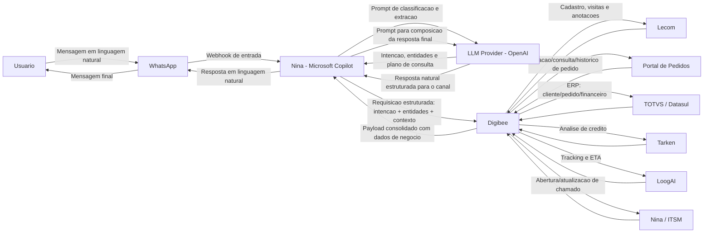
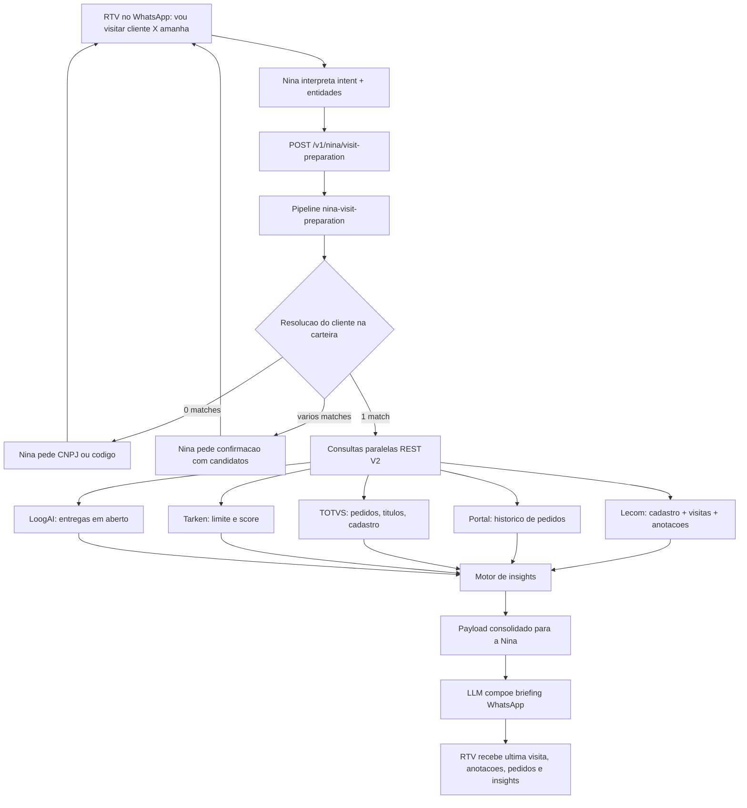

# Integracao Digibee com Sistemas Corporativos

TODOs:

- [ ] Adicionar fluxo de interação humana quando a nina não conseguir encontrar informações no sistema ou identificar algo de segurança(fallback)
- [ ] Adicionar fluxo de criação de tickets no ITSM no webhook de envio de mensagem, também adicionar um fluxo quando a nina responder essa mensagem(ou humano)
- [ ] (adicionar no roadmap) Adicionar na integração do portal de pedidos o fluxo o usuário vai fazer o upload de um pdf ou uma foto de pedido e já é criado automaticamente no sistema. adicionar fallbacks para arquivos inválidos ou corrompidos e imagens não nítidas. IA extrai informações identifica se já tem pedido criado ou não e confirma com o usuário a criação.
- [x] Adicionar fluxo de preparação para visita. RTV manda mensagem tipo "vou visitar cliente tal amanha". O sistema responde com data da ultima visita, anotacoes e registros anteriores, historico de pedidos e insights do cliente.
- [ ] Estudar riscos de integração entre esses sistemas
- [ ] Validar quem é o rtv com 3 primeiros dígitos do cpf
- [ ] Crira outro doc com os detalhes técnicos de integrações


Este documento descreve a arquitetura de integracao entre o **Digibee** e os sistemas:

- **WhatsApp** (canal de entrada do usuario)
- **Nina (Microsoft Copilot)** (bot com IA para interpretacao e orquestracao)
- **Lecom** (cadastro de clientes, registro de visitas comerciais e anotacoes)
- **Portal de Pedidos** (input, acompanhamento e historico de pedidos)
- **TOTVS / Datasul** (ERP Brasil)
- **Tarken** (solicitacao e analise de limite de credito)
- **LoogAI** (acompanhamento da data de entrega)
- **Nina / ITSM** (gestao de tickets e chamados)

## Principio arquitetural obrigatorio

**Toda requisicao de negocio deve passar pelo Digibee**, que e o hub oficial de integracao, governanca, seguranca, observabilidade e orquestracao.

### Documentacao oficial (Digibee)
- API Trigger (exposicao de pipelines via REST): https://docs.digibee.com/documentation/connectors-and-triggers/triggers/web-protocols/api
- REST V2 Connector (consumo de APIs externas): https://docs.digibee.com/documentation/connectors-and-triggers/connectors/web-protocols/rest-v2
- Consumers / API Keys e Basic Auth: https://docs.digibee.com/documentation/developer-guide/pt-br/platform-administration/settings/api-keys-consumers

---

## Fluxograma de Integracao (Mermaid)



---

## 1) WhatsApp - Canal Conversacional

### Modulos na arquitetura
- **Webhook de entrada** para receber mensagens do usuario.
- **Camada de entrega** para envio da resposta final.
- **Correlacao de conversa** para manter contexto por numero/sessao.

### APIs envolvidas
- API oficial do provedor WhatsApp (Cloud API/BSP).
- Endpoint de webhook exposto para Nina (ou middleware de canais).
- Endpoint de envio de mensagem para retorno ao usuario.

### Documentacao oficial
- WhatsApp Cloud API (visao geral): https://developers.facebook.com/docs/whatsapp/cloud-api/
- WhatsApp Messages API (envio de mensagens): https://developers.facebook.com/docs/whatsapp/cloud-api/reference/messages
- WhatsApp Service Messages (janela de atendimento e formato de payload): https://developers.facebook.com/docs/whatsapp/cloud-api/guides/send-messages/

### Autenticacao
- Token de acesso da API do provedor WhatsApp.
- Validacao de assinatura de webhook.
- TLS obrigatorio.

### Informacoes trafegadas
- Texto da mensagem do usuario.
- Metadados de conversa (numero, id da conversa, timestamp).
- Resposta final gerada pela Nina com dados consolidados do Digibee.

---

## 2) Nina (Microsoft Copilot) - Orquestracao com IA

### Modulos na arquitetura
- **NLU/LLM** para interpretar intencao e extrair entidades.
- **Planner de acoes** para decidir quais consultas executar.
- **Compositor de resposta** para gerar retorno em linguagem natural.
- **Guardrails** para mascarar dados sensiveis e aplicar politica de uso.

### APIs envolvidas
- Endpoint de inferencia da Nina/Copilot.
- API de inferencia da **OpenAI** como provider LLM (ex.: Responses API/Chat Completions).
- Endpoint de chamada para o Digibee (sincrono ou assincrono).
- Endpoint de callback para resposta consolidada, quando aplicavel.

### Documentacao oficial
- Microsoft Copilot Studio (documentacao principal): https://learn.microsoft.com/en-us/microsoft-copilot-studio/
- Copilot Studio - estrategias de integracao: https://learn.microsoft.com/en-us/microsoft-copilot-studio/guidance/integrations
- Copilot Studio - autenticacao: https://learn.microsoft.com/en-us/microsoft-copilot-studio/configuration-end-user-authentication
- Copilot Studio - entidades e slot filling: https://learn.microsoft.com/en-us/microsoft-copilot-studio/advanced-entities-slot-filling
- OpenAI API Reference (endpoint e schemas): https://developers.openai.com/api/reference/
- OpenAI Responses API (criacao de resposta): https://developers.openai.com/api/reference/resources/responses/methods/create/

### Autenticacao
- OAuth2/JWT entre Nina e servicos corporativos.
- Chave tecnica para chamadas ao Digibee.
- Controle de escopo por acao (consulta, atualizacao, abertura de chamado).

### Informacoes trafegadas
- Intencao detectada (ex.: "consultar pedido", "solicitar limite", "abrir chamado", "preparar visita").
- Entidades extraidas (CNPJ, numero do pedido, codigo/nome do cliente, data da visita, ticket).
- Resultado consolidado retornado pelo Digibee (incluindo briefing de visita e insights).
- Resposta textual final para o usuario no WhatsApp.

### Chamadas explicitas da Nina e fluxo de entrada/saida
1. **Entrada (WhatsApp -> Nina)**
   - `input_text`: mensagem em linguagem natural.
   - `channel_context`: telefone, sessao, timestamp, idioma.

2. **Nina -> LLM (OpenAI) - Interpretacao**
   - Envia prompt com contexto da conversa e politicas de seguranca.
   - Recebe `intent`, `entities`, `confidence` e `required_systems`.

3. **Nina -> Digibee - Orquestracao**
   - Envia payload estruturado com intencao e entidades.
   - Para briefing de visita, usa a **chamada dedicada** `POST /v1/nina/visit-preparation` (nao mistura com consulta pontual de pedido).
   - Recebe resposta consolidada com dados dos sistemas corporativos.

4. **Nina -> LLM (OpenAI) - Composicao da resposta**
   - Envia dados consolidados retornados pelo Digibee.
   - Recebe texto final, objetivo e adequado ao canal WhatsApp.

5. **Saida (Nina -> WhatsApp -> Usuario)**
   - Mensagem final com resposta de negocio e orientacoes de proximo passo.

---

## 3) Lecom - Cadastro de Clientes e Registro de Visitas

### Modulos no Digibee
- **Pipeline de Cadastro de Clientes**.
- **Pipeline de Visitas Comerciais** (processo Lecom de registro de visita, usado no briefing do RTV).
- Transformacao de payload (normalizacao de CPF/CNPJ, endereco, contatos).
- Validacoes de consistencia cadastral e duplicidade.
- Consulta de instancias do processo de visita por cliente (data, anotacoes, anexos).

### APIs envolvidas
- Lecom API para criacao/atualizacao de cadastro.
- Consulta de instancias e dados de atividade do processo de visita comercial.
- Conectores HTTP/API do Digibee (REST V2).
- Sincronizacao complementar com TOTVS/Datasul.

### Documentacao oficial
- Lecom Open API - introducao: https://lecomsa.readme.io/reference/getting-started-with-your-api
- Lecom Open API v6: https://lecomsa.readme.io/v6.0/reference/getting-started-with-your-api
- Consultar dados da atividade (anotacoes da visita): https://lecomsa.readme.io/v6.0/reference/getprocessbusinessdata-v2
- Obter informacoes gerais do processo: https://lecomsa.readme.io/v6.0/reference/getprocessinstance-v4
- Obter atividades do processo: https://lecomsa.readme.io/v6.0/reference/getactivityinstances-v5

### Autenticacao
- OAuth2 Client Credentials (preferencial).
- API Key quando necessario.
- TLS ponta a ponta.

### Informacoes trafegadas
- Dados cadastrais e fiscais.
- Enderecos, contatos e parametros comerciais.
- Historico de visitas: data, RTV responsavel, motivo, anotacoes, compromissos e anexos (ECM/dossie).
- Status de integracao e protocolo de processamento.

---

## 4) Portal de Pedidos - Input e Acompanhamento

> Observacao: como o Portal de Pedidos e uma ferramenta interna com documentacao limitada, foi adotado um padrao de integracao REST/JSON.

### Modulos no Digibee
- **Pipeline de Entrada de Pedidos**.
- Validacao comercial/fiscal.
- Orquestracao com ERP, credito e logistica.

### APIs envolvidas
- Endpoint de criacao/alteracao de pedido.
- Endpoint de consulta de status de pedido.
- Endpoint de historico de pedidos por cliente (ultimos N, periodo e status).
- Integracao com TOTVS, Tarken e LoogAI para enriquecimento.

### Autenticacao
- JWT corporativo ou OAuth2.
- mTLS opcional para trafego interno.
- Rate limit por consumidor.

### Informacoes trafegadas
- Cabecalho do pedido e itens.
- Condicao comercial, impostos e descontos.
- Status operacional, financeiro e logistico.
- Historico consolidado por cliente (data, valor, mix, status) para o briefing de visita.

---

## 5) TOTVS / Datasul - ERP Brasil

### Modulos no Digibee
- **Pipeline ERP Core**.
- Conector ERP para clientes, pedidos e faturamento.
- Retentativas, fila de reprocesso e rastreabilidade.

### APIs envolvidas
- Servicos de cadastro de clientes.
- Servicos de pedido de venda e faturamento.
- Servicos de consulta financeira (titulos, saldo, bloqueios).
- Consulta de historico de pedidos do cliente para o briefing de visita.

### Documentacao oficial
- TOTVS Developers - API Reference: https://api.totvs.com.br/referencelist
- TOTVS Datasul - desenvolvimento de APIs (TDN): https://tdn.totvs.com/display/public/LDT/Desenvolvimento+de+APIs+para+o+produto+Datasul
- TOTVS Central - guia de integracao REST no Datasul: https://centraldeatendimento.totvs.com/hc/pt-br/articles/16461753523863-Framework-Linha-Datasul-FRW-Documenta%C3%A7%C3%A3o-para-Integra%C3%A7%C3%A3o-e-utiliza%C3%A7%C3%A3o-de-APIs-REST

### Autenticacao
- Token de aplicacao, usuario tecnico ou gateway interno.
- HTTPS/TLS obrigatorio.
- Correlation/request-id para auditoria.

### Informacoes trafegadas
- Cadastro mestre de clientes.
- Status de pedido (digitado, liberado, faturado, cancelado).
- Titulos, saldo e bloqueios financeiros.
- Serie historica de pedidos e indicadores comerciais usados nos insights do RTV.

---

## 6) Tarken - Solicitacao e Analise de Limite de Credito

### Modulos no Digibee
- **Pipeline de Credito**.
- Montagem de dossie de analise.
- Fallback para analise manual em contingencia.

### APIs envolvidas
- API de solicitacao de analise de credito.
- API de consulta de resultado.
- API de revalidacao de limite.

### Autenticacao
- OAuth2 Client Credentials ou API Key assinada.
- TLS e mascaramento de dados sensiveis em logs.
- Timeout/circuit breaker para resiliencia.

### Informacoes trafegadas
- Documentos e identificacao do cliente.
- Valor solicitado, prazo e risco.
- Score, limite aprovado, validade e justificativa.
- Utilizacao do limite usada nos insights de preparacao de visita.

---

## 7) LoogAI - Acompanhamento da Data de Entrega

### Modulos no Digibee
- **Pipeline Logistico**.
- Consulta de tracking por pedido/NF.
- Normalizacao de eventos e ETA.

### APIs envolvidas
- API de tracking logistico.
- API/eventos de entrega (coletado, em transito, entregue, ocorrencia).
- Webhook de atualizacao de ETA (quando disponivel).

### Autenticacao
- Token de API com renovacao periodica.
- Validacao de assinatura de webhook.
- TLS obrigatorio.

### Informacoes trafegadas
- Status atual de entrega e historico de eventos.
- Data prevista de entrega (ETA).
- Ocorrencias e justificativas de atraso.
- Entregas em aberto do cliente, usadas nos insights de visita.

---

## 8) Nina / ITSM - Gestao de Tickets e Chamados

### Modulos no Digibee
- **Pipeline de Suporte ITSM**.
- Roteamento por tipo de incidente.
- Enriquecimento com dados de pedido, credito e logistica.

### APIs envolvidas
- ITSM REST API para abertura/atualizacao/encerramento.
- Webhooks para notificacoes de mudanca de status.
- Endpoint de diagnostico de integracoes.

### Autenticacao
- Bearer Token (OAuth2/JWT).
- Chave tecnica para webhooks.
- Escopos por perfil de operacao.

### Informacoes trafegadas
- ID do ticket, categoria, prioridade, SLA, responsavel.
- Evidencias tecnicas do erro e contexto de negocio.
- Historico de tratativas e status.

---

## 9) Preparacao de Visita Comercial (briefing do RTV)

Quando o RTV envia no WhatsApp uma mensagem como **"vou visitar cliente tal amanha"**, a Nina identifica a intencao `visit_preparation` e dispara uma **chamada dedicada** ao Digibee. O Digibee monta o briefing do cliente e devolve, em um unico payload:

1. **Data da ultima visita** (e intervalo desde a ultima).
2. **Anotacoes e registros anteriores** (processo Lecom de visita comercial, incluindo compromissos em aberto).
3. **Historico de pedidos** (Portal de Pedidos + TOTVS/Datasul).
4. **Insights do cliente** para o RTV (regras deterministicas no Digibee + narrativa pela LLM).

A Nina **nao consulta Lecom, Portal, TOTVS, Tarken ou LoogAI diretamente**. Toda orquestracao passa pelo Digibee.

### Quando acionar

| Sinal na mensagem | Exemplo | Acao da Nina |
|---|---|---|
| Intencao de visita futura | "vou visitar o cliente Acme amanha" | Extrai cliente + data e chama `prepare_customer_visit` |
| Pedido explicito de briefing | "me prepara a visita da Padaria Central" | Idem; se a data nao vier, assume o proximo dia util |
| Cliente ambiguo | "vou na Silva amanha" (varios matches) | Digibee devolve `AMBIGUOUS_CUSTOMER`; Nina pede confirmacao com quick replies |
| Cliente fora da carteira | Documento/codigo de outro RTV | Digibee nao devolve o briefing; Nina aplica guardrail de carteira |

Frases-gatilho (topic Copilot Studio / LLM): "vou visitar", "visito amanha", "preparar visita", "briefing do cliente", "antes da visita", "amanha estou no cliente".

### Chamada especifica da Nina

```
POST /v1/nina/visit-preparation
pipeline: nina-visit-preparation
action: prepare_customer_visit
```

Essa chamada e exclusiva do briefing. Nao deve ser embutida em `query_order_credit_delivery` nem em abertura de chamado.

| Campo | Descricao |
|---|---|
| `customer` | Identificacao extraida: nome livre, codigo ERP, CNPJ/CPF |
| `visitDate` | Data resolvida (`value`) e texto original (`literal`, ex.: "amanha") |
| `rtv` | Identidade da sessao WhatsApp (telefone, `rtvId` quando houver) |
| `briefingScope` | O que incluir: `lastVisit`, `notes`, `orderHistory`, `insights` (default: todos) |
| `orderHistoryWindow` | Janela do historico (default: 12 meses / ultimos 10 pedidos) |

A entidade de data segue o padrao Copilot Studio (Date and time): `visitDate.literal = "amanha"` e `visitDate.value = 2026-09-10`. Ver: https://learn.microsoft.com/en-us/microsoft-copilot-studio/advanced-entities-slot-filling

### Modulos no Digibee
- **Pipeline `nina-visit-preparation`** (API Trigger dedicado).
- Resolucao do cliente (Lecom + TOTVS) com filtro de carteira do RTV.
- Consulta paralela (Block Execution + REST V2) de visitas, pedidos, credito e logistica.
- Motor de insights deterministicos (`insights[]` com evidencias).
- Consolidacao canonica para a Nina, com `integrationStatus` parcial quando um sistema falhar.
- Cache curto do briefing (TTL) para o mesmo `rtvId` + cliente + data da visita.

### APIs envolvidas
- API Trigger Digibee: `POST /v1/nina/visit-preparation`.
- Lecom - cadastro do cliente e processo de visita comercial:
  - Obter informacoes gerais do processo: https://lecomsa.readme.io/v6.0/reference/getprocessinstance-v4
  - Obter atividades do processo: https://lecomsa.readme.io/v6.0/reference/getactivityinstances-v5
  - Consultar dados da atividade (anotacoes/campos): https://lecomsa.readme.io/v6.0/reference/getprocessbusinessdata-v2
  - Consultar dados em grid (itens da visita): https://lecomsa.readme.io/v6.0/reference/getprocessbusinessdatagrid-v3
  - Listar dossies/anexos: https://lecomsa.readme.io/v6.0/reference/getdossies-v1
- Portal de Pedidos - historico por cliente (REST interno).
- TOTVS/Datasul - pedidos de venda, faturamento e titulos do cliente: https://api.totvs.com.br/referencelist
- Tarken - limite, utilizacao e score (enriquecimento dos insights).
- LoogAI - entregas em aberto e atrasos (enriquecimento dos insights).
- REST V2 Digibee: https://docs.digibee.com/documentation/connectors-and-triggers/connectors/web-protocols/rest-v2

### Documentacao oficial
- Copilot Studio - entidades e slot filling (data relativa como "amanha"): https://learn.microsoft.com/en-us/microsoft-copilot-studio/advanced-entities-slot-filling
- Copilot Studio - boas praticas de slot filling: https://learn.microsoft.com/en-us/microsoft-copilot-studio/guidance/slot-filling-best-practices
- Copilot Studio - language understanding: https://learn.microsoft.com/en-us/microsoft-copilot-studio/guidance/language-understanding
- Copilot Studio - estrategias de integracao: https://learn.microsoft.com/en-us/microsoft-copilot-studio/guidance/integrations
- Digibee API Trigger: https://docs.digibee.com/documentation/connectors-and-triggers/triggers/web-protocols/api
- Lecom Open API v6: https://lecomsa.readme.io/v6.0/reference/getting-started-with-your-api

### Autenticacao
- OAuth2/JWT da Nina para o API Trigger `nina-visit-preparation` (escopo `prepare_customer_visit`).
- OAuth2 Client Credentials / API Key Lecom no REST V2.
- Token de aplicacao TOTVS, JWT do Portal, OAuth2 Tarken e token LoogAI.
- TLS obrigatorio. Briefing restrito a carteira do RTV autenticado na sessao.

### Informacoes trafegadas
- Identificacao do cliente e do RTV.
- Data prevista da visita e data da ultima visita.
- Anotacoes, compromissos e registros anteriores.
- Historico de pedidos (cabecalho, valor, status, principais itens).
- Insights com tipo, severidade, evidencia e acao sugerida.
- `integrationStatus` (sucesso total/parcial e avisos).

### Fontes de dado por bloco do briefing

| Bloco devolvido ao RTV | Sistema de origem | O que o Digibee busca |
|---|---|---|
| Cliente (nome, codigo, CNPJ, status) | Lecom + TOTVS | Cadastro mestre e status comercial |
| Ultima visita | Lecom (processo de visita comercial) | Data, RTV, motivo, resultado |
| Anotacoes e registros | Lecom (campos da atividade + grid + dossie) | Texto livre, pendencias, anexos |
| Historico de pedidos | Portal de Pedidos + TOTVS | Ultimos pedidos, valor, status, mix |
| Situacao financeira | TOTVS (titulos) + Tarken | Vencidos, limite, utilizacao |
| Entregas em aberto | LoogAI | ETA, atraso, ocorrencias |
| Insights | Motor no Digibee | Regras sobre os dados acima; a LLM so narra, nao inventa |

Se um sistema estiver indisponivel, o Digibee **nao aborta** o briefing: devolve o que tiver, marca `integrationStatus.overall = PARTIAL` e gera um insight `DADO_INCOMPLETO`.

### Motor de insights (obrigatorio no retorno)

Os insights sao **calculados no Digibee** a partir de evidencias. A LLM da Nina so formata o texto para o WhatsApp; nao cria insight sem `evidence`.

| Codigo | Tipo | Quando dispara | Acao sugerida ao RTV |
|---|---|---|---|
| `QUEDA_VOLUME` | `RISCO` | Faturamento dos ultimos 90 dias caiu vs. os 90 anteriores (ex.: >= 20%) | Investigar perda de mix ou concorrencia |
| `CLIENTE_INATIVO` | `RISCO` | Sem pedido no ciclo habitual (ex.: > 45 dias) | Levar oferta de reposicao |
| `TITULOS_VENCIDOS` | `RISCO` | Titulos em atraso no ERP | Alinhar cobranca antes de negociar volume |
| `CREDITO_APERTO` | `RISCO` | Utilizacao do limite Tarken >= 80% | Evitar ampliar prazo; checar analise |
| `COMPROMISSO_ABERTO` | `RELACIONAMENTO` | Ultima visita deixou pendencia nao cumprida | Retomar o compromisso na abertura da visita |
| `VISITA_ATRASADA` | `RELACIONAMENTO` | Intervalo desde a ultima visita acima da cadencia da carteira | Priorizar relacionamento, nao so pedido |
| `MIX_ESTREITO` | `OPORTUNIDADE` | Concentracao alta em poucos SKUs | Levar cross-sell dos itens sumidos |
| `CICLO_REPOSICAO` | `OPORTUNIDADE` | Proximo pedido esperado pela media de intervalo | Levar tabela e disponibilidade |
| `PEDIDO_EM_ATRASO` | `LOGISTICA` | Entrega LoogAI atrasada ou com ocorrencia | Tratar reclamacao antes da venda |
| `LIMITE_FOLGA` | `OPORTUNIDADE` | Limite disponivel e curva de compra crescente | Negociar incremento de volume |

Cada insight no payload tem `code`, `type`, `severity` (`LOW`/`MEDIUM`/`HIGH`), `title`, `summary`, `evidence` e `suggestedAction`.

### Fluxo da preparacao de visita



### Contrato da chamada dedicada (Nina -> Digibee)

```http
POST /v1/nina/visit-preparation
Content-Type: application/json
Authorization: Bearer {nina-jwt}
X-Correlation-Id: corr-20260909-0040
```

```json
{
  "pipeline": "nina-visit-preparation",
  "action": "prepare_customer_visit",
  "correlationId": "corr-20260909-0040",
  "channel": "whatsapp",
  "locale": "pt-BR",
  "rtv": {
    "userId": "5511999999999",
    "rtvId": "RTV-104",
    "sessionId": "sess-4410"
  },
  "customer": {
    "query": "Acme Alimentos",
    "customerCode": null,
    "document": null
  },
  "visitDate": {
    "literal": "amanha",
    "value": "2026-09-10"
  },
  "briefingScope": [
    "lastVisit",
    "notes",
    "orderHistory",
    "insights"
  ],
  "orderHistoryWindow": {
    "months": 12,
    "maxOrders": 10
  }
}
```

### Resposta do Digibee para a Nina (briefing consolidado)

```json
{
  "correlationId": "corr-20260909-0040",
  "channel": "whatsapp",
  "assistant": "nina-copilot",
  "action": "prepare_customer_visit",
  "visitaPrevista": {
    "data": "2026-09-10",
    "literalUsuario": "amanha"
  },
  "cliente": {
    "idErp": "CLI12345",
    "idLecom": "LC-8891",
    "razaoSocial": "Acme Alimentos Ltda",
    "nomeFantasia": "Acme Alimentos",
    "cnpj": "00.000.000/0001-00",
    "statusCadastro": "ATIVO",
    "cidade": "Campinas",
    "uf": "SP",
    "rtvCarteira": "RTV-104"
  },
  "ultimaVisita": {
    "data": "2026-08-12",
    "diasDesdeUltima": 28,
    "rtv": "RTV-104",
    "processoLecom": "VIS-2026-0812-009",
    "motivo": "REPOSICAO",
    "resultado": "PEDIDO_PARCIAL",
    "fonte": "lecom"
  },
  "anotacoesRegistros": [
    {
      "data": "2026-08-12",
      "tipo": "VISITA",
      "autor": "RTV-104",
      "texto": "Comprador pediu tabela nova do mix de frios. Reclama atraso do pedido 12090. Retomar amostra do item 554.",
      "compromissosAbertos": [
        "Enviar tabela atualizada de frios",
        "Levar amostra item 554"
      ],
      "anexos": [
        {
          "dossieId": "DOS-441",
          "nome": "relatorio-visita-2026-08-12.pdf"
        }
      ]
    },
    {
      "data": "2026-07-03",
      "tipo": "VISITA",
      "autor": "RTV-104",
      "texto": "Cliente testando concorrente na linha de conservas. Manter preco da ultima negociacao.",
      "compromissosAbertos": [],
      "anexos": []
    }
  ],
  "historicoPedidos": {
    "janelaMeses": 12,
    "quantidade": 8,
    "valorTotal": 184320.4,
    "ticketMedio": 23040.05,
    "ultimoPedidoEm": "2026-08-28",
    "itens": [
      {
        "numero": "12880",
        "data": "2026-08-28",
        "valorTotal": 15230.55,
        "statusErp": "FATURADO",
        "statusPortal": "ENTREGUE",
        "principaisItens": ["Frios linha A", "Conserva 500g"]
      },
      {
        "numero": "12090",
        "data": "2026-07-15",
        "valorTotal": 9800.0,
        "statusErp": "FATURADO",
        "statusPortal": "ENTREGUE_COM_ATRASO",
        "principaisItens": ["Conserva 500g"]
      }
    ]
  },
  "credito": {
    "provedor": "Tarken",
    "status": "APROVADO",
    "limiteAprovado": 50000.0,
    "limiteUtilizado": 41200.0,
    "score": 782
  },
  "logistica": {
    "provedor": "LoogAI",
    "entregasEmAberto": [
      {
        "pedido": "12880",
        "statusEntrega": "ENTREGUE",
        "previsaoEntrega": "2026-09-02"
      }
    ]
  },
  "insights": [
    {
      "code": "COMPROMISSO_ABERTO",
      "type": "RELACIONAMENTO",
      "severity": "HIGH",
      "title": "Pendencias da ultima visita",
      "summary": "Tabela de frios e amostra do item 554 ainda nao foram entregues.",
      "evidence": {
        "fonte": "lecom",
        "visita": "2026-08-12",
        "compromissos": ["Enviar tabela atualizada de frios", "Levar amostra item 554"]
      },
      "suggestedAction": "Abrir a visita retomando os dois compromissos."
    },
    {
      "code": "CREDITO_APERTO",
      "type": "RISCO",
      "severity": "MEDIUM",
      "title": "Limite de credito pressionado",
      "summary": "Utilizacao de 82% do limite Tarken (R$ 41.200 de R$ 50.000).",
      "evidence": {
        "fonte": "tarken",
        "limiteAprovado": 50000.0,
        "limiteUtilizado": 41200.0
      },
      "suggestedAction": "Evitar alongar prazo; negociar volume dentro do limite disponivel."
    },
    {
      "code": "MIX_ESTREITO",
      "type": "OPORTUNIDADE",
      "severity": "MEDIUM",
      "title": "Mix concentrado",
      "summary": "Pedidos recentes concentrados em frios e conserva; linha de secos sem compra ha 4 meses.",
      "evidence": {
        "fonte": "portal_pedidos",
        "categoriasRecentes": ["Frios linha A", "Conserva 500g"],
        "categoriasAusentes": ["Secos"]
      },
      "suggestedAction": "Levar proposta da linha de secos com base na ultima negociacao de julho."
    }
  ],
  "integrationStatus": {
    "overall": "SUCCESS",
    "warnings": []
  }
}
```

Quando o cliente nao for unico, o Digibee devolve `AMBIGUOUS_CUSTOMER` e a Nina pede confirmacao:

```json
{
  "correlationId": "corr-20260909-0041",
  "action": "prepare_customer_visit",
  "integrationStatus": {
    "overall": "AMBIGUOUS_CUSTOMER",
    "warnings": ["Mais de um cliente corresponde a 'Silva' na carteira do RTV"]
  },
  "candidatos": [
    { "idErp": "CLI1001", "nomeFantasia": "Silva Atacado", "cidade": "Campinas" },
    { "idErp": "CLI2044", "nomeFantasia": "Padaria Silva", "cidade": "Jundiai" }
  ]
}
```

Apos a confirmacao, a Nina chama de novo o mesmo endpoint com `customer.customerCode` (ex.: `CLI1001`). Se nao houver match, `integrationStatus.overall = CUSTOMER_NOT_FOUND` e a Nina pede CNPJ ou codigo. Se o cliente existir mas estiver fora da carteira do RTV, `overall = OUT_OF_PORTFOLIO` e o briefing **nao** e devolvido.

### Composicao da mensagem no WhatsApp

A LLM recebe o payload acima e gera texto curto, escaneavel no celular, nesta ordem:

1. Cabecalho (cliente + data da visita prevista).
2. Ultima visita (data e ha quantos dias).
3. Anotacoes / compromissos em aberto.
4. Historico recente de pedidos (3 a 5 linhas).
5. Insights (bullets com acao).

A LLM **nao omite** insights com `severity = HIGH` e **nao inventa** pedido, visita ou pendencia ausente do payload.

---

## Fluxo Conversacional com IA (WhatsApp + Nina + Digibee)

1. **Usuario envia mensagem em linguagem natural no WhatsApp**  
   Exemplo: "Qual a previsao de entrega do pedido 12345 e meu limite de credito?"  
   Exemplo (RTV): "Vou visitar o cliente Acme Alimentos amanha"

2. **Nina (Copilot) chama a LLM (OpenAI) para interpretar a mensagem**  
   Extrai intencao, entidades (pedido, cliente, cnpj, data da visita, etc.) e quais sistemas consultar.

3. **Nina chama o Digibee como camada unica de integracao**  
   Envia uma requisicao estruturada com os dados de entrada e nao consulta sistemas diretamente.  
   - Consulta pontual de pedido/credito/entrega: pipeline `nina-whatsapp-orchestrator`.  
   - Briefing de visita: chamada dedicada `POST /v1/nina/visit-preparation`.

4. **Digibee orquestra as chamadas necessarias**  
   - TOTVS/Datasul para status ERP/pedido e historico comercial  
   - Tarken para limite de credito  
   - LoogAI para previsao de entrega  
   - Lecom para dados cadastrais e registros de visita  
   - Portal de Pedidos para historico de pedidos  
   - ITSM para abertura/consulta de chamado (se solicitado)

5. **Digibee consolida os resultados**  
   Normaliza campos, trata erros e devolve payload canonico para Nina. No briefing de visita, inclui `ultimaVisita`, `anotacoesRegistros`, `historicoPedidos` e `insights`.

6. **Nina chama novamente a LLM (OpenAI) para compor a resposta final**  
   Usa o payload consolidado do Digibee para gerar texto claro e contextualizado. No briefing, a LLM so narra insights ja calculados pelo Digibee.

7. **WhatsApp entrega a resposta ao usuario**  
   Inclui, quando necessario, instrucoes de proximo passo (confirmar cliente ambiguo, levar amostra, tratar titulo vencido).

---

## Exemplos de Payload (Nina <-> LLM)

### 1) Nina -> LLM (OpenAI) - Interpretacao da mensagem

```json
{
  "provider": "openai",
  "operation": "intent_and_entity_extraction",
  "correlationId": "corr-20260907-0001",
  "channel": "whatsapp",
  "locale": "pt-BR",
  "input": {
    "userId": "5511999999999",
    "messageId": "wamid.HBgL...",
    "text": "Qual a previsao de entrega do pedido 12345 e meu limite de credito?"
  },
  "context": {
    "conversationState": {
      "lastIntent": "order_tracking",
      "openTicket": false
    },
    "allowedIntents": [
      "order_status",
      "delivery_eta",
      "credit_limit",
      "customer_registration",
      "open_ticket",
      "visit_preparation"
    ]
  },
  "responseFormat": {
    "type": "json_schema",
    "schemaName": "nina_intent_v1"
  }
}
```

### 2) LLM -> Nina - Resultado da interpretacao

```json
{
  "correlationId": "corr-20260907-0001",
  "intent": "delivery_eta_and_credit_limit",
  "confidence": 0.96,
  "entities": {
    "orderNumber": "12345",
    "customerDocument": null,
    "requestedTopics": [
      "delivery_eta",
      "credit_limit"
    ]
  },
  "requiredSystems": [
    "totvs_datasul",
    "tarken",
    "loogai"
  ],
  "digibeeRequest": {
    "pipeline": "nina-whatsapp-orchestrator",
    "action": "query_order_credit_delivery",
    "input": {
      "orderNumber": "12345"
    }
  }
}
```

### 3) Nina -> LLM (OpenAI) - Composicao da resposta final

```json
{
  "provider": "openai",
  "operation": "response_composition",
  "correlationId": "corr-20260907-0001",
  "channel": "whatsapp",
  "instructions": {
    "tone": "profissional e objetivo",
    "maxLength": 500,
    "maskSensitiveData": true
  },
  "digibeeOutput": {
    "pedido": {
      "numero": "12345",
      "statusErp": "LIBERADO"
    },
    "credito": {
      "status": "APROVADO",
      "limiteAprovado": 50000.0
    },
    "logistica": {
      "statusEntrega": "EM_TRANSITO",
      "previsaoEntrega": "2026-09-10"
    }
  },
  "responseFormat": {
    "type": "json_schema",
    "schemaName": "nina_outbound_message_v1"
  }
}
```

### 4) LLM -> Nina - Mensagem final estruturada para envio no WhatsApp

```json
{
  "correlationId": "corr-20260907-0001",
  "message": {
    "text": "Pedido 12345 esta liberado no ERP. Seu limite de credito foi aprovado em R$ 50.000,00. A entrega esta em transito com previsao para 10/09/2026.",
    "quickReplies": [
      "Ver detalhes do pedido",
      "Abrir chamado"
    ]
  },
  "metadata": {
    "usedSources": [
      "totvs_datasul",
      "tarken",
      "loogai"
    ],
    "containsSensitiveData": false
  }
}
```

### 5) Nina -> LLM (OpenAI) - Interpretacao de preparacao de visita

```json
{
  "provider": "openai",
  "operation": "intent_and_entity_extraction",
  "correlationId": "corr-20260909-0040",
  "channel": "whatsapp",
  "locale": "pt-BR",
  "input": {
    "userId": "5511999999999",
    "messageId": "wamid.HBgL...",
    "text": "Vou visitar o cliente Acme Alimentos amanha"
  },
  "context": {
    "conversationState": {
      "lastIntent": null,
      "openTicket": false,
      "rtvId": "RTV-104"
    },
    "allowedIntents": [
      "order_status",
      "delivery_eta",
      "credit_limit",
      "customer_registration",
      "open_ticket",
      "visit_preparation"
    ]
  },
  "responseFormat": {
    "type": "json_schema",
    "schemaName": "nina_intent_v1"
  }
}
```

### 6) LLM -> Nina - Resultado da interpretacao (visita)

```json
{
  "correlationId": "corr-20260909-0040",
  "intent": "visit_preparation",
  "confidence": 0.97,
  "entities": {
    "customerQuery": "Acme Alimentos",
    "customerDocument": null,
    "visitDate": {
      "literal": "amanha",
      "value": "2026-09-10"
    }
  },
  "requiredSystems": [
    "lecom",
    "portal_pedidos",
    "totvs_datasul",
    "tarken",
    "loogai"
  ],
  "digibeeRequest": {
    "pipeline": "nina-visit-preparation",
    "action": "prepare_customer_visit",
    "input": {
      "customerQuery": "Acme Alimentos",
      "visitDate": "2026-09-10"
    }
  }
}
```

### 7) Nina -> LLM (OpenAI) - Composicao do briefing de visita

```json
{
  "provider": "openai",
  "operation": "response_composition",
  "correlationId": "corr-20260909-0040",
  "channel": "whatsapp",
  "instructions": {
    "tone": "objetivo, para RTV em campo",
    "maxLength": 900,
    "maskSensitiveData": true,
    "mustInclude": [
      "ultima visita",
      "anotacoes e compromissos",
      "historico de pedidos",
      "insights com acao sugerida"
    ],
    "doNotInventInsights": true
  },
  "digibeeOutput": {
    "visitaPrevista": { "data": "2026-09-10" },
    "cliente": { "nomeFantasia": "Acme Alimentos", "idErp": "CLI12345" },
    "ultimaVisita": { "data": "2026-08-12", "diasDesdeUltima": 28 },
    "historicoPedidos": { "ultimoPedidoEm": "2026-08-28", "ticketMedio": 23040.05 },
    "insights": [
      { "code": "COMPROMISSO_ABERTO", "severity": "HIGH" },
      { "code": "CREDITO_APERTO", "severity": "MEDIUM" }
    ]
  },
  "responseFormat": {
    "type": "json_schema",
    "schemaName": "nina_outbound_message_v1"
  }
}
```

### 8) LLM -> Nina - Briefing pronto para o WhatsApp

```json
{
  "correlationId": "corr-20260909-0040",
  "message": {
    "text": "Preparacao da visita — Acme Alimentos (CLI12345)\nQuando: amanha, 10/09/2026\n\nUltima visita: 12/08/2026 (ha 28 dias). Resultado: pedido parcial.\nAnotacoes: comprador pediu tabela nova de frios e reclamou atraso do pedido 12090. Compromissos em aberto: enviar tabela de frios e levar amostra do item 554.\n\nPedidos recentes:\n- 12880 | 28/08 | R$ 15.230 | faturado/entregue\n- 12090 | 15/07 | R$ 9.800 | entregue com atraso\nTicket medio (12 meses): R$ 23.040\n\nInsights:\n- Retomar na abertura os 2 compromissos da ultima visita.\n- Limite Tarken em 82% — nao alongar prazo.\n- Mix concentrado em frios/conserva; levar proposta da linha de secos.",
    "quickReplies": [
      "Ver mais pedidos",
      "Detalhe do credito",
      "Registrar esta visita"
    ]
  },
  "metadata": {
    "usedSources": [
      "lecom",
      "portal_pedidos",
      "totvs_datasul",
      "tarken",
      "loogai"
    ],
    "containsSensitiveData": false,
    "insightCodes": [
      "COMPROMISSO_ABERTO",
      "CREDITO_APERTO",
      "MIX_ESTREITO"
    ]
  }
}
```

---

## Compilado Final - Como o Digibee Retorna as Informacoes

O Digibee recebe a solicitacao da Nina, executa integracoes com os sistemas necessarios e devolve um **objeto consolidado** para a Nina. Esse retorno pode conter:

- `cliente`: dados cadastrais e status no ERP.
- `pedido`: status comercial e financeiro.
- `credito`: score e limite aprovado na Tarken.
- `logistica`: status de transporte e ETA da LoogAI.
- `suporte`: ticket ITSM relacionado, quando houver.
- `ultimaVisita`, `anotacoesRegistros`, `historicoPedidos` e `insights`: briefing de preparacao de visita do RTV.
- `integrationStatus`: sucesso parcial/total e mensagens de erro tratadas.

A Nina usa esse objeto para produzir a resposta em linguagem natural no WhatsApp, mantendo a experiencia conversacional, sem expor complexidade tecnica ao usuario final. No briefing de visita, a Nina **nao inventa** insights: so narra os itens ja calculados pelo Digibee.

### Exemplo de payload consolidado (referencial)

```json
{
  "correlationId": "f0d6a3f3-66f8-4e14-bdf5-0ccdb7dbd77e",
  "channel": "whatsapp",
  "assistant": "nina-copilot",
  "cliente": {
    "idErp": "CLI12345",
    "cnpj": "00.000.000/0001-00",
    "statusCadastro": "ATIVO"
  },
  "pedido": {
    "numero": "12345",
    "statusErp": "LIBERADO",
    "valorTotal": 15230.55
  },
  "credito": {
    "provedor": "Tarken",
    "status": "APROVADO",
    "limiteAprovado": 50000.0,
    "score": 782
  },
  "logistica": {
    "provedor": "LoogAI",
    "statusEntrega": "EM_TRANSITO",
    "previsaoEntrega": "2026-09-10"
  },
  "suporte": {
    "ticketId": "INC-88421",
    "status": "EM_ANDAMENTO"
  },
  "integrationStatus": {
    "overall": "SUCCESS",
    "warnings": []
  }
}
```

### Exemplo de payload consolidado de preparacao de visita (resumo)

O contrato completo esta na secao 9. O retorno minimo esperado pelo compositor da Nina:

```json
{
  "correlationId": "corr-20260909-0040",
  "action": "prepare_customer_visit",
  "cliente": {
    "idErp": "CLI12345",
    "nomeFantasia": "Acme Alimentos"
  },
  "ultimaVisita": {
    "data": "2026-08-12",
    "diasDesdeUltima": 28
  },
  "anotacoesRegistros": [
    {
      "data": "2026-08-12",
      "texto": "Retomar amostra do item 554 e enviar tabela de frios."
    }
  ],
  "historicoPedidos": {
    "ultimoPedidoEm": "2026-08-28",
    "ticketMedio": 23040.05
  },
  "insights": [
    {
      "code": "COMPROMISSO_ABERTO",
      "type": "RELACIONAMENTO",
      "severity": "HIGH",
      "suggestedAction": "Abrir a visita retomando os compromissos."
    }
  ],
  "integrationStatus": {
    "overall": "SUCCESS",
    "warnings": []
  }
}
```
