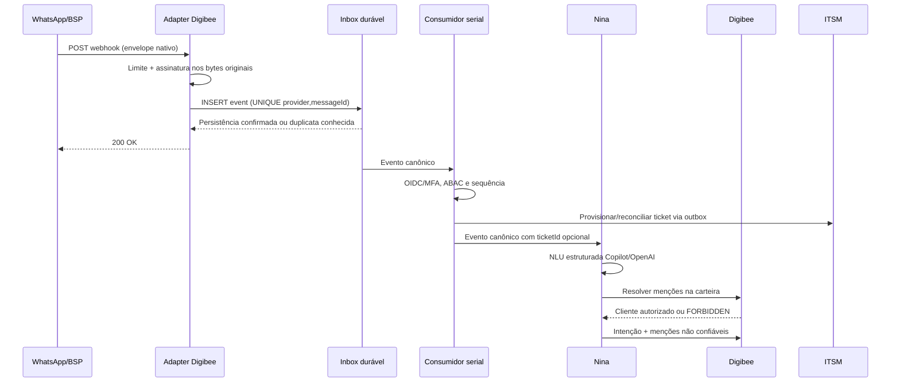
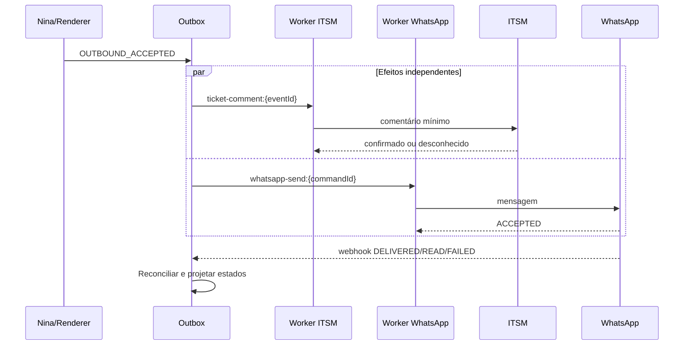
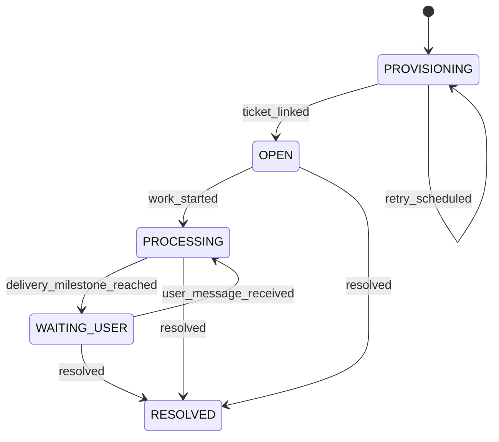
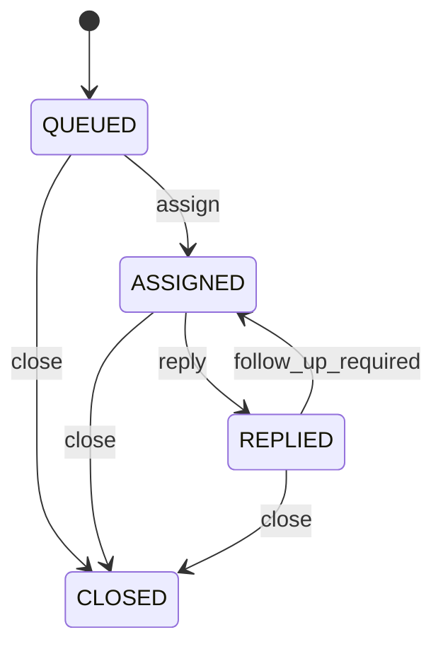
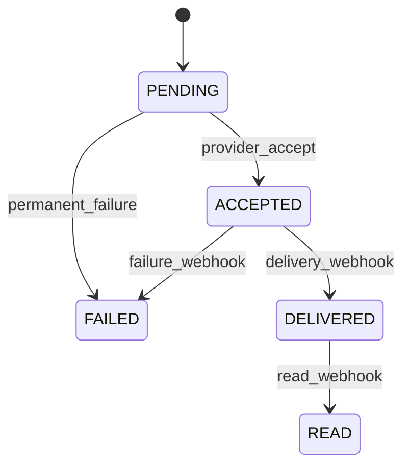

# Integração Digibee, Nina e Sistemas Corporativos

Este documento define a arquitetura de referência para o atendimento de RTVs pelo WhatsApp. O Digibee é o hub obrigatório de integração; a Nina interpreta solicitações e compõe respostas; Lecom, Portal de Pedidos, TOTVS/Datasul, Tarken, LoogAI e ITSM são acessados somente por contratos controlados.

Documentos complementares:

- [`docs/detalhes-tecnicos-integracoes.md`](docs/detalhes-tecnicos-integracoes.md): contratos, estados, idempotência e operação;
- [`docs/riscos-integracao.md`](docs/riscos-integracao.md): riscos, controles e critérios de produção;
- [`docs/validacao-rtv-cpf.md`](docs/validacao-rtv-cpf.md): autenticação corporativa, vínculo do RTV e uso restrito do CPF;
- [`docs/interpretacao-nina.md`](docs/interpretacao-nina.md): NLU de catálogo fechado, provedores Copilot/OpenAI e resolução na carteira;
- [`docs/plano-implementacao-interpretacao-nina.md`](docs/plano-implementacao-interpretacao-nina.md): fases para tornar a interpretação do WhatsApp robusta.

## Princípios obrigatórios

1. Toda operação de negócio passa pelo Digibee.
2. O recebimento é assíncrono: `200 OK` significa somente que o evento foi validado e persistido de forma durável.
3. `conversationId` é a identidade interna obrigatória; `ticketId` é uma referência opcional ao ITSM.
4. Identidade e autorização são derivadas no servidor. A LLM nunca escolhe `rtvId`, destinatário, tenant ou recurso autorizado.
5. Cada efeito externo é idempotente e parte de uma outbox durável.
6. Eventos de uma conversa são consumidos em ordem.
7. ITSM é uma projeção operacional mínima, não a fonte primária de auditoria nem a identidade da conversa.
8. A LLM é um componente não confiável: fatos devem vir de campos de origem e passar por validação.
9. Dados são classificados e minimizados antes de atravessar qualquer fronteira.
10. Contratos HTTP e de eventos são versionados e validados.

## Visão de componentes

| Camada | Responsabilidade |
| --- | --- |
| WhatsApp / Teams | Canais; emissão de eventos e recebimento de mensagens |
| Adapter de canal | Validação criptográfica e normalização do envelope nativo |
| Inbox | Aceite durável, unicidade de `messageId` e ordenação por conversa |
| Identidade | OIDC Authorization Code + PKCE, MFA, sessão e vínculo telefone–RTV |
| Autorização | ABAC por sujeito, ação, carteira, finalidade e nível de autenticação |
| Nina NLU | Intenção de catálogo e menções não confiáveis; Copilot ou OpenAI via adapter |
| Resolução | Cliente/pedido na carteira vigente; IDs nunca vêm da LLM |
| Nina composição | Template determinístico ou LLM + validador factual |
| Digibee | Orquestração, deadlines, contratos, consolidação e regras determinísticas |
| Sistemas de origem | Lecom, Portal, TOTVS, Tarken e LoogAI |
| Outbox | Comandos duráveis para ITSM, WhatsApp e Teams |
| ITSM | Projeção operacional com resumo mínimo e ACL |
| Auditoria | Trilha imutável e segregada, independente de ITSM e Teams |

```mermaid
flowchart LR
    C[WhatsApp / Teams] --> V[Validação criptográfica]
    V --> I[Inbox durável<br/>deduplicação atômica]
    I --> ACK[ACK 200]
    I --> Q[Fila particionada<br/>por conversationId]
    Q --> AUTH[OIDC/MFA + identidade servidor]
    AUTH --> ABAC[ABAC de conversa]
    ABAC --> NLU[Nina NLU<br/>catálogo + menções]
    NLU --> RES[Resolução na carteira]
    RES --> ABAC2[ABAC do recurso]
    ABAC2 --> D[Digibee]
    D --> S[Sistemas de origem]
    S --> D
    D --> CONS[Consolidação<br/>fonte, versão e freshness]
    CONS --> MIN[Minimização / DLP]
    MIN --> R[Renderer determinístico<br/>ou LLM + validador factual]
    R --> O[Outbox durável]
    O --> ITSM[ITSM]
    O --> W[WhatsApp]
    O --> T[Teams bot]
    ITSM --> REC[Confirmação e reconciliação]
    W --> REC
    T --> REC
```



## Identificadores e causalidade

| Identificador | Obrigatoriedade | Responsabilidade |
| --- | --- | --- |
| `traceId` | Sim | Observabilidade distribuída |
| `conversationId` | Sim | Identidade opaca da sessão |
| `eventId` | Sim | Identidade imutável do evento |
| `causationId` | Sim, salvo evento raiz | Evento que causou o evento atual |
| `messageId` | Em eventos de canal | Identidade fornecida pelo canal |
| `inReplyToMessageId` | Em respostas | Mensagem à qual a resposta se refere |
| `conversationSequence` | Sim | Sequência monotônica por conversa |
| `conversationVersion` | Sim | Compare-and-set do estado da conversa |
| `operationId` | Em cada efeito | Idempotência da escrita externa |
| `ticketId` | Não | Referência reconciliável ao ITSM |
| `handoffId` | Em handoff | Processo de atendimento humano |
| `entityVersion` | Quando aplicável | Concorrência otimista do recurso |

Eventos são particionados por `conversationId`. Uma resposta cuja versão já tenha sido superada recebe resultado `STALE`, é auditada e não altera contexto nem é enviada automaticamente.

## Fluxo de entrada do WhatsApp

Cloud API e cada BSP possuem adapters separados, pois headers e envelopes podem divergir.

1. O endpoint `GET` realiza a verificação exigida pelo provedor.
2. O `POST` limita tamanho e tipo e valida a assinatura sobre os **bytes originais**, antes de parsear JSON.
3. O adapter extrai o `messageId`, resolve ou cria `conversationId` e tenta inserir o evento na inbox com restrição única.
4. Após confirmação da persistência, responde `200 OK`.
5. Um consumidor com lease e fencing token adquire o próximo evento da conversa.
6. A sessão corporativa e a autorização são verificadas antes de qualquer consulta.
7. Ticket, Nina e integrações são processados assincronamente.



O `200` não declara conclusão do negócio. Payload inválido ou assinatura incorreta é rejeitado sem persistência; indisponibilidade da inbox não recebe ACK de sucesso.

### Evento canônico do adapter para a Nina

O envelope abaixo não é o webhook nativo:

```json
{
  "schemaVersion": "1.0.0",
  "eventId": "evt_01J...",
  "traceId": "trc_01J...",
  "conversationId": "cnv_01J...",
  "conversationSequence": 14,
  "conversationVersion": 8,
  "causationId": "evt_01J_previous",
  "messageId": "wamid.HBgL...",
  "occurredAt": "2026-09-10T01:40:00Z",
  "channel": "whatsapp",
  "input": {
    "text": "Qual a previsão de entrega do pedido 12345 e meu limite de crédito?"
  },
  "ticket": {
    "ticketId": null,
    "ticketLinkStatus": "PENDING"
  }
}
```

O número do telefone permanece em um cofre de identidade/canal. O evento usa identificadores tokenizados.

## Conversa independente do ITSM

`conversationId` é criado antes de integrações externas. A conversa pode seguir quando `ticketLinkStatus` for `PENDING` ou `UNAVAILABLE`; eventos e decisões permanecem na trilha durável e são reproduzidos no ITSM, em ordem, após recuperação.

| `ticketLinkStatus` | Significado | Comportamento |
| --- | --- | --- |
| `PENDING` | Provisionamento ainda não concluído | Conversa segue; outbox tenta criar o ticket |
| `LINKED` | `ticketId` confirmado | Projeções posteriores usam a referência |
| `UNAVAILABLE` | ITSM indisponível após tentativas | Conversa segue conforme política da intenção; reconciliador atua |
| `CONFLICT` | Resultado remoto incompatível | Suspende apenas efeitos dependentes e abre incidente operacional |

Operações sensíveis exigem que o evento de autorização esteja persistido na auditoria imutável, mas não dependem da disponibilidade do ITSM.

### Sessão

- chave interna: `tenantId + environment + conversationId + subjectId`;
- inatividade padrão: 30 minutos;
- duração absoluta: 8 horas;
- nova mensagem renova apenas o prazo de inatividade;
- handoff `QUEUED` ou `ASSIGNED` impede o encerramento da conversa, mas a credencial do RTV ainda pode expirar e exigir nova autenticação;
- mensagem posterior a uma conversa resolvida cria nova conversa;
- reabertura só ocorre por evento explícito e regra versionada.

## Inbox, idempotência e recuperação

Não se usa “consultar e depois gravar”. O aceite é uma inserção atômica `put-if-absent` ou `INSERT` com restrição única.

| Estado da inbox | Uso |
| --- | --- |
| `RECEIVED` | Evento persistido e elegível |
| `PROCESSING` | Consumidor possui lease e fencing token válidos |
| `COMPLETED` | Regras concluídas e efeitos registrados na outbox |
| `FAILED_RETRYABLE` | Nova tentativa permitida após o lease |
| `FAILED_FINAL` | Falha não recuperável, auditada e encaminhada |

Toda transição usa compare-and-set. Lease expirado permite retomada; fencing token impede que um consumidor antigo finalize depois do novo. Timeout de destino é resultado desconhecido, não prova de falha: consultar e reconciliar antes de repetir.

## Identidade e autorização do RTV

O RTV autentica-se no provedor corporativo com OIDC Authorization Code + PKCE e MFA. O servidor mantém vínculo verificado entre número de WhatsApp, `subjectId` imutável, tenant e `rtvId`.

A sessão curta registra `auth_time`, `acr`/nível de autenticação e versão das permissões. Crédito, dados financeiros e mutações exigem step-up MFA conforme política.

O backend deriva `subjectId`, `rtvId`, tenant, destinatário e permissões das claims validadas. Esses campos não são aceitos da Nina, da LLM nem do cliente.

```text
subject autenticado
AND ação permitida
AND cliente pertence à carteira vigente
AND finalidade autorizada
AND nível de autenticação suficiente
```

A autorização ABAC tem negação por padrão, ocorre antes do fan-out e é reforçada na fonte quando possível. Os três primeiros dígitos do CPF são somente sinal antifraude; não autenticam nem autorizam. Consulte o documento específico de validação.

## Orquestração e contratos de intenção

A interpretação do WhatsApp não usa o Copilot Studio como fonte de verdade. O runtime `nina-nlu` classifica a utterance contra o catálogo `intents-v1`, devolve menções não confiáveis e só então o Digibee resolve cliente ou pedido na carteira do RTV. Detalhes, guardrails de injeção e o exemplo “Hommerson Agro / 1 milhão” estão em [`docs/interpretacao-nina.md`](docs/interpretacao-nina.md).

A LLM retorna uma intenção principal e `requestedTopics[]`. Metadados permanecem no envelope. IDs de cliente, `rtvId` e códigos emitidos pelo modelo são descartados.

```json
{
  "schemaVersion": "1.0.0",
  "eventId": "evt_01J...",
  "traceId": "trc_01J...",
  "conversationId": "cnv_01J...",
  "conversationSequence": 14,
  "conversationVersion": 8,
  "causationId": "evt_01J_inbound",
  "ticketId": null,
  "intent": "credit_analysis",
  "requestedTopics": ["credit_limit", "credit_available", "credit_check_amount", "overdue_titles"],
  "mentions": {
    "customer": {
      "raw": "Hommerson Agro",
      "type": "CUSTOMER_NAME"
    },
    "requestedOrderAmount": {
      "raw": "1milhão",
      "amountMinor": 100000000,
      "currency": "BRL"
    }
  }
}
```

`mentions` é não confiável. O backend resolve cliente e pedido na carteira, acrescenta o contexto de segurança derivado no servidor e só então constrói as chamadas.

### Matriz de resultado mínimo

| Intenção | Obrigatório | Opcional | Freshness máxima | `NOT_FOUND` | `TIMEOUT` / `STALE` | `PARTIAL_SUCCESS` |
| --- | --- | --- | --- | --- | --- | --- |
| `credit_analysis` | Cliente na carteira e AAL financeiro | Checagem de valor pedido | Crédito 5 min; títulos 5 min | Resposta genérica, sem revelar cliente fora da carteira | Não decidir capacidade; sinalizar limitação | Não permitido |
| `order_query` | Pedido autorizado | ETA, crédito | Pedido 5 min; ETA 15 min; crédito 5 min | Informar ausência sem revelar cliente | Omitir tópico e sinalizar indisponibilidade | Responder apenas tópicos válidos |
| `visit_preparation` | Cliente autorizado | Visitas, pedidos, crédito, logística | Cadastro 24 h; demais 15 min | Handoff se cliente não puder ser resolvido | Omitir bloco e indicar limitação | Briefing com blocos válidos |
| `customer_lookup` | Cliente autorizado | Cadastro | Cadastro 24 h | Resposta genérica | Omitir bloco | Responder campos válidos |
| `customer_update` | Cliente, campos e MFA | — | Autorização em tempo real | Não executar | Não repetir sem reconciliação | Não permitido |
| `order_create` | Rascunho confirmado, MFA e versão | — | Autorização em tempo real | Não executar | Consultar por `operationId` | Não permitido |

`FORBIDDEN` nunca vira `NOT_FOUND` detalhado nem expõe existência do recurso. Gera resposta genérica e evento de segurança.

## Fonte de verdade e consistência temporal

| Entidade/campo | Fonte de verdade | Fontes auxiliares | Regra de conflito |
| --- | --- | --- | --- |
| Identidade RTV e vínculo | IAM corporativo | Diretório de pessoas | IAM prevalece |
| Carteira vigente | TOTVS/Datasul | Lecom | versão vigente do TOTVS |
| Cadastro fiscal | Lecom | TOTVS | ownership definido por campo |
| Estado financeiro/crédito | Tarken | TOTVS | Tarken para decisão; TOTVS para títulos |
| Pedido | TOTVS | Portal | TOTVS após integração; Portal durante captura |
| Entrega/ETA | LoogAI | TOTVS | LoogAI para tracking; TOTVS para faturamento |
| Conversa/eventos | Event store | ITSM | event store prevalece |

Todo bloco consolidado inclui `source`, `sourceUpdatedAt`, `observedAt`, `version` e `staleness`. A resposta possui `asOf`; dados fora da janela são omitidos ou marcados `STALE`, nunca combinados silenciosamente.

Dinheiro usa `{ "amountMinor": 5000000, "currency": "BRL" }`. Instantes usam RFC 3339 UTC; datas civis usam `YYYY-MM-DD` e timezone de negócio explícito.

## Insights e composição

Insights são determinísticos, versionados e testados:

| Código | Condição |
| --- | --- |
| `CREDIT_NEAR_LIMIT` | uso do limite maior ou igual a 80% |
| `CREDIT_INSUFFICIENT` | valor pedido maior que o disponível autorizado |
| `CREDIT_SUFFICIENT_FOR_AMOUNT` | valor pedido menor ou igual ao disponível, sem fato de bloqueio na origem |
| `OVERDUE_TITLES` | há título vencido autorizado |
| `DELIVERY_EXCEPTION` | entrega possui ocorrência |
| `OPEN_ORDERS` | há pedidos ainda abertos |
| `VISIT_GAP` | 45 dias ou mais desde a última visita |
| `VOLUME_DROP` | volume da janela inferior ao período comparável |
| `MISSING_RECURRING_SKU` | item recorrente ausente na janela atual |
| `TALKING_POINT` | pauta derivada de um ou mais códigos anteriores |

Fatos devem ser renderizados por template sempre que possível. Se uma LLM for usada, cada afirmação factual referencia `sourceField`; schema estrito e validador rejeitam nomes, números, datas ou valores ausentes. Em falha ou recusa, usa-se renderer determinístico. Histórico conversacional livre não é enviado à etapa de composição.

“Nina → adapter LLM” é um contrato interno, usado na NLU e, se necessário, na composição. O adapter mapeia para o provedor `microsoft_copilot` (Azure OpenAI / Microsoft Foundry) ou `openai`, com modelo em allowlist, structured output, timeout, recusa e resposta incompleta. Esse envelope não é o request nativo da Responses API nem o JSON auto-detectado do Copilot Studio. O bot Copilot no Teams permanece canal e handoff; não orquestra sistemas de origem.

Exemplo de saída validável:

```json
{
  "schemaVersion": "1.0.0",
  "message": {
    "segments": [
      {
        "text": "O pedido 12345 está liberado.",
        "sourceField": "$.pedido.statusErp"
      },
      {
        "text": "A previsão de entrega é 2026-09-10.",
        "sourceField": "$.logistica.previsaoEntrega"
      }
    ]
  },
  "dataClasses": ["COMMERCIAL_CONFIDENTIAL"]
}
```

## Outbox, entrega e reconciliação

Atualizar ITSM e enviar ao WhatsApp são efeitos independentes:

```text
OUTBOUND_ACCEPTED
  -> ITSM_COMMENT_PENDING / RECORDED
  -> WHATSAPP_SEND_PENDING / ACCEPTED
  -> DELIVERY_CONFIRMED / FAILED
  -> RECONCILED
```

| Efeito | Exemplo de `operationId` |
| --- | --- |
| Criar ticket | `ticket-create:{eventId}` |
| Comentar ticket | `ticket-comment:{eventId}` |
| Enviar WhatsApp | `whatsapp-send:{outboundCommandId}` |
| Publicar handoff | `teams-handoff:{handoffId}` |
| Criar pedido | `order-create:{confirmedDraftId}` |

Cada destino recebe o mesmo `operationId` nas tentativas. Sem idempotência nativa, o worker consulta o efeito antes de repeti-lo. Webhooks do WhatsApp atualizam `ACCEPTED`, `DELIVERED`, `READ` e `FAILED`.

O ticket só entra em `WAITING_USER` após o marco de negócio configurado, por padrão `DELIVERED`. Aceite da API não equivale a entrega. Falha de ITSM não bloqueia o envio, pois a reconciliação é independente.



## Máquinas de estado separadas

Ticket, handoff e entrega não compartilham o mesmo estado.







Cada transição possui evento, precondição, ator responsável, `entityVersion` e regra para evento tardio. O fallback imediato cabe em handoff `QUEUED`; não se tenta representar “escalado” como estado do ticket.

## Fallback humano no Teams

Topologia única:

1. Digibee cria o handoff e publica uma mensagem com Adaptive Card via Microsoft Graph.
2. Um Teams bot/app instalado recebe a atividade de Universal Action, incluindo os inputs do card.
3. O bot valida o token Bot Framework/Entra (`iss`, `aud`, tenant, assinatura e validade) e extrai o agente de `from.aadObjectId`.
4. O bot chama o endpoint interno com identidade de workload, escopo `handoff.callback` e uma asserção de ator assinada que vincula agente, tenant e atividade original.
5. O Digibee valida a asserção e resolve servidor-side conversa, ticket e destinatário.
6. Nonce de uso único, expiração, `handoffEventId` e `handoffVersion` bloqueiam replay e corrida.

O `attachments[].content` é uma string JSON serializada, e `body.content` referencia o attachment:

```json
{
  "body": {
    "contentType": "html",
    "content": "Nova solicitação humana <attachment id=\"handoff-card\"></attachment>"
  },
  "attachments": [
    {
      "id": "handoff-card",
      "contentType": "application/vnd.microsoft.card.adaptive",
      "contentUrl": null,
      "content": "{\"type\":\"AdaptiveCard\",\"version\":\"1.5\",\"$schema\":\"http://adaptivecards.io/schemas/adaptive-card.json\",\"body\":[{\"type\":\"TextBlock\",\"text\":\"Handoff HO-20260910-4412\"},{\"type\":\"Input.Text\",\"id\":\"agentReply\",\"isMultiline\":true,\"label\":\"Resposta ao usuário\"}],\"actions\":[{\"type\":\"Action.Execute\",\"title\":\"Assumir\",\"verb\":\"assign\",\"data\":{\"handoffId\":\"HO-20260910-4412\",\"handoffVersion\":1,\"nonce\":\"nonce-assign\"}},{\"type\":\"Action.Execute\",\"title\":\"Responder\",\"verb\":\"reply\",\"associatedInputs\":\"auto\",\"data\":{\"handoffId\":\"HO-20260910-4412\",\"handoffVersion\":1,\"nonce\":\"nonce-reply\"}},{\"type\":\"Action.Execute\",\"title\":\"Encerrar\",\"verb\":\"close\",\"data\":{\"handoffId\":\"HO-20260910-4412\",\"handoffVersion\":1,\"nonce\":\"nonce-close\"}}]}"
    }
  ]
}
```

O callback não aceita `ticketId`, `userId`, destinatário ou identidade do agente como autoridade:

```http
POST /v1/nina/human-fallback/events
Authorization: Bearer {teams-bot-workload-token}
Content-Type: application/json
Idempotency-Key: hfe_01J...
```

```json
{
  "schemaVersion": "1.0.0",
  "eventId": "hfe_01J...",
  "traceId": "trc_01J...",
  "causationId": "teams-activity-174...",
  "pipelineAction": "process_handoff_event",
  "handoffAction": "reply",
  "handoffId": "HO-20260910-4412",
  "handoffEventId": "hfe_01J...",
  "handoffVersion": 3,
  "nonce": "nonce-use-once",
  "occurredAt": "2026-09-10T01:44:00Z",
  "actorAssertion": "eyJhbGciOiJFUzI1NiIsInR5cCI6IkpXVCJ9...",
  "reply": {
    "text": "Confirme o número do pedido para continuarmos."
  }
}
```

O bot monta `reply.text` a partir do input `agentReply` somente na ação `reply`. O Digibee verifica a asserção assinada contra a identidade de workload e a atividade original, deriva o agente de `aadObjectId`, exige ownership ou permissão de supervisor e atualiza com compare-and-set. `assign`, `reply` e `close` têm precondições distintas.

## Minimização, ITSM e LGPD

Antes de OpenAI, Teams, ITSM e WhatsApp, a política DLP calcula classes; não confia em booleano informado pelo chamador.

| Classe | Exemplos | Tratamento |
| --- | --- | --- |
| `PERSONAL_IDENTIFIER` | CPF, CNPJ, telefone, nome | Tokenizar ou mascarar conforme finalidade |
| `COMMERCIAL_CONFIDENTIAL` | pedidos, condições, anotações | Menor conjunto necessário e ACL |
| `FINANCIAL_PROFILE` | limite, score, títulos | Step-up, mascaramento forte e destino restrito |
| `SECURITY_EVIDENCE` | sinais de fraude/injeção | Trilha segregada; nunca WhatsApp/ITSM público |

O ITSM recebe resumo mínimo, IDs tokenizados e `visibility=restricted`, com ACL por fila e finalidade. A primeira mensagem fica apenas na descrição mínima do ticket; eventos posteriores viram comentários, sem duplicação.

A trilha imutável registra ator autenticado, decisão de autorização, ação, recurso, finalidade, instante e resultado. O programa deve manter inventário de processamento/destino, RIPD, base legal, operadores, transferência internacional, retenção, descarte, direitos do titular e revisão de decisões automatizadas. Exclusões são propagadas. Uso da OpenAI exige dados minimizados/tokenizados, treinamento desabilitado e retenção/região contratualmente aprovadas.

## Contratos e padrões

- OpenAPI 3.1 para HTTP;
- JSON Schema imutável por versão para eventos;
- `schemaVersion` obrigatório;
- mudanças aditivas dentro da versão compatível; ruptura exige nova versão;
- testes produtor/consumidor e validação de todos os exemplos;
- período de depreciação publicado;
- RFC 9457 (`application/problem+json`) para erros;
- RFC 3339 UTC para instantes;
- `YYYY-MM-DD` apenas para data civil, acompanhado de timezone;
- dinheiro em minor units e moeda;
- limites de payload, campos obrigatórios e `additionalProperties: false`.

Exemplo de erro:

```json
{
  "type": "https://example.internal/problems/stale-conversation",
  "title": "Versão de conversa obsoleta",
  "status": 409,
  "detail": "O evento não pode alterar uma versão mais recente.",
  "instance": "evt_01J...",
  "code": "STALE",
  "traceId": "trc_01J..."
}
```

## Roadmap: upload inteligente de pedidos

O fluxo planejado recebe PDF ou imagem, valida assinatura, tamanho, formato e malware, armazena temporariamente de forma criptografada, executa OCR e cria um rascunho versionado. A confirmação explícita com step-up MFA gera `confirmedDraftId`; somente então a outbox emite `order-create:{confirmedDraftId}`.

Arquivo corrompido, imagem ilegível e campos ambíguos nunca criam pedido. Hash do arquivo auxilia detecção, mas a idempotência efetiva é o `operationId` do rascunho confirmado. Após timeout, consultar Portal/TOTVS antes de repetir.

## Observabilidade mínima

- backlog e idade máxima de inbox/outbox;
- duplicatas rejeitadas e leases recuperados;
- respostas `STALE`;
- latência por intenção e dependência;
- divergência entre ITSM e WhatsApp;
- mensagens `ACCEPTED`, `DELIVERED`, `READ` e `FAILED`;
- handoffs estagnados e callbacks rejeitados;
- freshness por fonte;
- decisões ABAC negadas;
- rejeições de NLU, injeção, ID inventado e clarificações;
- divergência canário Copilot versus OpenAI;
- falhas do validador factual e uso de fallback determinístico;
- pendências de exclusão e retenção.

## Critérios mínimos para produção

- OIDC + PKCE + MFA e sessão vinculada ao número;
- identidade, ticket e destinatário resolvidos no servidor;
- ABAC de carteira antes do fan-out;
- inbox/outbox duráveis com testes de concorrência e recuperação;
- callback Teams autenticado, autorizado, idempotente e não repetível;
- política de indisponibilidade do ITSM comprovada por teste;
- OpenAPI/JSON Schemas versionados e contract tests;
- NLU de catálogo fechado, resolução na carteira e testes de acesso cruzado;
- Copilot Studio sem generative orchestration contra ERP/crédito;
- renderer determinístico ou validação factual estrita;
- DLP antes de cada fronteira;
- RIPD, retenção, ACL, trilha imutável e direitos LGPD definidos;
- reconciliação e métricas operacionais ativas.

## Referências

- [Digibee API Trigger](https://docs.digibee.com/documentation/connectors-and-triggers/triggers/web-protocols/api)
- [Digibee REST V2](https://docs.digibee.com/documentation/connectors-and-triggers/connectors/web-protocols/rest-v2)
- [WhatsApp Cloud API](https://developers.facebook.com/docs/whatsapp/cloud-api/)
- [Copilot Studio](https://learn.microsoft.com/en-us/microsoft-copilot-studio/)
- [Microsoft Graph Teams messages](https://learn.microsoft.com/en-us/graph/api/channel-post-messages)
- [Teams Universal Actions](https://learn.microsoft.com/en-us/adaptive-cards/authoring-cards/universal-action-model)
- [OpenAI API](https://developers.openai.com/api/reference/)
