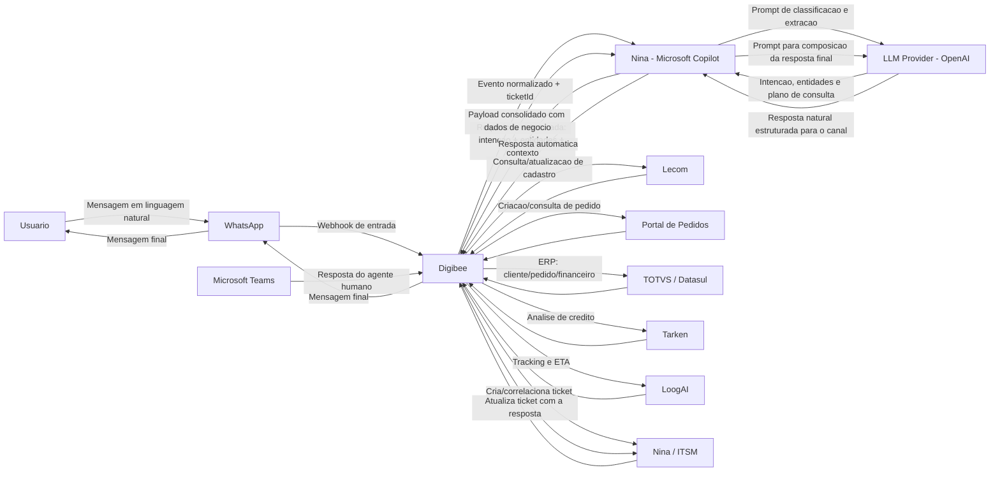
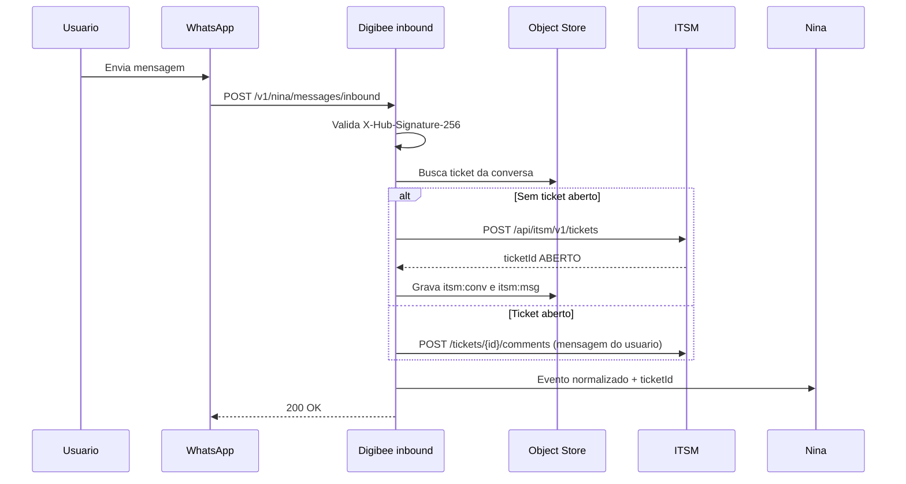
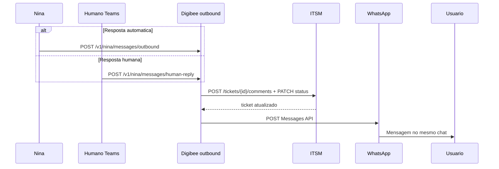

# Integracao Digibee com Sistemas Corporativos

TODOs:

- [ ] Adicionar fluxo de interação humana quando a nina não conseguir encontrar informações no sistema ou identificar algo de segurança(fallback)
- [x] Adicionar fluxo de criação de tickets no ITSM no webhook de envio de mensagem, também adicionar um fluxo atualizando o ticket quando a Nina (ou humano via Teams) responder essa mensagem
- [ ] (adicionar no roadmap) Adicionar na integração do portal de pedidos o fluxo o usuário vai fazer o upload de um pdf ou uma foto de pedido e já é criado automaticamente no sistema. adicionar fallbacks para arquivos inválidos ou corrompidos e imagens não nítidas. IA extrai informações identifica se já tem pedido criado ou não e confirma com o usuário a criação.
- [ ] Adicionar fluxo de preparação para visita. rtv manda mensagem tipo "vou visitar cliente tal amanhã". O sistema responde com: Para a preparação de uma visita, são importantes informações como a data da última visita, anotações e registros anteriores, além do histórico de pedidos do cliente.
- [ ] Estudar riscos de integração entre esses sistemas
- [ ] Validar quem é o rtv com 3 primeiros dígitos do cpf
- [ ] Crira outro doc com os detalhes técnicos de integrações


Este documento descreve a arquitetura de integracao entre o **Digibee** e os sistemas:

- **WhatsApp** (canal de entrada do usuario)
- **Nina (Microsoft Copilot)** (bot com IA para interpretacao e orquestracao)
- **Lecom** (cadastro de clientes)
- **Portal de Pedidos** (input e acompanhamento de pedidos)
- **TOTVS / Datasul** (ERP Brasil)
- **Tarken** (solicitacao e analise de limite de credito)
- **LoogAI** (acompanhamento da data de entrega)
- **Nina / ITSM** (gestao de tickets e chamados)
- **Microsoft Teams** (resposta humana que atualiza o mesmo ticket ITSM)

## Principio arquitetural obrigatorio

**Toda requisicao de negocio deve passar pelo Digibee**, que e o hub oficial de integracao, governanca, seguranca, observabilidade e orquestracao.

### Documentacao oficial (Digibee)
- API Trigger (exposicao de pipelines via REST): https://docs.digibee.com/documentation/connectors-and-triggers/triggers/web-protocols/api
- REST V2 Connector (consumo de APIs externas): https://docs.digibee.com/documentation/connectors-and-triggers/connectors/web-protocols/rest-v2
- Consumers / API Keys e Basic Auth: https://docs.digibee.com/documentation/developer-guide/pt-br/platform-administration/settings/api-keys-consumers

---

## Fluxograma de Integracao (Mermaid)



---

## 1) WhatsApp - Canal Conversacional

### Modulos na arquitetura
- **Webhook de entrada** (API Trigger no Digibee) para receber mensagens do usuario.
- **Side-effect ITSM na entrada**: abertura ou correlacao de ticket a cada mensagem enviada pelo usuario.
- **Camada de entrega** para envio da resposta final (Nina ou humano via Teams).
- **Side-effect ITSM na saida**: atualizacao do mesmo ticket com o texto e o autor da resposta.
- **Correlacao de conversa** para manter contexto por numero/sessao e o `ticketId` associado.

### APIs envolvidas
- API oficial do provedor WhatsApp (Cloud API/BSP).
- Endpoint de webhook exposto pelo Digibee (`POST /v1/nina/messages/inbound`) — nao pela Nina diretamente.
- Endpoint de envio de mensagem para retorno ao usuario (`POST /v1/nina/messages/outbound`).
- Endpoint de callback da resposta humana no Teams (`POST /v1/nina/messages/human-reply`).

### Documentacao oficial
- WhatsApp Cloud API (visao geral): https://developers.facebook.com/docs/whatsapp/cloud-api/
- WhatsApp Messages API (envio de mensagens): https://developers.facebook.com/docs/whatsapp/cloud-api/reference/messages
- WhatsApp Service Messages (janela de atendimento e formato de payload): https://developers.facebook.com/docs/whatsapp/cloud-api/guides/send-messages/
- WhatsApp Webhooks (configuracao): https://developers.facebook.com/docs/whatsapp/cloud-api/guides/set-up-webhooks/
- WhatsApp messages webhook (payload de entrada): https://developers.facebook.com/docs/whatsapp/cloud-api/webhooks/components

### Autenticacao
- Token de acesso da API do provedor WhatsApp.
- Validacao de assinatura de webhook (`X-Hub-Signature-256`).
- TLS obrigatorio.

### Informacoes trafegadas
- Texto da mensagem do usuario.
- Metadados de conversa (numero, id da conversa, `messageId`/`wamid`, timestamp).
- `ticketId` ITSM correlacionado a sessao.
- Resposta final gerada pela Nina (ou pelo agente humano no Teams) com dados consolidados do Digibee.

---

## 2) Nina (Microsoft Copilot) - Orquestracao com IA

### Modulos na arquitetura
- **NLU/LLM** para interpretar intencao e extrair entidades.
- **Planner de acoes** para decidir quais consultas executar.
- **Compositor de resposta** para gerar retorno em linguagem natural.
- **Guardrails** para mascarar dados sensiveis e aplicar politica de uso.

### APIs envolvidas
- Endpoint de inferencia da Nina/Copilot.
- API de inferencia da **OpenAI** como provider LLM (ex.: Responses API/Chat Completions).
- Endpoint de chamada para o Digibee (sincrono ou assincrono) - pipeline `nina-whatsapp-orchestrator`.
- Endpoint de envio da resposta (`POST /v1/nina/messages/outbound`) - pipeline `nina-itsm-ticket-update`.
- Endpoint de callback para resposta consolidada, quando aplicavel.

### Documentacao oficial
- Microsoft Copilot Studio (documentacao principal): https://learn.microsoft.com/en-us/microsoft-copilot-studio/
- Copilot Studio - estrategias de integracao: https://learn.microsoft.com/en-us/microsoft-copilot-studio/guidance/integrations
- Copilot Studio - autenticacao: https://learn.microsoft.com/en-us/microsoft-copilot-studio/configuration-end-user-authentication
- Copilot Studio - handoff para agente humano: https://learn.microsoft.com/en-us/microsoft-copilot-studio/advanced-hand-off
- OpenAI API Reference (endpoint e schemas): https://developers.openai.com/api/reference/
- OpenAI Responses API (criacao de resposta): https://developers.openai.com/api/reference/resources/responses/methods/create/

### Autenticacao
- OAuth2/JWT entre Nina e servicos corporativos.
- Chave tecnica para chamadas ao Digibee.
- Controle de escopo por acao (consulta, atualizacao, abertura de chamado).

### Informacoes trafegadas
- Intencao detectada (ex.: "consultar pedido", "solicitar limite", "abrir chamado").
- Entidades extraidas (CNPJ, numero do pedido, codigo do cliente, ticket).
- Resultado consolidado retornado pelo Digibee, incluindo `suporte.ticketId`.
- Resposta textual final para o usuario no WhatsApp (automatica ou proveniente do agente humano no Teams).

### Chamadas explicitas da Nina e fluxo de entrada/saida
1. **Entrada (WhatsApp -> Digibee -> Nina)**
   - O webhook de envio da mensagem chega no Digibee (`POST /v1/nina/messages/inbound`).
   - Digibee cria ou correlaciona o ticket ITSM e encaminha `input_text`, `channel_context` e `ticketId` para a Nina.

2. **Nina -> LLM (OpenAI) - Interpretacao**
   - Envia prompt com contexto da conversa e politicas de seguranca.
   - Recebe `intent`, `entities`, `confidence` e `required_systems`.

3. **Nina -> Digibee - Orquestracao**
   - Envia payload estruturado com intencao, entidades e `ticketId`.
   - Recebe resposta consolidada com dados dos sistemas corporativos.

4. **Nina -> LLM (OpenAI) - Composicao da resposta**
   - Envia dados consolidados retornados pelo Digibee.
   - Recebe texto final, objetivo e adequado ao canal WhatsApp.

5. **Saida (Nina -> Digibee -> WhatsApp)**
   - A Nina **nao** envia direto ao WhatsApp. Chama `POST /v1/nina/messages/outbound`.
   - Digibee atualiza o ticket ITSM com a resposta e so depois entrega a mensagem ao usuario.

6. **Saida humana (Teams -> Digibee -> WhatsApp)**
   - Se um agente humano responder no Teams, o callback `POST /v1/nina/messages/human-reply` atualiza o mesmo ticket e entrega a mensagem no WhatsApp.

---

## 3) Lecom - Cadastro de Clientes

### Modulos no Digibee
- **Pipeline de Cadastro de Clientes**.
- Transformacao de payload (normalizacao de CPF/CNPJ, endereco, contatos).
- Validacoes de consistencia cadastral e duplicidade.

### APIs envolvidas
- Lecom API para criacao/atualizacao de cadastro.
- Conectores HTTP/API do Digibee.
- Sincronizacao complementar com TOTVS/Datasul.

### Documentacao oficial
- Lecom Open API - introducao: https://lecomsa.readme.io/reference/getting-started-with-your-api
- Lecom Open API v6: https://lecomsa.readme.io/v6.0/reference/getting-started-with-your-api

### Autenticacao
- OAuth2 Client Credentials (preferencial).
- API Key quando necessario.
- TLS ponta a ponta.

### Informacoes trafegadas
- Dados cadastrais e fiscais.
- Enderecos, contatos e parametros comerciais.
- Status de integracao e protocolo de processamento.

---

## 4) Portal de Pedidos - Input e Acompanhamento

> Observacao: como o Portal de Pedidos e uma ferramenta interna com documentacao limitada, foi adotado um padrao de integracao REST/JSON.

### Modulos no Digibee
- **Pipeline de Entrada de Pedidos**.
- Validacao comercial/fiscal.
- Orquestracao com ERP, credito e logistica.

### APIs envolvidas
- Endpoint de criacao/alteracao de pedido.
- Endpoint de consulta de status de pedido.
- Integracao com TOTVS, Tarken e LoogAI para enriquecimento.

### Autenticacao
- JWT corporativo ou OAuth2.
- mTLS opcional para trafego interno.
- Rate limit por consumidor.

### Informacoes trafegadas
- Cabecalho do pedido e itens.
- Condicao comercial, impostos e descontos.
- Status operacional, financeiro e logistico.

---

## 5) TOTVS / Datasul - ERP Brasil

### Modulos no Digibee
- **Pipeline ERP Core**.
- Conector ERP para clientes, pedidos e faturamento.
- Retentativas, fila de reprocesso e rastreabilidade.

### APIs envolvidas
- Servicos de cadastro de clientes.
- Servicos de pedido de venda e faturamento.
- Servicos de consulta financeira.

### Documentacao oficial
- TOTVS Developers - API Reference: https://api.totvs.com.br/referencelist
- TOTVS Datasul - desenvolvimento de APIs (TDN): https://tdn.totvs.com/display/public/LDT/Desenvolvimento+de+APIs+para+o+produto+Datasul
- TOTVS Central - guia de integracao REST no Datasul: https://centraldeatendimento.totvs.com/hc/pt-br/articles/16461753523863-Framework-Linha-Datasul-FRW-Documenta%C3%A7%C3%A3o-para-Integra%C3%A7%C3%A3o-e-utiliza%C3%A7%C3%A3o-de-APIs-REST

### Autenticacao
- Token de aplicacao, usuario tecnico ou gateway interno.
- HTTPS/TLS obrigatorio.
- Correlation/request-id para auditoria.

### Informacoes trafegadas
- Cadastro mestre de clientes.
- Status de pedido (digitado, liberado, faturado, cancelado).
- Titulos, saldo e bloqueios financeiros.

---

## 6) Tarken - Solicitacao e Analise de Limite de Credito

### Modulos no Digibee
- **Pipeline de Credito**.
- Montagem de dossie de analise.
- Fallback para analise manual em contingencia.

### APIs envolvidas
- API de solicitacao de analise de credito.
- API de consulta de resultado.
- API de revalidacao de limite.

### Autenticacao
- OAuth2 Client Credentials ou API Key assinada.
- TLS e mascaramento de dados sensiveis em logs.
- Timeout/circuit breaker para resiliencia.

### Informacoes trafegadas
- Documentos e identificacao do cliente.
- Valor solicitado, prazo e risco.
- Score, limite aprovado, validade e justificativa.

---

## 7) LoogAI - Acompanhamento da Data de Entrega

### Modulos no Digibee
- **Pipeline Logistico**.
- Consulta de tracking por pedido/NF.
- Normalizacao de eventos e ETA.

### APIs envolvidas
- API de tracking logistico.
- API/eventos de entrega (coletado, em transito, entregue, ocorrencia).
- Webhook de atualizacao de ETA (quando disponivel).

### Autenticacao
- Token de API com renovacao periodica.
- Validacao de assinatura de webhook.
- TLS obrigatorio.

### Informacoes trafegadas
- Status atual de entrega e historico de eventos.
- Data prevista de entrega (ETA).
- Ocorrencias e justificativas de atraso.

---

## 8) Nina / ITSM - Gestao de Tickets e Chamados

Toda mensagem enviada pelo usuario no WhatsApp gera (ou correlaciona) um ticket no ITSM. Toda resposta — da Nina ou de um humano via Microsoft Teams — atualiza esse mesmo ticket. A Nina **nao** chama o ITSM diretamente: abertura e atualizacao passam pelo Digibee.

### Modulos no Digibee
- **Pipeline `nina-whatsapp-inbound`** (webhook de envio de mensagem): cria ou correlaciona o ticket.
- **Pipeline `nina-itsm-ticket-update`**: atualiza o ticket quando a Nina ou o humano responde.
- **Object Store `nina-itsm-conversation`**: mapeia conversa (`channel` + `userId`) para `ticketId` aberto.
- Roteamento por tipo de incidente e enriquecimento com dados de pedido, credito e logistica.

### APIs envolvidas
- ITSM REST API para abertura/atualizacao/encerramento.
- API Trigger do webhook WhatsApp: `POST /v1/nina/messages/inbound`.
- API Trigger da resposta da Nina: `POST /v1/nina/messages/outbound`.
- API Trigger da resposta humana no Teams: `POST /v1/nina/messages/human-reply`.
- Webhooks ITSM para notificacoes de mudanca de status (opcional, no sentido inverso).

### Documentacao oficial
- Digibee API Trigger: https://docs.digibee.com/documentation/connectors-and-triggers/triggers/web-protocols/api
- Digibee REST V2 (consumo da API ITSM): https://docs.digibee.com/documentation/connectors-and-triggers/connectors/web-protocols/rest-v2
- Digibee Object Store (correlacao conversa/ticket): https://docs.digibee.com/documentation/connectors-and-triggers/connectors/structured-data/object-store
- WhatsApp messages webhook: https://developers.facebook.com/docs/whatsapp/cloud-api/webhooks/components
- Microsoft Graph - postar mensagem em canal Teams: https://learn.microsoft.com/en-us/graph/api/channel-post-messages
- Copilot Studio - handoff para agente humano: https://learn.microsoft.com/en-us/microsoft-copilot-studio/advanced-hand-off

### Autenticacao
- Bearer Token (OAuth2/JWT) para a ITSM REST API.
- Validacao de assinatura do webhook WhatsApp (`X-Hub-Signature-256`).
- Chave tecnica / API Key nos API Triggers do Digibee.
- OAuth2 (Microsoft Graph) para notificar e receber resposta no Teams.
- Escopos por perfil de operacao (criar ticket, comentar, alterar status).

### Informacoes trafegadas
- ID do ticket, categoria, prioridade, SLA, responsavel.
- `messageId` (wamid), `conversationId`, autor da mensagem (`user` | `nina` | `human`).
- Texto da mensagem de entrada e da resposta.
- Evidencias tecnicas do erro e contexto de negocio.
- Historico de tratativas e status.

### Modelo de correlacao (1 conversa = 1 ticket aberto)

| Chave no Object Store | Uso |
| --- | --- |
| `itsm:msg:{messageId}` | Idempotencia: o mesmo `wamid` nao abre ticket duas vezes (retry do webhook). |
| `itsm:conv:{channel}:{userId}` | Ticket aberto da sessao (`ticketId`, `status`, `handoffId` opcional). |

Regras:
- Se nao existir ticket aberto para a conversa, o webhook **cria** um ticket (`ABERTO`).
- Se ja existir ticket aberto, o webhook **anexa um comentario** com a nova mensagem do usuario (nao cria duplicata).
- A resposta da Nina ou do humano **atualiza** o mesmo `ticketId`.
- Encerramento (`RESOLVIDO`) ocorre quando o humano fecha o atendimento ou quando a sessao expira.
- A intencao `open_ticket` **nao** abre um segundo chamado: consulta, prioriza ou reabre o ticket ja correlacionado a conversa.

### Maquina de status do ticket

```
ABERTO --> EM_ANDAMENTO   (Nina ou humano assumiu)
EM_ANDAMENTO --> AGUARDANDO_USUARIO  (resposta enviada no WhatsApp)
AGUARDANDO_USUARIO --> EM_ANDAMENTO  (usuario mandou nova mensagem)
EM_ANDAMENTO --> ESCALADO  (handoff para humano no Teams)
ESCALADO --> AGUARDANDO_USUARIO  (humano respondeu)
qualquer estado aberto --> RESOLVIDO
```

### Fluxo A — Criacao de ticket no webhook de envio de mensagem

Pipeline: `nina-whatsapp-inbound`  
Trigger: API Trigger `POST /v1/nina/messages/inbound`

1. WhatsApp Cloud API dispara o webhook `messages` (usuario enviou texto).
2. Digibee valida a assinatura e responde `200` rapidamente (o provedor reenvia se houver timeout).
3. Normaliza o payload (`from`, `wamid`, `text`, timestamp).
4. Consulta o Object Store:
   - se `itsm:msg:{wamid}` ja existe, ignora (idempotencia);
   - se `itsm:conv:whatsapp:{userId}` tem ticket aberto, usa esse `ticketId`;
   - senao, chama a ITSM REST API (`POST /api/itsm/v1/tickets`) e grava o mapeamento.
5. Anexa a mensagem do usuario como comentario do ticket (`author=user`, `source=whatsapp`).
6. Encaminha o evento normalizado para a Nina, ja com `ticketId`.

A falha na abertura do ticket **nao** bloqueia a conversa: o Digibee registra warning, segue para a Nina e tenta reprocessar a criacao (fila de reprocesso). O usuario nao deve ver erro tecnico.



### Fluxo B — Atualizacao do ticket na resposta (Nina ou humano via Teams)

Pipeline: `nina-itsm-ticket-update`  
Triggers:
- `POST /v1/nina/messages/outbound` (resposta automatica da Nina)
- `POST /v1/nina/messages/human-reply` (resposta do agente no Teams)

1. A Nina devolve o texto final **para o Digibee**, nunca direto ao WhatsApp.
2. Digibee localiza o ticket pelo `ticketId` (preferencial) ou pela chave `itsm:conv:{channel}:{userId}`.
3. Atualiza o ITSM:
   - comentario/work note com o texto da resposta;
   - `author` = `nina` ou `human`;
   - `source` = `copilot` ou `teams`;
   - status `AGUARDANDO_USUARIO` (ou `ESCALADO` se ainda houver handoff aberto).
4. Envia a mensagem ao usuario pela WhatsApp Messages API.
5. Grava no Object Store o `outboundMessageId` ligado ao ticket (rastreio de entrega).

Se a resposta vier de um humano no Teams:
- o agente responde no canal/thread notificado pelo Digibee (Adaptive Card ou reply na thread);
- o bot/callback do Teams chama `POST /v1/nina/messages/human-reply`;
- o Digibee aplica o **mesmo** contrato de atualizacao do ticket e entrega no WhatsApp da sessao original.



### Contratos HTTP (referenciais)

#### WhatsApp -> Digibee (webhook de envio de mensagem)

```http
POST /v1/nina/messages/inbound
Content-Type: application/json
X-Hub-Signature-256: sha256=...
```

O Digibee aceita o envelope nativo do WhatsApp e normaliza internamente. Campos minimos apos normalizacao:

```json
{
  "pipeline": "nina-whatsapp-inbound",
  "action": "ingest_user_message",
  "channel": "whatsapp",
  "correlationId": "corr-20260909-0100",
  "message": {
    "id": "wamid.HBgL...",
    "from": "5511999999999",
    "timestamp": "1749416383",
    "type": "text",
    "text": "Qual a previsao de entrega do pedido 12345 e meu limite de credito?"
  }
}
```

#### Digibee -> ITSM (criar ticket)

```http
POST /api/itsm/v1/tickets
Authorization: Bearer {itsm-token}
Content-Type: application/json
Idempotency-Key: wamid.HBgL...
```

```json
{
  "source": "whatsapp",
  "sourceMessageId": "wamid.HBgL...",
  "requester": {
    "channelUserId": "5511999999999"
  },
  "category": "CONVERSACIONAL",
  "priority": "MEDIUM",
  "shortDescription": "Mensagem WhatsApp de 5511999999999",
  "description": "Qual a previsao de entrega do pedido 12345 e meu limite de credito?",
  "channelContext": {
    "channel": "whatsapp",
    "conversationKey": "whatsapp:5511999999999"
  }
}
```

#### Digibee -> ITSM (anexar mensagem do usuario a ticket existente)

```http
POST /api/itsm/v1/tickets/INC-88421/comments
Authorization: Bearer {itsm-token}
Content-Type: application/json
```

```json
{
  "author": "user",
  "source": "whatsapp",
  "sourceMessageId": "wamid.HBgL...",
  "body": "Qual a previsao de entrega do pedido 12345 e meu limite de credito?",
  "visibility": "public"
}
```

#### Digibee -> Nina (evento ja com ticket)

```json
{
  "correlationId": "corr-20260909-0100",
  "channel": "whatsapp",
  "ticketId": "INC-88421",
  "ticketStatus": "ABERTO",
  "input": {
    "userId": "5511999999999",
    "messageId": "wamid.HBgL...",
    "text": "Qual a previsao de entrega do pedido 12345 e meu limite de credito?"
  }
}
```

#### Nina -> Digibee (resposta automatica, atualiza o ticket)

```http
POST /v1/nina/messages/outbound
Content-Type: application/json
X-Correlation-Id: corr-20260909-0100
```

```json
{
  "pipeline": "nina-itsm-ticket-update",
  "action": "reply_and_update_ticket",
  "correlationId": "corr-20260909-0100",
  "ticketId": "INC-88421",
  "author": "nina",
  "source": "copilot",
  "channel": "whatsapp",
  "userId": "5511999999999",
  "inReplyToMessageId": "wamid.HBgL...",
  "replyToUser": {
    "text": "Pedido 12345 esta liberado no ERP. Seu limite de credito foi aprovado em R$ 50.000,00. A entrega esta em transito com previsao para 10/09/2026."
  }
}
```

#### Teams -> Digibee (resposta humana, atualiza o mesmo ticket)

```http
POST /v1/nina/messages/human-reply
Content-Type: application/json
X-Correlation-Id: corr-20260909-0100
```

```json
{
  "pipeline": "nina-itsm-ticket-update",
  "action": "reply_and_update_ticket",
  "correlationId": "corr-20260909-0100",
  "ticketId": "INC-88421",
  "handoffId": "HO-20260909-4412",
  "author": "human",
  "source": "teams",
  "channel": "whatsapp",
  "userId": "5511999999999",
  "agent": {
    "id": "agente.silva@empresa.com",
    "displayName": "Agente Silva"
  },
  "replyToUser": {
    "text": "Confirmei no ERP: o pedido 12345 sai hoje. Qualquer desvio de rota eu atualizo neste chat."
  }
}
```

#### Digibee -> ITSM (atualizar ticket com a resposta)

```http
POST /api/itsm/v1/tickets/INC-88421/comments
Authorization: Bearer {itsm-token}
Content-Type: application/json
```

```json
{
  "author": "nina",
  "source": "copilot",
  "body": "Pedido 12345 esta liberado no ERP. Seu limite de credito foi aprovado em R$ 50.000,00. A entrega esta em transito com previsao para 10/09/2026.",
  "visibility": "public",
  "statusAfterComment": "AGUARDANDO_USUARIO"
}
```

No caso humano, `author` vira `human`, `source` vira `teams` e o comentario inclui o `agent.id`.

#### Digibee -> ITSM (PATCH de status)

```http
PATCH /api/itsm/v1/tickets/INC-88421
Authorization: Bearer {itsm-token}
Content-Type: application/json
```

```json
{
  "status": "AGUARDANDO_USUARIO",
  "lastReplyAuthor": "nina",
  "lastReplyAt": "2026-09-09T00:55:12Z"
}
```

### Resiliencia e observabilidade
- Idempotencia por `messageId` (entrada) e por `correlationId` + `ticketId` (saida).
- Retry com backoff no REST V2 para falhas 5xx/timeout do ITSM.
- Falha de ITSM nao impede entrega da mensagem ao usuario; gera alerta e item de reprocesso.
- Correlation/request-id unico (`correlationId`) em WhatsApp, Nina, Digibee, ITSM e Teams.

---

## Fluxo Conversacional com IA (WhatsApp + Nina + Digibee + ITSM)

1. **Usuario envia mensagem em linguagem natural no WhatsApp**  
   Exemplo: "Qual a previsao de entrega do pedido 12345 e meu limite de credito?"

2. **O webhook de envio da mensagem chega no Digibee** (`POST /v1/nina/messages/inbound`)  
   Digibee valida a assinatura, cria ou correlaciona o ticket ITSM e so entao encaminha o evento para a Nina (com `ticketId`).

3. **Nina (Copilot) chama a LLM (OpenAI) para interpretar a mensagem**  
   Extrai intencao, entidades (pedido, cliente, cnpj, etc.) e quais sistemas consultar.

4. **Nina chama o Digibee como camada unica de integracao**  
   Envia uma requisicao estruturada com os dados de entrada e o `ticketId`. Nao consulta sistemas diretamente.

5. **Digibee orquestra as chamadas necessarias**  
   - TOTVS/Datasul para status ERP/pedido  
   - Tarken para limite de credito  
   - LoogAI para previsao de entrega  
   - Lecom para dados cadastrais (se necessario)  
   - ITSM ja foi acionado no webhook de entrada; aqui so consulta/enriquece o chamado se preciso

6. **Digibee consolida os resultados**  
   Normaliza campos, trata erros e devolve payload canonico para Nina (incluindo `suporte.ticketId`).

7. **Nina chama novamente a LLM (OpenAI) para compor a resposta final**  
   Usa o payload consolidado do Digibee para gerar texto claro e contextualizado.

8. **Nina envia a resposta para o Digibee** (`POST /v1/nina/messages/outbound`)  
   Digibee atualiza o ticket ITSM (comentario + status `AGUARDANDO_USUARIO`) e so depois entrega no WhatsApp.

9. **Se a resposta for de um humano no Teams** (`POST /v1/nina/messages/human-reply`)  
   O mesmo pipeline `nina-itsm-ticket-update` anexa o comentario com `author=human` / `source=teams` e entrega no mesmo chat do WhatsApp.

10. **WhatsApp entrega a resposta ao usuario**  
    Inclui, quando necessario, instrucoes de proximo passo e o protocolo do ticket.

---

## Exemplos de Payload (Nina <-> LLM / Digibee <-> ITSM)

### 1) Nina -> LLM (OpenAI) - Interpretacao da mensagem

```json
{
  "provider": "openai",
  "operation": "intent_and_entity_extraction",
  "correlationId": "corr-20260907-0001",
  "channel": "whatsapp",
  "locale": "pt-BR",
  "input": {
    "userId": "5511999999999",
    "messageId": "wamid.HBgL...",
    "ticketId": "INC-88421",
    "text": "Qual a previsao de entrega do pedido 12345 e meu limite de credito?"
  },
  "context": {
    "conversationState": {
      "lastIntent": "order_tracking",
      "openTicket": true,
      "ticketId": "INC-88421"
    },
    "allowedIntents": [
      "order_status",
      "delivery_eta",
      "credit_limit",
      "customer_registration",
      "open_ticket"
    ]
  },
  "responseFormat": {
    "type": "json_schema",
    "schemaName": "nina_intent_v1"
  }
}
```

### 2) LLM -> Nina - Resultado da interpretacao

```json
{
  "correlationId": "corr-20260907-0001",
  "intent": "delivery_eta_and_credit_limit",
  "confidence": 0.96,
  "entities": {
    "orderNumber": "12345",
    "customerDocument": null,
    "requestedTopics": [
      "delivery_eta",
      "credit_limit"
    ]
  },
  "requiredSystems": [
    "totvs_datasul",
    "tarken",
    "loogai"
  ],
  "digibeeRequest": {
    "pipeline": "nina-whatsapp-orchestrator",
    "action": "query_order_credit_delivery",
    "input": {
      "orderNumber": "12345",
      "ticketId": "INC-88421"
    }
  }
}
```

### 3) Nina -> LLM (OpenAI) - Composicao da resposta final

```json
{
  "provider": "openai",
  "operation": "response_composition",
  "correlationId": "corr-20260907-0001",
  "channel": "whatsapp",
  "instructions": {
    "tone": "profissional e objetivo",
    "maxLength": 500,
    "maskSensitiveData": true
  },
  "digibeeOutput": {
    "pedido": {
      "numero": "12345",
      "statusErp": "LIBERADO"
    },
    "credito": {
      "status": "APROVADO",
      "limiteAprovado": 50000.0
    },
    "logistica": {
      "statusEntrega": "EM_TRANSITO",
      "previsaoEntrega": "2026-09-10"
    },
    "suporte": {
      "ticketId": "INC-88421",
      "status": "EM_ANDAMENTO"
    }
  },
  "responseFormat": {
    "type": "json_schema",
    "schemaName": "nina_outbound_message_v1"
  }
}
```

### 4) LLM -> Nina - Mensagem final estruturada para envio no WhatsApp

```json
{
  "correlationId": "corr-20260907-0001",
  "ticketId": "INC-88421",
  "message": {
    "text": "Pedido 12345 esta liberado no ERP. Seu limite de credito foi aprovado em R$ 50.000,00. A entrega esta em transito com previsao para 10/09/2026.",
    "quickReplies": [
      "Ver detalhes do pedido",
      "Abrir chamado"
    ]
  },
  "metadata": {
    "usedSources": [
      "totvs_datasul",
      "tarken",
      "loogai"
    ],
    "containsSensitiveData": false
  }
}
```

### 5) Nina -> Digibee - Envio da resposta (atualiza o ticket ITSM)

A Nina nao publica direto no WhatsApp. O Digibee atualiza o ticket e faz o envio.

```json
{
  "pipeline": "nina-itsm-ticket-update",
  "action": "reply_and_update_ticket",
  "correlationId": "corr-20260907-0001",
  "ticketId": "INC-88421",
  "author": "nina",
  "source": "copilot",
  "channel": "whatsapp",
  "userId": "5511999999999",
  "replyToUser": {
    "text": "Pedido 12345 esta liberado no ERP. Seu limite de credito foi aprovado em R$ 50.000,00. A entrega esta em transito com previsao para 10/09/2026."
  }
}
```

### 6) Humano (Teams) -> Digibee - Mesma atualizacao de ticket, autor humano

```json
{
  "pipeline": "nina-itsm-ticket-update",
  "action": "reply_and_update_ticket",
  "correlationId": "corr-20260907-0001",
  "ticketId": "INC-88421",
  "author": "human",
  "source": "teams",
  "channel": "whatsapp",
  "userId": "5511999999999",
  "agent": {
    "id": "agente.silva@empresa.com",
    "displayName": "Agente Silva"
  },
  "replyToUser": {
    "text": "Confirmei no ERP: o pedido 12345 sai hoje. Qualquer desvio de rota eu atualizo neste chat."
  }
}
```

---

## Compilado Final - Como o Digibee Retorna as Informacoes

O Digibee recebe a solicitacao da Nina, executa integracoes com os sistemas necessarios e devolve um **objeto consolidado** para a Nina. Esse retorno pode conter:

- `cliente`: dados cadastrais e status no ERP.
- `pedido`: status comercial e financeiro.
- `credito`: score e limite aprovado na Tarken.
- `logistica`: status de transporte e ETA da LoogAI.
- `suporte`: ticket ITSM da conversa (aberto no webhook de entrada e atualizado na resposta).
- `integrationStatus`: sucesso parcial/total e mensagens de erro tratadas.

A Nina usa esse objeto para produzir a resposta em linguagem natural. O Digibee persiste essa resposta no ticket ITSM e entrega no WhatsApp, mantendo a experiencia conversacional sem expor complexidade tecnica ao usuario final.

### Exemplo de payload consolidado (referencial)

```json
{
  "correlationId": "f0d6a3f3-66f8-4e14-bdf5-0ccdb7dbd77e",
  "channel": "whatsapp",
  "assistant": "nina-copilot",
  "cliente": {
    "idErp": "CLI12345",
    "cnpj": "00.000.000/0001-00",
    "statusCadastro": "ATIVO"
  },
  "pedido": {
    "numero": "12345",
    "statusErp": "LIBERADO",
    "valorTotal": 15230.55
  },
  "credito": {
    "provedor": "Tarken",
    "status": "APROVADO",
    "limiteAprovado": 50000.0,
    "score": 782
  },
  "logistica": {
    "provedor": "LoogAI",
    "statusEntrega": "EM_TRANSITO",
    "previsaoEntrega": "2026-09-10"
  },
  "suporte": {
    "ticketId": "INC-88421",
    "status": "EM_ANDAMENTO",
    "openedFrom": "whatsapp_inbound_webhook",
    "lastReplyAuthor": null
  },
  "integrationStatus": {
    "overall": "SUCCESS",
    "warnings": []
  }
}
```

### Exemplo de `suporte` apos a resposta (Nina ou humano)

Quando o Digibee conclui `nina-itsm-ticket-update`, o bloco `suporte` passa a refletir o autor da ultima resposta:

```json
{
  "suporte": {
    "ticketId": "INC-88421",
    "status": "AGUARDANDO_USUARIO",
    "openedFrom": "whatsapp_inbound_webhook",
    "lastReplyAuthor": "nina",
    "lastReplySource": "copilot",
    "lastReplyAt": "2026-09-09T00:55:12Z"
  }
}
```

Resposta humana via Teams usa `lastReplyAuthor: "human"` e `lastReplySource: "teams"`.
