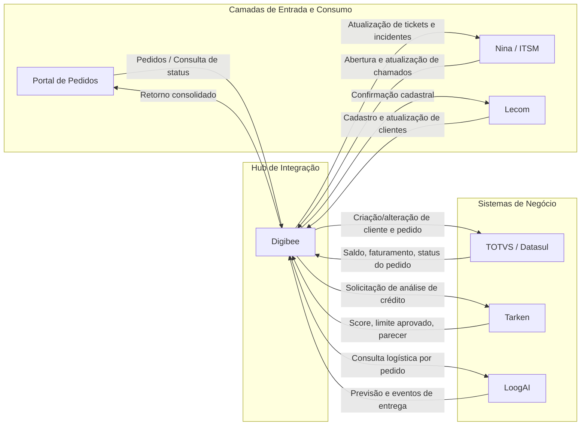

# Integração Digibee com Sistemas Corporativos

Este documento descreve uma proposta técnica de integração do **Digibee** com os sistemas:

- **Lecom** (cadastro de clientes)
- **Nina / ITSM** (gestão de tickets e chamados)
- **Portal de Pedidos** (entrada e acompanhamento de pedidos)
- **TOTVS / Datasul** (ERP Brasil)
- **Tarken** (solicitação e análise de limite de crédito)
- **LoogAI** (acompanhamento de data de entrega)

---

## Fluxograma de Integração (Mermaid)



---

## 1) Lecom — Cadastro de Clientes

### Módulos no Digibee
- **Pipeline de Cadastro de Clientes**
- **Transformação de payload** (normalização de CPF/CNPJ, endereço, contatos)
- **Orquestração de validações** (duplicidade, campos obrigatórios, regras fiscais)

### APIs envolvidas
- **Lecom API**: endpoints de criação/atualização de cadastro.
- **Digibee API Gateway / HTTP Connector**: consumo e publicação dos serviços de integração.
- Integração complementar com **TOTVS/Datasul** para persistência de cadastro mestre.

### Autenticação
- Preferencialmente **OAuth2 Client Credentials** para APIs REST.
- Quando não disponível, **API Key** + controle de IP/rede corporativa.
- Assinatura de requisição com **TLS** ponta a ponta.

### Informações trafegadas
- Dados cadastrais: razão social, nome fantasia, CPF/CNPJ, inscrição estadual.
- Endereços (cobrança/entrega), contatos, e-mails e telefones.
- Parâmetros comerciais: condição de pagamento, segmento, vendedor responsável.
- Status de sincronização e protocolo de processamento.

---

## 2) Nina / ITSM — Gestão de Tickets e Chamados

### Módulos no Digibee
- **Pipeline de Suporte ITSM**
- **Roteamento por tipo de ocorrência** (pedido, crédito, cadastro, logística)
- **Enriquecimento de contexto** (consulta em TOTVS, Tarken e LoogAI)

### APIs envolvidas
- **ITSM REST API** para abertura, atualização e encerramento de chamados.
- **Webhooks de eventos** para retorno automático ao Nina.
- API de consulta de status das integrações no Digibee para diagnóstico.

### Autenticação
- **Bearer Token (OAuth2/JWT)** para operações de ticket.
- Chave técnica por integração para webhooks de retorno.
- Controle de escopo por perfil (abertura, leitura, atualização).

### Informações trafegadas
- ID do ticket, categoria, criticidade, SLA e responsável.
- Dados de pedido/cliente associados ao incidente.
- Mensagens de erro técnico e funcional do fluxo de integração.
- Histórico de tratativas e mudanças de status do chamado.

---

## 3) Portal de Pedidos — Input e Acompanhamento de Pedidos

> Observação: como a documentação detalhada do Portal é limitada, a definição abaixo considera um padrão comum de integração REST/JSON em ambiente corporativo.

### Módulos no Digibee
- **Pipeline de Entrada de Pedidos**
- **Validação comercial e fiscal**
- **Orquestração entre ERP, crédito e logística**

### APIs envolvidas
- Endpoint de **recepção de pedidos** (criação e alteração).
- Endpoint de **consulta de status** (em processamento, aprovado, faturado, entregue).
- Integrações a jusante com TOTVS, Tarken e LoogAI para compor o retorno.

### Autenticação
- **JWT** emitido por SSO corporativo ou **OAuth2**.
- Opcionalmente **mTLS** para comunicação serviço-a-serviço interna.
- Rate limit por consumidor para evitar sobrecarga.

### Informações trafegadas
- Cabeçalho do pedido: número, filial, cliente, condição de pagamento.
- Itens: SKU, quantidade, preço, desconto, impostos.
- Resultado de crédito e disponibilidade de faturamento.
- Status logístico e previsão de entrega.

---

## 4) TOTVS / Datasul — ERP Brasil

### Módulos no Digibee
- **Pipeline ERP Core**
- **Conector ERP** para rotinas de clientes, pedidos e faturamento.
- **Tratamento de erros de integração** com retentativa e fila de reprocesso.

### APIs envolvidas
- APIs/serviços de **cadastro de clientes**.
- APIs/serviços de **pedido de venda** e **faturamento**.
- APIs/serviços de **consulta financeira** (títulos, saldo, bloqueios).

### Autenticação
- Conforme padrão do ambiente ERP: **token de aplicação**, usuário técnico ou gateway interno.
- Transporte seguro via **HTTPS/TLS**.
- Auditoria de chamadas por correlação de request-id.

### Informações trafegadas
- Mestre de clientes e suas atualizações.
- Pedidos de venda e retorno de status (digitado, liberado, faturado, cancelado).
- Dados financeiros para suporte à decisão de crédito.
- Eventos de integração para rastreabilidade operacional.

---

## 5) Tarken — Solicitação e Análise de Limite de Crédito

### Módulos no Digibee
- **Pipeline de Crédito**
- **Montagem de dossiê** (dados cadastrais + financeiros + histórico)
- **Política de fallback** para análise manual em caso de indisponibilidade

### APIs envolvidas
- Endpoint para **solicitar análise de crédito**.
- Endpoint para **consultar resultado da análise**.
- Endpoint para **revalidação de limite** em alterações de pedido.

### Autenticação
- **OAuth2 Client Credentials** (preferencial) ou API Key assinada.
- Criptografia em trânsito e mascaramento de dados sensíveis em logs.
- Controle de timeout e circuit breaker no Digibee.

### Informações trafegadas
- Identificação do cliente e documentos.
- Valor solicitado, prazo, tipo de operação e risco.
- Resultado: score, limite aprovado, validade, justificativa e restrições.
- Código de retorno para continuidade do fluxo de pedido.

---

## 6) LoogAI — Acompanhamento da Data de Entrega

### Módulos no Digibee
- **Pipeline Logístico**
- **Consulta de tracking por pedido/nota**
- **Normalização de eventos de entrega** para consumo no Portal e ITSM

### APIs envolvidas
- Endpoint de **tracking** por pedido, NF ou código logístico.
- Endpoint de **eventos logísticos** (coletado, em trânsito, entregue, ocorrência).
- Webhook de atualização de ETA (Estimated Time of Arrival), quando disponível.

### Autenticação
- Token de API com renovação periódica.
- Assinatura/verificação de webhooks para garantir integridade dos eventos.
- TLS obrigatório nas integrações síncronas e assíncronas.

### Informações trafegadas
- Status atual de entrega e timestamp de cada evento.
- Data prevista de entrega (ETA) e janelas logísticas.
- Exceções de rota, tentativa de entrega e motivo de atraso.
- Comprovante de entrega (quando aplicável).

---

## Compilado Final — Como o Digibee Consolida e Retorna as Informações

O **Digibee** atua como camada central de integração e orquestração, realizando:

1. **Recepção do evento inicial**  
   Entrada via Portal de Pedidos, Lecom ou Nina/ITSM.

2. **Validação e enriquecimento**  
   Normaliza payloads e consulta sistemas mestres (principalmente TOTVS/Datasul).

3. **Processamento paralelo de domínios**  
   - Crédito: consulta Tarken  
   - Logística: consulta LoogAI  
   - ERP: atualização e leitura de status no TOTVS/Datasul

4. **Consolidação de resposta canônica**  
   Monta um objeto único com:
   - dados cadastrais/clientes,
   - dados comerciais do pedido,
   - resultado de crédito,
   - status financeiro/ERP,
   - acompanhamento logístico.

5. **Retorno aos sistemas consumidores**  
   Publica a resposta consolidada para:
   - **Portal de Pedidos** (visão operacional de ponta a ponta),
   - **Nina / ITSM** (contexto para suporte e SLA),
   - **Lecom** (confirmações de cadastro e consistência).

### Exemplo de payload consolidado (referencial)

```json
{
  "correlationId": "9d8f8e8b-0f00-4f15-a0d1-5ce2f7d5e2f9",
  "cliente": {
    "idErp": "CLI12345",
    "cnpj": "00.000.000/0001-00",
    "statusCadastro": "ATIVO"
  },
  "pedido": {
    "numero": "PED-2026-001245",
    "statusErp": "LIBERADO",
    "valorTotal": 15230.55
  },
  "credito": {
    "provedor": "Tarken",
    "status": "APROVADO",
    "limiteAprovado": 50000.00,
    "score": 782
  },
  "logistica": {
    "provedor": "LoogAI",
    "statusEntrega": "EM_TRANSITO",
    "previsaoEntrega": "2026-09-10"
  },
  "suporte": {
    "ticketId": "INC-88421",
    "status": "EM_ANDAMENTO"
  }
}
```
