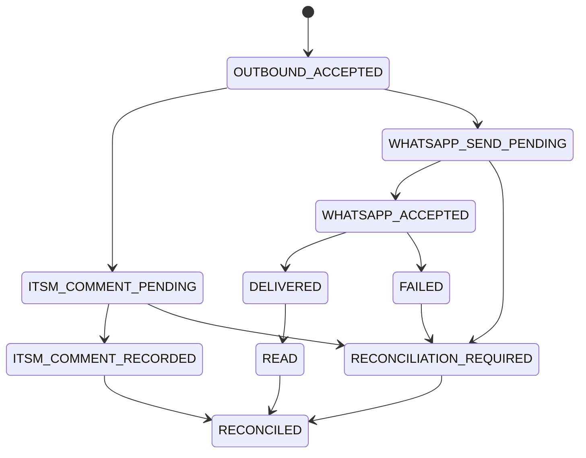
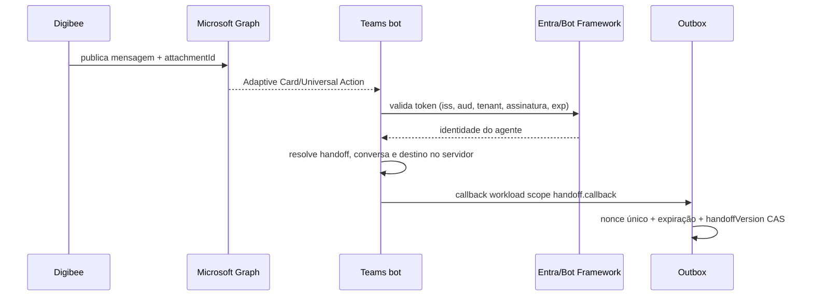

# Integração Digibee, Nina e sistemas corporativos

Arquitetura de referência para atendimento de RTVs pelo WhatsApp, com a Nina
(Microsoft Copilot) como camada conversacional e o Digibee como único hub de
integração. Este repositório documenta contratos e decisões arquiteturais; não
contém uma implementação executável.

## Princípios obrigatórios

1. Toda operação de negócio passa pelo Digibee.
2. Recebimento e efeitos externos usam inbox/outbox duráveis e idempotência
   atômica.
3. `conversationId` é a identidade interna obrigatória; `ticketId` é uma
   referência opcional ao ITSM.
4. O ITSM é uma projeção operacional, não a fonte primária de mensagens,
   identidade ou auditoria.
5. Identidade e autorização são derivadas no servidor. Campos produzidos pela
   LLM nunca selecionam `subjectId`, `rtvId`, tenant, ticket ou destinatário.
6. A LLM é tratada como componente não confiável: interpreta intenção e
   entidades e só verbaliza fatos validados.
7. Dados são classificados e minimizados antes de cruzar cada fronteira.
8. Contratos HTTP e eventos são versionados e validados.

Documentos complementares:

- [Detalhes técnicos](docs/detalhes-tecnicos-integracoes.md)
- [Riscos e controles](docs/riscos-integracao.md)
- [Identidade e autenticação do RTV](docs/validacao-rtv-cpf.md)
- [Governança LGPD](docs/governanca-lgpd.md)
- [OpenAPI 3.1](docs/contracts/openapi.yaml)
- [Schemas JSON](docs/contracts/schemas/)

## Rastreabilidade das correções

| Achado | Decisão aplicada | Artefato principal |
| --- | --- | --- |
| P0.1 | ACK somente após inbox durável; processamento assíncrono | fluxo inbound |
| P0.2 | `conversationId` obrigatório e `ticketId` opcional/reconciliável | identidade e ITSM |
| P0.3 | unicidade, CAS, lease e fencing token | estados da inbox |
| P0.4 | outbox, efeitos independentes e status real de entrega | fluxo outbound |
| P0.5 | OIDC PKCE/MFA; CPF apenas sinal | documento de identidade |
| P0.6 | identidade e destino derivados no servidor + ABAC | identidade e autorização |
| P0.7 | bot autenticado, nonce, expiração, ownership e CAS | fallback Teams |
| P0.8 | Graph + attachment referenciado + Universal Actions + bot | fallback Teams |
| P0.9 | sequência por conversa, versão e política `STALE` | ordenação causal |
| P1.1 | máquinas separadas de ticket, handoff e entrega | tabelas de estado |
| P1.2 | contratos separados para webhook nativo e evento canônico | contratos canônicos |
| P1.3 | renderer ou saída com `sourceField` e validador factual | LLM |
| P1.4 | classes DLP calculadas e mascaramento por destino | classificação |
| P1.5 | inventário, RIPD, retenção, direitos e transferências | governança LGPD |
| P1.6 | ITSM mínimo; auditoria imutável segregada | ITSM |
| P1.7 | `operationId` por efeito e reconciliação antes de retry | outbound |
| P1.8 | ownership por campo, `asOf`, versão e frescor | matriz de fontes |
| P1.9 | mínimos e falhas por intenção | matriz de resultados |
| P1.10 | adapter LLM separado do mapping OpenAI | contratos da LLM |
| P1.11 | intenção principal, `requestedTopics[]` e envelope único | schemas v1 |
| P2.1 | catálogo oficial; 29 dias não gera `VISIT_GAP` | catálogo de insights |
| P2.2 | primeira mensagem só na descrição resumida | regra ITSM |
| P2.3 | chave com tenant/ambiente, TTL e regra pós-resolução | sessão |
| P2.4 | OpenAPI 3.1, JSON Schema e testes de contrato | `docs/contracts` |
| P2.5 | RFC 9457, RFC 3339, data civil e dinheiro em minor units | padrões de API |

## Arquitetura-alvo

```mermaid
flowchart LR
    U[RTV] --> WA[WhatsApp]
    WA --> AD[Adapter Meta/BSP]
    AD --> V[Validação sobre bytes originais]
    V --> IN[(Inbox durável<br/>unique messageId)]
    IN -->|persistência confirmada| ACK[200 OK]
    IN --> Q[Fila particionada<br/>conversationId]
    Q --> IAM[OIDC + PKCE + MFA]
    IAM --> AUTH[ABAC<br/>ação + carteira + finalidade]
    AUTH --> N[Nina]
    N --> LA[Adapter LLM]
    N --> D[Digibee]
    D --> S[Sistemas de origem]
    S --> C[Consolidação<br/>source + version + freshness]
    C --> M[DLP e minimização]
    M --> R[Renderer determinístico<br/>ou LLM + validador factual]
    R --> OB[(Outbox durável)]
    OB --> ITSM[ITSM: projeção mínima]
    OB --> WAO[WhatsApp]
    OB --> TB[Teams bot]
    WAO --> WS[Webhooks sent/delivered/read/failed]
    ITSM --> REC[Reconciliação]
    WS --> REC
    TB --> REC
    REC --> AUD[(Auditoria imutável)]
```



O `200 OK` do webhook significa somente “evento aceito de forma durável”.
ITSM, Nina e demais integrações são processados após o ACK.

## Identificadores e responsabilidades

| Identificador | Obrigatório | Responsabilidade | Origem confiável |
| --- | --- | --- | --- |
| `traceId` | sim | Observabilidade distribuída | gateway |
| `conversationId` | sim | Sessão interna opaca | serviço de conversas |
| `eventId` | sim | Evento imutável | produtor autenticado |
| `causationId` | sim, exceto raiz | Evento que causou o atual | produtor |
| `messageId` | no canal | Identidade fornecida pelo canal | adapter validado |
| `operationId` | em cada efeito | Idempotência da escrita externa | outbox |
| `ticketId` | não | Referência externa ao ITSM | reconciliador ITSM |
| `handoffId` | no handoff | Atendimento humano | serviço de handoff |
| `entityVersion` | em mutações | Concorrência otimista | dono da entidade |

`correlationId` legado foi substituído por `traceId`; ele não serve para
idempotência.

## Fluxo inbound e indisponibilidade do ITSM

```mermaid
sequenceDiagram
    participant W as WhatsApp
    participant A as Adapter
    participant I as Inbox
    participant Q as Consumidor serial
    participant C as Conversas
    participant T as ITSM
    participant N as Nina

    W->>A: webhook nativo + assinatura
    A->>A: valida bytes, tipo e tamanho
    A->>I: INSERT messageId (unique), estado RECEIVED
    I-->>A: commit
    A-->>W: 200 OK
    I->>Q: evento canônico
    Q->>I: CAS PROCESSING + lease/fencing token
    Q->>C: cria/obtém conversationId e sequence
    par projeção operacional
        Q->>T: criar/reconciliar ticket (operationId)
    and conversa
        Q->>N: evento normalizado; ticketId opcional
    end
    Q->>I: CAS COMPLETED
```

Se o ITSM falhar, `ticketLinkStatus` fica `PENDING` ou `UNAVAILABLE`. Mensagens
e decisões continuam na trilha durável e o reconciliador cria o ticket de forma
idempotente e reproduz, em ordem, somente o resumo/eventos autorizados. Uma
operação sensível pode exigir auditoria durável, mas nunca depende do ITSM.

### Estados da inbox

| Estado | Entrada | Saída | Recuperação |
| --- | --- | --- | --- |
| `RECEIVED` | insert atômico | claim por CAS | elegível imediatamente |
| `PROCESSING` | lease + fencing token | `COMPLETED` ou falha | retomar após expiração da lease |
| `COMPLETED` | efeitos comandados | terminal | duplicata recebe ACK sem reprocessar |
| `FAILED_RETRYABLE` | erro transitório | novo claim | backoff e limite configurado |
| `FAILED_FINAL` | erro não recuperável | terminal | fila de análise, sem retry cego |

Uma restrição única em `(channelProvider, messageId)` faz a reserva antes de
qualquer efeito. Timeout externo é resultado desconhecido; o worker consulta o
destino e reconcilia antes de repetir.

## Ordenação causal e sessão

- A fila é particionada por `conversationId`.
- Cada entrada recebe `conversationSequence` monotônico.
- Mutações usam compare-and-set em `conversationVersion`.
- Respostas carregam `eventId`, `causationId` e `inReplyToMessageId`.
- Resultado cuja versão esperada foi superada vira `STALE`: é auditado, mas
  não altera contexto nem é enviado, salvo regra específica da intenção.
- Chave lógica: `tenantId + environment + channel + subjectId`; telefone não é
  identidade.
- Inatividade: 30 minutos; máximo absoluto: 12 horas. Atividade renova apenas a
  janela de inatividade. Handoff ativo suspende expiração.
- Mensagem após `RESOLVED` cria nova conversa. Reabertura só ocorre por ação
  explícita de supervisor e CAS.

## Identidade e autorização

O RTV autentica em IAM corporativo por OIDC Authorization Code + PKCE e MFA. O
backend valida `iss`, `aud`, assinatura, expiração, nonce, tenant e `auth_time`,
e vincula a sessão curta ao telefone verificado e ao identificador imutável do
colaborador. Crédito, perfil financeiro e mutações exigem step-up MFA recente.

O backend deriva `subjectId`, `rtvId`, `tenantId`, destinatário e permissões.
Antes do fan-out, a decisão ABAC aplica negação por padrão:

```text
subject autenticado
AND ação permitida
AND cliente pertence à carteira vigente
AND finalidade autorizada
AND nível e recência da autenticação suficientes
```

O prefixo de CPF não autentica nem autoriza. Se mantido, é apenas sinal de
fraude. Correlação indispensável usa HMAC com chave em KMS/HSM.

## Outbound, entrega e reconciliação

ITSM e WhatsApp são efeitos independentes comandados pela outbox:



| Efeito | `operationId` |
| --- | --- |
| Criar ticket | `ticket-create:{inboundEventId}` |
| Registrar resumo/comentário | `ticket-comment:{eventId}` |
| Enviar WhatsApp | `whatsapp-send:{outboundCommandId}` |
| Publicar handoff | `teams-handoff:{handoffId}` |
| Criar pedido confirmado | `order-create:{confirmedDraftId}` |

O ticket muda para `WAITING_USER` somente após `DELIVERED`. Aceite da API não
é entrega. Webhooks do WhatsApp atualizam `ACCEPTED`, `DELIVERED`, `READ` e
`FAILED`. Destinos sem chave idempotente exigem consulta por `operationId` e
reconciliação antes do retry.

## Máquinas de estado separadas

### Ticket (projeção ITSM)

| De | Para | Evento/precondição | Responsável |
| --- | --- | --- | --- |
| — | `PROVISIONING` | conversa criada | reconciliador |
| `PROVISIONING` | `OPEN` | ticket criado | reconciliador |
| `OPEN` | `PROCESSING` | processamento iniciado | orquestrador |
| `OPEN` | `RESOLVED` | encerramento sem resposta | supervisor |
| `PROCESSING` | `WAITING_USER` | entrega `DELIVERED` | reconciliador |
| `WAITING_USER` | `PROCESSING` | nova mensagem ordenada | consumidor |
| qualquer aberto | `RESOLVED` | regra de encerramento + CAS | serviço autorizado |

### Handoff

| De | Para | Precondição |
| --- | --- | --- |
| — | `QUEUED` | handoff persistido |
| `QUEUED` | `ASSIGNED` | agente autorizado assume |
| `ASSIGNED` | `REPLIED` | resposta aceita na outbox |
| `ASSIGNED`/`REPLIED` | `CLOSED` | owner ou supervisor encerra |

### Entrega

| De | Para | Origem |
| --- | --- | --- |
| — | `PENDING` | comando outbound |
| `PENDING` | `ACCEPTED` | API do canal |
| `ACCEPTED` | `DELIVERED`/`FAILED` | webhook assinado |
| `DELIVERED` | `READ` | webhook assinado |

Eventos tardios só avançam a máquina quando `entityVersion` e transição forem
válidos; caso contrário são registrados como `STALE`.

## Fallback humano via Teams

Topologia única:



O callback contém `pipelineAction=process_handoff_event` e
`handoffAction=assign|reply|close`. `handoffEventId`, nonce de uso único,
expiração e `handoffVersion` impedem replay. `ticketId`, agente, telefone e
destino são ignorados se enviados pelo cliente e resolvidos no servidor.
`assign` exige agente habilitado; `reply` exige ownership; `close` exige owner
ou supervisor.

O payload Graph serializa `attachments[].content` como string JSON,
atribui `id` ao attachment e referencia esse ID em
`body.content` com `<attachment id="..."></attachment>`. O bot instalado recebe
as ações Universal Actions; o card não chama o Digibee diretamente.

## Contratos canônicos

Há contratos distintos:

1. Meta Cloud API ou BSP → adapter: envelope nativo, verificação `GET`, headers
   e assinatura específicos do provedor.
2. Adapter → inbox/Nina: evento canônico `InboundMessage.v1`.
3. Nina → Digibee: comando versionado; metadados permanecem no envelope.
4. Nina → adapter LLM: contrato interno.
5. Adapter LLM → OpenAI Responses API: mapping do provedor.

Adapters Meta e BSP não compartilham validação quando envelopes ou headers
diferirem.

Exemplo canônico:

```json
{
  "schemaVersion": "1.0.0",
  "eventId": "01J7...",
  "traceId": "4bf92f3577b34da6a3ce929d0e0e4736",
  "causationId": null,
  "conversationId": "01J7CONV...",
  "conversationSequence": 1,
  "conversationVersion": 1,
  "occurredAt": "2026-09-10T01:30:00Z",
  "channel": "whatsapp",
  "messageId": "wamid.HBgL...",
  "ticketId": null,
  "ticketLinkStatus": "PENDING",
  "input": {
    "text": "Qual a previsão do pedido 12345 e meu limite?"
  }
}
```

A classificação usa uma intenção principal e tópicos:

```json
{
  "schemaVersion": "1.0.0",
  "intent": "order_inquiry",
  "requestedTopics": ["delivery_eta", "credit_limit"],
  "entities": {"orderNumber": "12345"},
  "confidence": "0.96"
}
```

Metadados de identidade, conversa e ticket não entram em `entities` nem na
saída do modelo. O backend monta o comando Digibee após autorizar a ação.

### LLM e validação factual

O renderer determinístico é o padrão para respostas factuais. Quando a LLM for
necessária:

- recebe somente dados minimizados e estruturados, sem histórico livre;
- usa structured output com schema estrito;
- cada afirmação factual referencia um `sourceField`;
- validador rejeita nomes, números, datas e valores ausentes da entrada;
- recusa, timeout, resposta incompleta ou falha de validação usa template.

“Nina → adapter LLM” não é um request da OpenAI. O adapter mapeia explicitamente
para uma versão aprovada da Responses API, com modelo allowlisted, timeout,
structured output, tratamento de `refusal` e de resposta incompleta.

## Dados, fontes e consistência temporal

| Entidade/campo | Fonte de verdade | Projeção/fallback | Frescor máximo |
| --- | --- | --- | --- |
| Cliente: identidade fiscal e status | TOTVS | Lecom para contato/workflow | 24 h |
| Cliente: endereço e contato operacional | Lecom | TOTVS | 24 h |
| Carteira vigente do RTV | IAM/serviço de território | nenhuma | 15 min |
| Pedido: existência/status/faturamento | TOTVS | Portal enquanto pré-ERP | 5 min |
| Pedido: captura e rascunho | Portal | nenhuma | imediato |
| Crédito e score | Tarken | nenhuma | 15 min |
| Tracking e ETA | LoogAI | TOTVS para expedição | 10 min |
| Visitas/anotações comerciais | TOTVS/SFA | nenhuma | 24 h |
| Ticket operacional | ITSM | trilha interna para reconstrução | 5 min |

Cada bloco inclui `source`, `sourceUpdatedAt`, `observedAt`, `version` e
`staleness`. O consolidado fixa `asOf`; fonte fora da janela é omitida ou
marcada `STALE`, nunca combinada silenciosamente com snapshots incompatíveis.

### Resultado mínimo por intenção

| Intenção | Obrigatório | Opcional | `NOT_FOUND` | `TIMEOUT`/`STALE` | `FORBIDDEN` |
| --- | --- | --- | --- | --- | --- |
| `order_inquiry` | pedido autorizado | crédito, ETA | pedir correção ou handoff | parcial se pedido confiável | negar, auditar, segurança |
| `visit_preparation` | cliente autorizado | visitas, pedidos, crédito, logística | desambiguar ou handoff | parcial com aviso e `asOf` | negar, auditar, segurança |
| `customer_registration` | identidade + permissão de mutação | contato | não aplicável | não mutar; tentar depois | negar |
| `order_create` | draft confirmado + step-up | ETA estimada | não criar | reconciliar antes de retry | negar |

`PARTIAL_SUCCESS` só é permitido se todos os campos obrigatórios estiverem
válidos e frescos. Ausência de um opcional não aciona fallback.

## Preparação para visita e catálogo de insights

| Código v1 | Tipo | Condição determinística |
| --- | --- | --- |
| `CREDIT_NEAR_LIMIT` | alerta | uso do limite ≥ 80% |
| `OVERDUE_TITLES` | alerta | título vencido na fonte |
| `DELIVERY_EXCEPTION` | alerta | ocorrência logística aberta |
| `CUSTOMER_BLOCKED` | alerta | cadastro bloqueado |
| `VOLUME_DROP` | oportunidade | queda configurada entre janelas comparáveis |
| `MISSING_RECURRING_SKU` | oportunidade | SKU recorrente ausente na janela |
| `PURCHASE_GAP` | oportunidade | intervalo de compra acima do limiar |
| `VISIT_GAP` | contexto | dias desde última visita ≥ 45 |
| `AVG_TICKET` | contexto | média em pedidos válidos da janela |
| `PRODUCT_MIX` | contexto | três famílias/SKUs por valor |
| `OPEN_ORDERS` | contexto | pedidos não terminais existentes |
| `TALKING_POINT` | pauta | derivado de insight anterior, com referência |

O exemplo de 29 dias não produz `VISIT_GAP`. `OPEN_DELIVERY` não existe; uma
ocorrência usa `DELIVERY_EXCEPTION` e um pedido aberto usa `OPEN_ORDERS`.
Condições e exemplos são testados contra o enum versionado.

## Classificação, minimização e ITSM

| Classe | Exemplos | Regra padrão |
| --- | --- | --- |
| `PERSONAL_IDENTIFIER` | CPF, CNPJ, telefone | tokenizar/mascarar por destino |
| `COMMERCIAL_CONFIDENTIAL` | preços, mix, anotações | finalidade e carteira obrigatórias |
| `FINANCIAL_PROFILE` | limite, score, títulos | step-up; não enviar score ao WhatsApp/LLM |
| `SECURITY_EVIDENCE` | sinais, decisão ABAC | somente trilha segregada |

A classificação é calculada pelo DLP, não informada por booleano do chamador.
ITSM recebe resumo mínimo, identificadores tokenizados e ACL por fila/finalidade;
`visibility=public` é proibido para conteúdo pessoal, comercial ou financeiro.
A primeira mensagem aparece somente como descrição resumida do ticket. Eventos
posteriores viram work notes mínimas, sem duplicar a primeira.

Auditoria imutável, separada de ITSM e Teams, registra ator autenticado, decisão
de autorização, ação, recurso, finalidade, instante e resultado.

## Padrões de API e versionamento

- OpenAPI 3.1 para HTTP e JSON Schema 2020-12 para payloads.
- `schemaVersion` semântico e schema imutável por versão.
- Mudanças aditivas compatíveis em minor; remoções/semântica em major.
- Duas versões major coexistem durante a janela de depreciação publicada.
- Testes de contrato de produtor e consumidor validam exemplos em CI.
- RFC 9457 (`application/problem+json`) para erros.
- RFC 3339 UTC para instantes; `YYYY-MM-DD` apenas para data civil, com
  `businessTimeZone`.
- Dinheiro usa `{ "amountMinor": 1523055, "currency": "BRL" }`.
- Schemas definem limites, obrigatórios e `additionalProperties: false`.
- Limite inbound padrão: 256 KiB para JSON; anexos seguem fluxo dedicado.

## Operação e critérios de produção

- Métricas: backlog, idade da fila, deduplicação, leases expiradas, respostas
  `STALE`, divergência ITSM/WhatsApp, handoffs estagnados e freshness.
- Alarmes distinguem aceite, entrega e leitura.
- Testes cobrem corrida de webhook, crash entre efeitos, timeout após commit no
  destino, replay de callback, evento tardio e reconstrução do ITSM.
- Retenção, descarte, direitos do titular, RIPD, operadores e transferências
  internacionais seguem [a política LGPD](docs/governanca-lgpd.md).

## Roadmap: upload inteligente de pedidos

O fluxo permanece planejado. Anexo passa por armazenamento temporário
criptografado, antivírus, OCR e validação. O pedido só é criado após confirmação
explícita e step-up quando exigido. A criação usa
`operationId=order-create:{confirmedDraftId}`; em timeout, consulta e reconcilia
antes de repetir. Hash não substitui a chave idempotente. Arquivo corrompido,
imagem ilegível, dados ambíguos e risco de segurança têm respostas próprias.
Eventos de segurança vão para a auditoria segregada; o ITSM recebe apenas resumo
mínimo autorizado.
