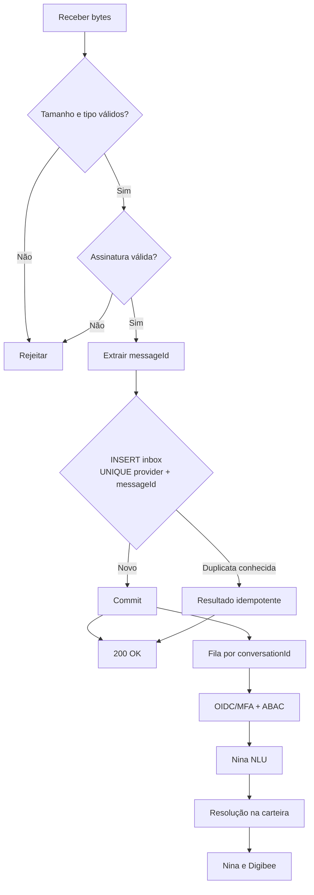
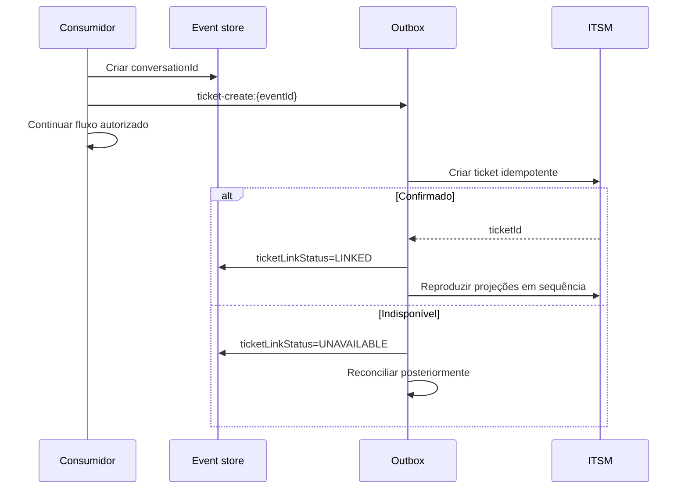
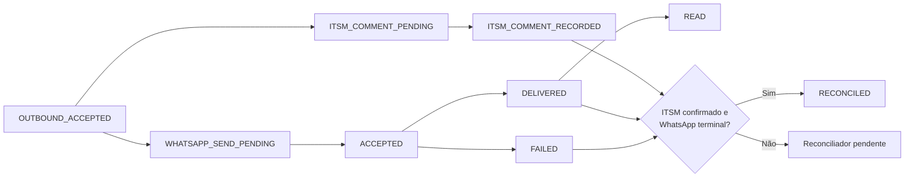

# Detalhes técnicos das integrações

Este documento detalha a implementação da arquitetura descrita no [`README.md`](../README.md). A interpretação de linguagem natural está em [`interpretacao-nina.md`](interpretacao-nina.md). Exemplos são referenciais e devem ser validados pelos schemas publicados.

## 1. Pipelines e componentes

| Componente | Trigger | Responsabilidade | Resultado |
| --- | --- | --- | --- |
| Adapter WhatsApp Cloud API | `GET/POST /v1/channels/whatsapp/meta/webhook` | Verificação, assinatura nos bytes originais, limites e normalização | Evento persistido ou rejeição |
| Adapter BSP | Endpoint próprio por BSP | Validar contrato específico do fornecedor | Mesmo evento canônico |
| Inbox worker | Evento `RECEIVED` | Consumir em ordem por `conversationId` | `COMPLETED` ou falha tipada |
| `nina-nlu` | Evento com ABAC de conversa | Parser determinístico + adapter Copilot/OpenAI + guardrails de catálogo | Intenção, tópicos e menções validados |
| `resolve_customer_mention` | Menção de cliente | Busca filtrada pela carteira do `rtvId` de servidor | 0, 1 ou N candidatos |
| `nina-whatsapp-orchestrator` | Recurso autorizado | Orquestrar consultas e mutações da intenção | Resultado consolidado versionado |
| `nina-human-fallback` | Comando de handoff | Criar handoff e publicação via Graph | `handoffId` |
| Teams bot | Universal Action | Validar atividade e encaminhar evento autenticado | Evento de handoff |
| Outbox workers | Comando pendente | Efeitos independentes em ITSM, WhatsApp e Teams | Confirmação/reconciliação |
| Audit writer | Eventos de segurança/negócio | Trilha imutável segregada | Registro append-only |

## 2. Processamento inbound



O endpoint só responde `200` depois do commit. Falha na inbox não pode ser mascarada como aceite. Parse, ticket, Nina e sistemas corporativos ficam fora do caminho de ACK.

### Contrato canônico

```json
{
  "schemaVersion": "1.0.0",
  "eventId": "evt_01J...",
  "traceId": "trc_01J...",
  "conversationId": "cnv_01J...",
  "conversationSequence": 7,
  "conversationVersion": 4,
  "causationId": null,
  "messageId": "wamid.HBgL...",
  "occurredAt": "2026-09-10T01:40:00Z",
  "channel": "whatsapp",
  "input": {
    "type": "text",
    "text": "Qual a previsão de entrega do pedido 12345?"
  },
  "ticket": {
    "ticketId": null,
    "ticketLinkStatus": "PENDING"
  }
}
```

## 3. Correlação, concorrência e idempotência

| Registro | Chave única | Estados/versão |
| --- | --- | --- |
| Inbox | `provider + messageId` | `RECEIVED`, `PROCESSING`, `COMPLETED`, `FAILED_RETRYABLE`, `FAILED_FINAL` |
| Conversa | `tenantId + environment + conversationId` | `conversationSequence`, `conversationVersion` |
| Link ITSM | `conversationId` | `PENDING`, `LINKED`, `UNAVAILABLE`, `CONFLICT` |
| Handoff | `handoffId` | estado e `handoffVersion` |
| Outbox | `operationId` | `PENDING`, `IN_FLIGHT`, `CONFIRMED`, `UNKNOWN`, `FAILED_FINAL` |

Aquisição do trabalho usa lease, fencing token e compare-and-set. Quando o lease expira, outro worker pode retomar; o token antigo não pode confirmar a operação.

`conversationSequence` é monotônico. Um resultado só altera o estado se `conversationVersion` ainda corresponder à versão lida. Caso contrário, retorna `STALE`. A política padrão não envia resposta obsoleta.

### IDs estáveis por efeito

```text
ticket-create:{eventId}
ticket-comment:{eventId}
whatsapp-send:{outboundCommandId}
teams-handoff:{handoffId}
order-create:{confirmedDraftId}
```

Retry automático exige o mesmo `operationId`. Após timeout, marcar `UNKNOWN`, consultar o destino e reconciliar antes de repetir. Somente erros classificados como transitórios (`429`, `502`, `503`, `504` e falha de transporte definida) usam backoff com jitter e limite. Erros de autenticação, autorização, validação e conflito não são repetidos cegamente.

## 4. Conversa e ITSM

`conversationId` existe antes do ticket. O evento enviado à Nina sempre o contém; `ticketId` pode ser nulo.



A primeira mensagem aparece apenas na descrição mínima da criação. Mensagens posteriores usam comentários com `visibility=restricted`. O título não contém telefone, CPF/CNPJ ou texto sensível. ITSM armazena resumo e tokens, não transcrição integral.

## 5. Contrato de orquestração

Metadados ficam no envelope; a intenção é única e os tópicos são uma lista. A NLU preenche `intent`, `requestedTopics` e `mentions`; o orquestrador só corre depois da resolução na carteira. IDs emitidos pelo modelo são ignorados.

```json
{
  "schemaVersion": "1.0.0",
  "eventId": "evt_01J...",
  "traceId": "trc_01J...",
  "conversationId": "cnv_01J...",
  "conversationSequence": 7,
  "conversationVersion": 4,
  "causationId": "evt_01J_inbound",
  "ticketId": null,
  "intent": "credit_analysis",
  "requestedTopics": ["credit_limit", "credit_available", "credit_check_amount", "overdue_titles"],
  "mentions": {
    "customer": {
      "raw": "Hommerson Agro",
      "type": "CUSTOMER_NAME"
    },
    "requestedOrderAmount": {
      "raw": "1milhão",
      "amountMinor": 100000000,
      "currency": "BRL"
    }
  }
}
```

Não há `rtvId`, tenant, telefone ou destinatário fornecido pela LLM. O gateway valida o token e acrescenta contexto interno:

```json
{
  "subjectId": "sub_01J...",
  "rtvId": "RTV-4412",
  "tenantId": "tenant-br",
  "authTime": "2026-09-10T01:32:00Z",
  "authenticationLevel": "urn:company:aal2",
  "permissionVersion": 81,
  "purpose": "RTV_CUSTOMER_SERVICE"
}
```

Esse bloco não volta para o modelo. Antes do fan-out, o policy enforcement point avalia ação, carteira, finalidade, freshness da permissão e nível de autenticação.

## 6. Consolidação e fontes

Cada bloco segue este formato:

```json
{
  "data": {
    "statusErp": "LIBERADO",
    "total": {
      "amountMinor": 1523055,
      "currency": "BRL"
    }
  },
  "provenance": {
    "source": "totvs_datasul",
    "sourceUpdatedAt": "2026-09-10T01:35:20Z",
    "observedAt": "2026-09-10T01:40:04Z",
    "version": "order-12345-v18",
    "staleness": "PT4M44S"
  }
}
```

O consolidado inclui `asOf` e não mistura silenciosamente snapshots fora da janela. Ownership:

| Dado | Fonte principal | Observação |
| --- | --- | --- |
| Identidade e vínculo RTV | IAM | claims e sessão |
| Carteira | TOTVS | Lecom não amplia autorização |
| Cadastro fiscal | Lecom, por campo | conflitos são sinalizados |
| Pedido integrado | TOTVS | Portal é principal durante captura |
| Crédito | Tarken | títulos permanecem no TOTVS |
| ETA/tracking | LoogAI | faturamento permanece no TOTVS |
| Eventos da conversa | Event store | ITSM é projeção |

## 7. Sucesso parcial

Cada intenção possui schema próprio de requisitos. Resultado global não substitui o status de cada fonte.

| Status da dependência | Tratamento |
| --- | --- |
| `SUCCESS` | Usar se estiver dentro da freshness |
| `NOT_FOUND` | Omitir dado; não inventar |
| `FORBIDDEN` | Encerrar acesso e gerar evento de segurança |
| `TIMEOUT` | Marcar indisponível; usar outro bloco somente se permitido |
| `STALE` | Omitir ou rotular conforme matriz da intenção |
| `PARTIAL_SUCCESS` | Responder apenas com fatos válidos e avisar limitação |

Mutações, crédito decisório e criação de pedido não admitem sucesso parcial. Uma consulta de preparação de visita pode omitir visitas se cadastro autorizado e outros blocos válidos existirem.

## 8. LLM e validação factual

Há dois estágios e dois contratos por estágio:

1. NLU: classificar utterance no catálogo `intents-v1` e extrair menções. Provedores: `microsoft_copilot` e `openai`.
2. Composição: gerar texto apenas com fatos consolidados. Renderer determinístico é preferencial.

Contratos:

1. Nina → adapter LLM: envelope interno com operação (`interpret_utterance` ou composição), dados minimizados e schema de saída.
2. Adapter → provedor: request nativo (Azure OpenAI/Foundry ou OpenAI), modelo em allowlist, structured output, timeout e tratamento de recusa/incompletude.

O JSON auto-detectado do Copilot Studio e a generative orchestration **não** substituem o schema versionado. O adapter rejeita chaves extras, intenção fora do enum e IDs de negócio.

O renderer determinístico é preferencial para fatos. Se houver LLM na composição:

- saída usa JSON Schema estrito;
- cada segmento factual contém `sourceField`;
- o validador compara nomes, números, datas, moeda e enumerações;
- qualquer fato sem lastro rejeita a saída completa;
- o fallback é template determinístico;
- histórico conversacional livre não entra na composição.

```json
{
  "schemaVersion": "1.0.0",
  "message": {
    "segments": [
      {
        "text": "Pedido 12345: LIBERADO.",
        "sourceField": "$.pedido.data.statusErp"
      }
    ]
  },
  "dataClasses": ["COMMERCIAL_CONFIDENTIAL"]
}
```

O catálogo `insights-v1` usa enums únicos. `VISIT_GAP` requer no mínimo 45 dias; uma visita há 29 dias não gera esse código. Entrega em aberto usa `OPEN_ORDERS`; ocorrência usa `DELIVERY_EXCEPTION`. `CREDIT_INSUFFICIENT` e `CREDIT_SUFFICIENT_FOR_AMOUNT` só nascem de Tarken `SUCCESS` mais o valor pedido já parseado; timeout não afirma capacidade.

## 9. Outbound e marcos de entrega



O worker de ITSM e o worker de WhatsApp avançam independentemente. O ticket vai para `WAITING_USER` no marco `DELIVERED`, salvo decisão de negócio versionada. Webhooks de status precisam ser autenticados e idempotentes.

## 10. Teams

O Graph somente publica o card. Ele não transforma `Action.Submit` em chamada direta ao Digibee. Um bot instalado recebe Universal Actions e valida o token Bot Framework/Entra.

O bot chama:

```http
POST /v1/nina/human-fallback/events
Authorization: Bearer {workload-token}
Idempotency-Key: hfe_01J...
Content-Type: application/json
```

```json
{
  "schemaVersion": "1.0.0",
  "eventId": "hfe_01J...",
  "traceId": "trc_01J...",
  "causationId": "teams-activity-174...",
  "pipelineAction": "process_handoff_event",
  "handoffAction": "assign",
  "handoffId": "HO-20260910-4412",
  "handoffEventId": "hfe_01J...",
  "handoffVersion": 1,
  "nonce": "single-use-expiring-nonce",
  "occurredAt": "2026-09-10T01:44:00Z",
  "actorAssertion": "eyJhbGciOiJFUzI1NiIsInR5cCI6IkpXVCJ9..."
}
```

Validações obrigatórias:

- token: assinatura, `iss`, `aud`, tenant, validade e escopo `handoff.callback`;
- `handoffEventId` e nonce ainda não consumidos;
- nonce dentro da expiração;
- compare-and-set de `handoffVersion`;
- agente derivado de `from.aadObjectId` na atividade validada e transportado em asserção assinada pelo bot;
- ownership do handoff ou permissão de supervisor;
- ação permitida no estado atual.

O token de workload autentica o bot, não o humano. Por isso, a asserção vincula `aadObjectId`, tenant e ID da atividade original e é verificada pelo Digibee. Na ação `reply`, o bot inclui o valor do `Input.Text` recebido com `associatedInputs=auto`; nas demais ações, texto é ignorado. Ticket, conversa e destino são resolvidos pelo `handoffId`; valores enviados pelo card não são autoridade.

## 11. Máquinas de estado

| Máquina | Estados | Eventos principais |
| --- | --- | --- |
| Ticket | `PROVISIONING`, `OPEN`, `PROCESSING`, `WAITING_USER`, `RESOLVED` | `ticket_linked`, `work_started`, `delivery_milestone_reached`, `resolved` |
| Handoff | `QUEUED`, `ASSIGNED`, `REPLIED`, `CLOSED` | `assign`, `reply`, `close`, `follow_up_required` |
| Entrega | `PENDING`, `ACCEPTED`, `DELIVERED`, `READ`, `FAILED` | webhooks autenticados do canal |

Cada evento registra precondição, ator, versão esperada e política para atraso. “Escalado” pertence ao handoff, não ao ticket.

## 12. Padrões de contrato

- OpenAPI 3.1 para endpoints HTTP;
- JSON Schema imutável por versão;
- `schemaVersion` obrigatório;
- testes de contrato de produtor e consumidor;
- `additionalProperties: false` por padrão;
- RFC 9457 para erros;
- RFC 3339 UTC para instantes;
- `YYYY-MM-DD` para datas civis com `timeZone`, por exemplo `America/Sao_Paulo`;
- valores monetários em `amountMinor` inteiro e `currency`;
- tamanho máximo, campos obrigatórios e enums documentados;
- nova versão maior para mudanças incompatíveis e janela publicada de depreciação.

## 13. Operação e observabilidade

| Sinal | Uso |
| --- | --- |
| `traceId` | rastreamento distribuído |
| idade/backlog inbox e outbox | capacidade e indisponibilidade |
| duplicatas e fencing rejects | concorrência/idempotência |
| respostas `STALE` | ordenação causal |
| divergência ITSM/WhatsApp | reconciliação |
| entrega por estado | aceite, entrega, leitura e falha |
| handoff por idade/estado | SLA humano |
| freshness por fonte | qualidade do consolidado |
| rejeições ABAC | segurança |
| rejeições NLU / injeção / ID inventado | qualidade da interpretação |
| divergência canário Copilot vs OpenAI | estabilidade do catálogo |
| rejeições factuais | qualidade da composição |

Alertas devem ter runbook, owner e limiar ajustado ao SLO. Logs não contêm payload completo nem identificadores diretos.

## 14. Checklist de deploy

1. Validar todos os exemplos contra OpenAPI/JSON Schema.
2. Executar testes concorrentes de duplicata, lease expirado e fencing.
3. Simular timeout após commit em cada destino e comprovar reconciliação.
4. Comprovar ordenação por conversa e descarte de resposta `STALE`.
5. Testar ITSM indisponível sem perda de trilha.
6. Testar token, replay, versão e ownership do callback Teams.
7. Validar DLP e ACL por destino.
8. Testar recusas/incompletude da NLU, failover de provedor e fallback determinístico.
9. Testar cliente fora da carteira e `customerId` inventado pela LLM.
10. Verificar retenção, exclusão propagada e auditoria imutável.
11. Publicar changelog, compatibilidade e rollback.
