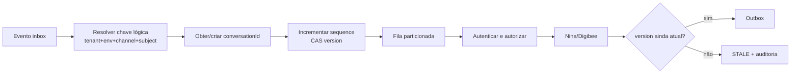
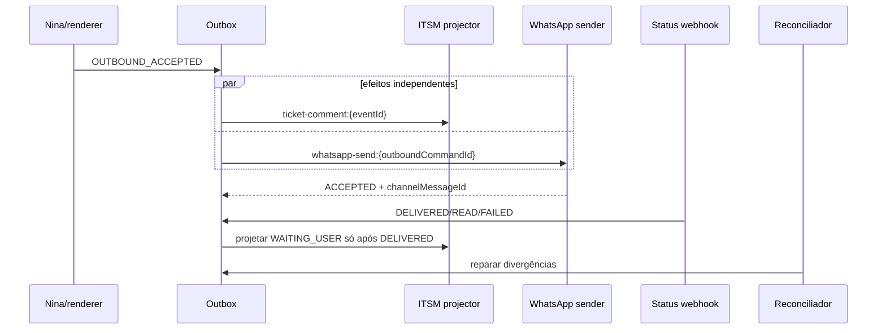
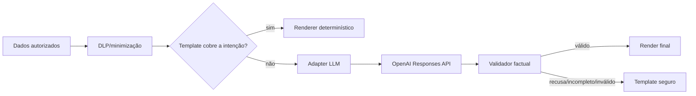

# Detalhes técnicos das integrações

Este documento operacionaliza a arquitetura do `README.md`. Valores de timeout,
retenção e SLO são configuração por ambiente; os invariantes abaixo não são.

## Componentes e ownership

| Componente | Responsabilidade | Persistência |
| --- | --- | --- |
| Adapter Meta/BSP | verificação `GET`, assinatura sobre bytes originais, limites e normalização | nenhuma |
| Inbox | aceite durável, deduplicação e leases | banco com unicidade e CAS |
| Serviço de conversas | `conversationId`, sequência, versão e sessão | banco transacional |
| IAM/policy engine | autenticação OIDC e decisão ABAC | políticas versionadas |
| Nina | intenção, entidades e composição controlada | contexto mínimo |
| Digibee | orquestração e contratos com sistemas | estado técnico mínimo |
| Outbox | comandos para efeitos independentes | banco transacional |
| Reconciliadores | confirmar resultado desconhecido e reparar projeções | checkpoints |
| Auditoria | fatos imutáveis de segurança e negócio | WORM/append-only |
| ITSM | resumo operacional com ACL | projeção reconstruível |
| Teams bot | receber Universal Actions e autenticar agente | estado de handoff |

## Pipelines

| Pipeline | Trigger | Aceite/saída | Idempotência |
| --- | --- | --- | --- |
| `whatsapp-meta-adapter-v1` | webhook Meta nativo | inbox commit + ACK | `(meta,messageId)` unique |
| `whatsapp-bsp-adapter-v1` | webhook BSP específico | inbox commit + ACK | `(bsp,messageId)` unique |
| `nina-inbound-worker-v1` | evento da inbox | evento para Nina | `eventId` |
| `nina-orchestrator-v1` | `POST /v1/orchestrations` | consolidado `asOf` | `operationId` |
| `nina-outbound-v1` | `POST /v1/outbound-commands` | comando na outbox | `outboundCommandId` |
| `nina-human-fallback-v1` | `POST /v1/handoffs` | handoff persistido | `handoffId` |
| `teams-callback-v1` | bot autenticado → `/v1/handoff-events` | evento de handoff | `handoffEventId` + nonce |
| `itsm-projector-v1` | outbox/eventos | ticket/resumo reconciliado | `operationId` |
| `whatsapp-delivery-v1` | outbox + status webhook | estados de entrega | message/status event ID |

Nenhum pipeline outbound pressupõe que outro efeito concluiu. A outbox cria
comandos independentes na mesma transação que aceita a resposta.

## Transação inbound

```text
BEGIN
  INSERT inbox(channel_provider, message_id, event_id, raw_digest, state)
    VALUES (...) ON CONFLICT DO NOTHING
  INSERT audit(event_id, type='INBOUND_ACCEPTED', ...)
COMMIT
ACK 200
```

- Duplicata confirmada recebe `200` sem novo efeito.
- O payload bruto pode ser descartado após validação; retenção excepcional deve
  seguir a política LGPD.
- Claim usa `state`, `leaseUntil`, `fencingToken` monotônico e CAS.
- Worker antigo não pode concluir após perder a lease.
- Falha final preserva evento e motivo; não apaga a reserva.

## Conversa e processamento serial



Sessão: 30 minutos de inatividade, 12 horas de duração absoluta e suspensão da
expiração durante handoff. Após resolução, a próxima mensagem cria uma conversa.

## Contrato interno de identidade

O gateway anexa um contexto assinado e não exposto à LLM:

```json
{
  "subjectId": "2cbfe19d-...",
  "rtvId": "RTV-4412",
  "tenantId": "br-sales",
  "phoneBindingId": "pb-...",
  "authTime": "2026-09-10T01:10:00Z",
  "acr": "urn:company:loa:2",
  "permissionVersion": "73"
}
```

Pedidos da Nina só contêm intenção e entidades não confiáveis. O backend ignora
qualquer tentativa de fornecer campos de identidade ou destino.

## Decisão ABAC

| Verificação | Falha | Efeito |
| --- | --- | --- |
| token, issuer, audience, tenant e assinatura | `401` | não consultar fontes |
| ação no escopo | `403` | negar e auditar |
| cliente na carteira vigente | `403` | negar, evento de segurança |
| finalidade permitida | `403` | negar e auditar |
| ACR e `auth_time` suficientes | `403 STEP_UP_REQUIRED` | iniciar MFA |
| versão da permissão atual | `409 PERMISSION_CHANGED` | reautenticar/reavaliar |

A mesma regra é reforçada na fonte quando ela oferece autorização por linha ou
recurso.

## Orquestração e consolidação

Cada resposta de fonte usa este envelope:

```json
{
  "source": "totvs",
  "sourceUpdatedAt": "2026-09-10T01:20:00Z",
  "observedAt": "2026-09-10T01:21:03Z",
  "version": "40771",
  "staleness": "FRESH",
  "data": {}
}
```

O agregador fixa `asOf` no início. `PARTIAL_SUCCESS` requer todos os campos
obrigatórios válidos. `TIMEOUT`, `NOT_FOUND`, `FORBIDDEN` e `STALE` permanecem
distintos. A matriz por intenção está no `README.md`.

### Retry de escrita

1. Criar `operationId` estável.
2. Persistir comando antes da chamada.
3. Enviar a chave se o destino a suporta.
4. Em timeout, marcar `OUTCOME_UNKNOWN`.
5. Consultar o destino por chave ou evidência inequívoca.
6. Repetir somente quando a reconciliação confirmar ausência.
7. Caso não seja possível provar ausência, encaminhar para análise; não repetir
   cegamente.

## Outbound



## Teams bot e callback

Digibee publica via Graph uma mensagem que referencia o attachment:

```json
{
  "body": {
    "contentType": "html",
    "content": "Novo handoff <attachment id=\"card-ho-4412\"></attachment>"
  },
  "attachments": [{
    "id": "card-ho-4412",
    "contentType": "application/vnd.microsoft.card.adaptive",
    "content": "{\"type\":\"AdaptiveCard\",\"version\":\"1.5\",\"body\":[{\"type\":\"TextBlock\",\"text\":\"Atendimento HO-4412\"}],\"actions\":[{\"type\":\"Action.Execute\",\"title\":\"Assumir\",\"verb\":\"assign\",\"data\":{\"handoffId\":\"HO-4412\",\"handoffVersion\":1}}]}"
  }]
}
```

O conteúdo é minimizado: sem telefone completo, score, CPF/CNPJ completo ou
evidência de segurança fora da fila autorizada.

O Teams entrega a ação ao bot instalado. O bot valida token Bot
Framework/Entra (`iss`, `aud`, tenant, assinatura, `nbf`, `exp`), deriva o
agente e chama Digibee com credencial de workload no escopo
`handoff.callback`.

```json
{
  "schemaVersion": "1.0.0",
  "pipelineAction": "process_handoff_event",
  "handoffAction": "reply",
  "handoffId": "HO-4412",
  "handoffEventId": "01J7HE...",
  "handoffVersion": 2,
  "nonce": "one-time-value",
  "expiresAt": "2026-09-10T01:40:00Z",
  "reply": {"text": "Confirme o número do pedido."}
}
```

O servidor resolve ticket, conversa, agente e WhatsApp. Nonce é consumido
atomicamente; evento repetido retorna o resultado anterior. `assign`, `reply` e
`close` têm transições e permissões distintas.

## ITSM

- Primeira mensagem: apenas descrição resumida e minimizada.
- Mensagens posteriores: work notes mínimas, nunca transcrição integral.
- Identificadores pessoais são tokenizados.
- ACL é restrita por fila e finalidade; sem `visibility=public`.
- `ticketId` pode permanecer nulo com `ticketLinkStatus=PENDING|UNAVAILABLE`.
- Após recuperação, eventos autorizados são projetados na ordem da conversa.
- Auditoria imutável nunca é delegada ao ITSM.

## Adapter LLM e renderer

Fluxo preferencial:



Cada fato da saída estruturada inclui `sourceField`, por exemplo:

```json
{
  "claims": [{
    "text": "A entrega está prevista para 10/09/2026.",
    "sourceField": "/logistica/previsaoEntrega"
  }]
}
```

O validador compara strings, nomes, números, datas e valores com o payload
efetivamente enviado ao adapter. Histórico conversacional livre não participa
da composição.

## Padrões de contratos

- Especificação normativa: `docs/contracts/openapi.yaml`.
- Schemas: `docs/contracts/schemas/*.json`.
- Erros: RFC 9457.
- Instantes: RFC 3339 UTC.
- Datas civis: `YYYY-MM-DD` + `businessTimeZone`.
- Dinheiro: inteiro em unidade mínima e moeda ISO 4217.
- Campos desconhecidos: rejeitados.
- Compatibilidade: minor aditivo; major para remoção ou mudança semântica.
- Exemplos são fixtures de contract tests e devem validar em CI.

## Observabilidade e reconciliação

| Métrica | Dimensões essenciais |
| --- | --- |
| `inbox_backlog_age_seconds` | provider, tenant |
| `inbox_duplicates_total` | provider |
| `lease_expired_total` | worker, pipeline |
| `stale_response_total` | intent |
| `outbox_effect_age_seconds` | effect, destination |
| `delivery_state_total` | accepted, delivered, read, failed |
| `projection_divergence_total` | ITSM, WhatsApp, Teams |
| `handoff_stalled_total` | queue, state |
| `source_staleness_seconds` | source, entity |
| `authorization_denied_total` | action, reason; sem PII |

Alertas usam idade e tendência, não apenas contagem. Logs nunca carregam tokens,
texto livre sensível ou documentos completos.

## Testes obrigatórios

1. Dois webhooks simultâneos com o mesmo `messageId`.
2. Crash após claim e retomada com fencing token.
3. Timeout depois de o destino gravar o efeito.
4. ITSM indisponível durante toda a conversa e reconstrução posterior.
5. Resposta lenta superada por mensagem mais nova (`STALE`).
6. Replay, nonce expirado e versão divergente no Teams.
7. LLM produz fato não presente e cai no template.
8. DLP por destino e ACL do ITSM.
9. Transições inválidas de ticket, handoff e entrega.
10. Contratos e exemplos contra OpenAPI/JSON Schema.
