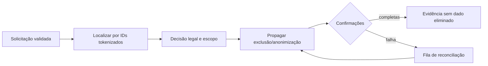

# Governança LGPD

Esta política define o mínimo arquitetural. Prazos finais, bases legais e
transferências devem ser aprovados por Jurídico/DPO no RIPD antes da produção.

## Inventário de tratamento

| Finalidade | Categorias | Controlador/operador | Destinos | Minimização |
| --- | --- | --- | --- | --- |
| autenticar RTV | identidade corporativa, vínculo do telefone | empresa / IAM | IAM, policy engine | IDs opacos e claims mínimos |
| atender consulta | mensagem, cliente, pedido | empresa / integradores | Digibee e fontes necessárias | somente campos da intenção |
| compor resposta | fatos autorizados | empresa / provedor LLM | adapter/OpenAI aprovada | tokenizar IDs; sem histórico livre |
| entregar mensagem | telefone e resposta | empresa / BSP/Meta | WhatsApp | conteúdo necessário ao usuário |
| handoff | contexto mínimo | empresa / Microsoft | Teams bot/fila autorizada | sem documento/score completos |
| suporte operacional | resumo e protocolo | empresa / ITSM | ITSM | IDs tokenizados; sem transcrição |
| segurança/auditoria | ator, decisão, ação e resultado | empresa / storage auditado | trilha segregada | sem texto livre quando dispensável |

O registro de operações deve completar, para cada linha, finalidade específica,
base legal, titular, sistema, campos, região, subprocessadores, retenção,
controles e processo de atendimento ao titular.

## Classificação e política por destino

| Classe | OpenAI | Teams | ITSM | WhatsApp | Auditoria |
| --- | --- | --- | --- | --- | --- |
| `PERSONAL_IDENTIFIER` | tokenizado | mascarado | tokenizado | somente quando necessário | pseudonimizado |
| `COMMERCIAL_CONFIDENTIAL` | mínimo autorizado | fila com ACL | resumo com ACL | RTV autorizado | evento categórico |
| `FINANCIAL_PROFILE` | sem score; mínimo | proibido por padrão | proibido por padrão | resultado necessário + step-up | decisão sem valor detalhado |
| `SECURITY_EVIDENCE` | proibido | canal segregado mínimo | proibido | proibido | permitido com ACL |

O DLP calcula classes antes de cada fronteira. Campo booleano fornecido pelo
chamador não substitui classificação.

## Retenção e descarte

| Categoria | Prazo operacional proposto | Término |
| --- | --- | --- |
| payload bruto de webhook | não persistir; máximo 24 h em quarentena de incidente | exclusão criptográfica |
| inbox/outbox técnico | 30 dias após conclusão | purge verificável |
| contexto conversacional | 30 dias após encerramento | anonimizar/excluir |
| anexos de pedido | 24 h, salvo obrigação de negócio aprovada | exclusão criptográfica |
| ITSM resumido | prazo da política de suporte aprovada | exclusão/anonimização propagada |
| auditoria de segurança | prazo aprovado no RIPD e obrigação aplicável | retenção WORM + purge governado |
| dados no provedor LLM | menor retenção contratualmente disponível | exclusão conforme contrato |

Prazos são propostas conservadoras, não uma declaração de base legal. O RIPD
deve confirmar necessidade e proporcionalidade. Legal hold suspende descarte de
forma registrada e limitada.

## Exclusão propagada e direitos do titular

- Atender acesso, correção, oposição, portabilidade e revisão de decisão
  automatizada conforme aplicabilidade.
- Não usar telefone/CPF em buscas amplas; usar índice de identidade protegido.
- Propagar a ITSM, Teams, OpenAI, BSP, caches, backups e sistemas de origem
  conforme papel e obrigação de cada parte.
- Backups usam expiração definida e bloqueiam restauração sem reaplicar tombstone.
- Registrar comprovação sem reter o conteúdo excluído.

## OpenAI e transferência internacional

Antes de habilitar:

- DPA e subprocessadores aprovados;
- treinamento com dados enviado desabilitado;
- retenção mínima/zero quando disponível;
- região e mecanismo de transferência aprovados;
- controles de acesso, criptografia e notificação de incidente;
- proibição de enviar CPF/CNPJ completos, telefone, score e histórico livre;
- processo de exclusão e evidência contratual testado.

Se essas condições não forem atendidas, usar renderer determinístico sem envio
ao provedor.

## ITSM, Teams e auditoria

- ITSM contém resumo mínimo, não transcrição; ACL por fila/finalidade.
- Teams recebe contexto temporário e minimizado; canais gerais são proibidos.
- Evidência de segurança fica na trilha imutável segregada.
- Auditoria registra ator, autorização, ação, recurso, finalidade, instante e
  resultado, com acesso monitorado.
- Exportações e pesquisas administrativas são registradas e revisadas.

## RIPD

O RIPD deve cobrir:

1. fluxo e volume por categoria de dado;
2. finalidade e base legal por tratamento;
3. decisões automatizadas e revisão humana;
4. risco de acesso cruzado, SIM swap, prompt injection e exfiltração;
5. operadores, subprocessadores e transferência internacional;
6. necessidade/proporcionalidade de LLM, Teams e ITSM;
7. retenção, descarte, backups e direitos;
8. controles, testes, risco residual e aceite formal.

## Gate de produção

- [ ] Inventário e RIPD aprovados por DPO/Jurídico.
- [ ] DPA, região, retenção e treinamento do provedor LLM aprovados.
- [ ] DLP por destino e testes negativos ativos.
- [ ] ACL e prevenção de transcrição no ITSM/Teams verificadas.
- [ ] Exclusão propagada e restauração de backup testadas.
- [ ] Processo de revisão humana de decisões publicado.
- [ ] Plano de incidente e comunicação ao controlador/titular definido.
