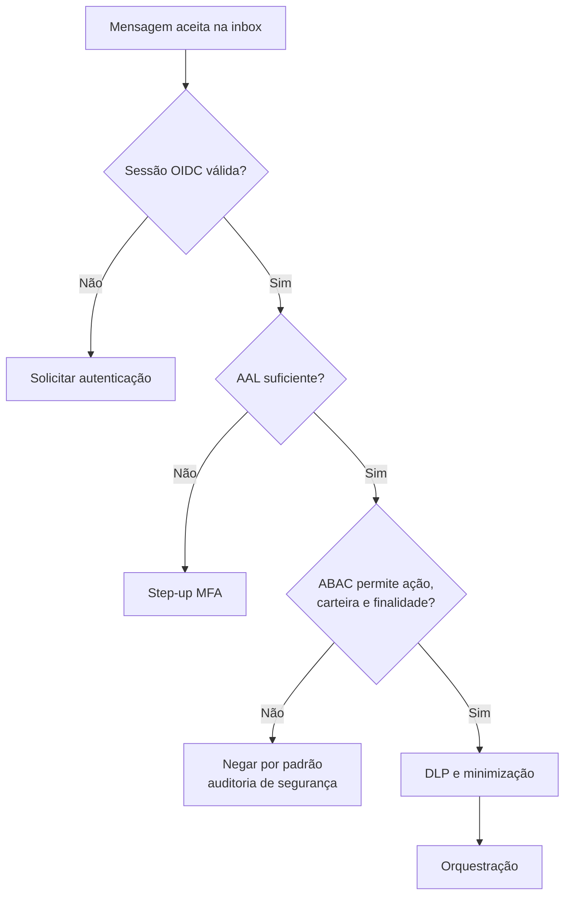
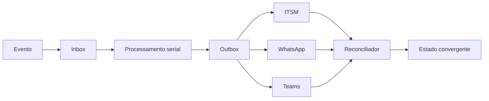

# Riscos das integrações

Este documento registra riscos, controles e evidências mínimas para a arquitetura Digibee + Nina. O [`README.md`](../README.md) é a referência arquitetural e [`detalhes-tecnicos-integracoes.md`](detalhes-tecnicos-integracoes.md) define os mecanismos.

## Escala

- **P0 — crítico:** acesso indevido, perda/duplicação de mensagens ou inviabilidade do fluxo.
- **P1 — alto:** dados incorretos, estados divergentes ou integração insegura.
- **P2 — médio:** interoperabilidade, operação ou evolução degradadas.

## Matriz de riscos

| ID | Pri. | Risco | Sinal | Controle obrigatório | Evidência de aceite |
| --- | --- | --- | --- | --- | --- |
| R01 | P0 | Timeout do webhook e reentrega | ACK p95 alto, duplicatas | Validar e persistir em inbox antes do ACK; processamento assíncrono | Teste com ITSM/Nina indisponíveis ainda confirma o evento persistido rapidamente |
| R02 | P0 | Conversa depender de `ticketId` | eventos sem ticket falham | `conversationId` obrigatório; ticket opcional e reconciliável | Conversa continua com `ticketLinkStatus=UNAVAILABLE` e depois projeta eventos em ordem |
| R03 | P0 | Corrida na deduplicação | efeitos duplicados simultâneos | restrição única/put-if-absent, CAS, lease e fencing | teste concorrente produz um único efeito |
| R04 | P0 | Dupla escrita ITSM + WhatsApp | ticket e entrega divergem | outbox, `operationId` por efeito e reconciliador | falha isolada de cada destino converge sem duplicar |
| R05 | P0 | Prefixo de CPF usado como autenticação | acesso com dado adivinhável | OIDC + PKCE + MFA; vínculo servidor-side; prefixo só como sinal | teste comprova que prefixo correto sem sessão não autoriza |
| R06 | P0 | `rtvId`/destino controlado pela LLM | acesso cruzado/IDOR | identidade e destinatário derivados das claims; ABAC antes do fan-out | payload adulterado não muda sujeito, carteira ou destino |
| R07 | P0 | Callback Teams falsificado ou repetido | ações sem ator ou duplicadas | bot autenticado, workload token, nonce, evento único, expiração, versão e ownership | testes de token, replay, corrida e supervisor |
| R08 | P0 | Card sem receptor funcional | botões não geram ação | Graph publica; Teams bot recebe Universal Action; attachment serializado e referenciado | teste ponta a ponta de `assign`, `reply`, `close` |
| R09 | P0 | Respostas fora de ordem | contexto/ticket regride | partição por conversa, sequência, versão e política `STALE` | resposta antiga não é enviada nem altera estado |
| R10 | P1 | Estados incompatíveis | transição impossível | máquinas separadas para ticket, handoff e entrega | testes de todas as transições e eventos tardios |
| R11 | P1 | Envelope nativo misturado ao canônico | assinatura/schema inválidos | adapters por Cloud API/BSP e contrato canônico separado | fixtures reais de cada provedor validam |
| R12 | P1 | LLM inventa fatos | saída sem lastro | renderer determinístico ou `sourceField`, schema estrito e validador | nome/número/data ausente reprova e aciona template |
| R13 | P1 | Dado completo em fronteira indevida | CPF/CNPJ/score em logs ou canais | classificação calculada, minimização, tokenização e DLP | testes por destino não encontram classes proibidas |
| R14 | P1 | Governança LGPD insuficiente | retenção e finalidade desconhecidas | inventário, RIPD, base legal, operadores, região, direitos e exclusão propagada | aprovações e testes de retenção/exclusão |
| R15 | P1 | ITSM usado como auditoria integral | tickets públicos/editáveis | resumo mínimo, ACL e auditoria append-only segregada | ITSM sem transcrição/PII desnecessária; auditoria íntegra |
| R16 | P1 | Retry duplica escrita | timeout após commit remoto | `operationId`; estado `UNKNOWN`; consulta antes de repetir | fault injection após commit não duplica |
| R17 | P1 | Fonte de verdade indefinida | valores conflitantes | ownership por campo, proveniência, versão, `asOf` e freshness | conflito é resolvido ou sinalizado, nunca ocultado |
| R18 | P1 | Sucesso parcial ambíguo | resposta incompleta tratada como completa | matriz por intenção e status por dependência | testes para `NOT_FOUND`, `FORBIDDEN`, `TIMEOUT`, `STALE`, `PARTIAL_SUCCESS` |
| R19 | P1 | Contrato interno confundido com OpenAI | request incompatível | separar Nina→adapter e adapter→API escolhida | contract tests dos dois contratos |
| R20 | P1 | Intents/campos divergentes | produtor e consumidor discordam | uma intenção + `requestedTopics[]`; envelope único | todos os exemplos passam no mesmo schema |
| R21 | P2 | Catálogo de insights inconsistente | código viola regra | catálogo versionado, enums e testes determinísticos | `VISIT_GAP` não ocorre abaixo de 45 dias |
| R22 | P2 | Primeira mensagem duplicada | descrição e comentário iguais | primeira mensagem só na descrição; posteriores em comentário | teste de criação verifica uma ocorrência |
| R23 | P2 | Sessão sem expiração formal | conversa antiga reutilizada | TTL, máximo absoluto, namespace e regra de handoff/resolução | testes de inatividade, limite e nova conversa |
| R24 | P2 | Contratos sem versionamento | quebra em deploy | OpenAPI 3.1, JSON Schema, compatibilidade e depreciação | pipeline de contract tests bloqueia ruptura |
| R25 | P2 | HTTP, datas e dinheiro ambíguos | parsing/precisão divergentes | RFC 9457, RFC 3339, data civil + timezone, minor units + moeda | testes de serialização e limites |

## Controles de segurança

Requisitos:

- Authorization Code + PKCE e MFA;
- sessão curta com `auth_time`, nível e versão das permissões;
- vínculo verificado entre telefone, sujeito imutável e RTV;
- step-up para finanças e mutações;
- negação por padrão e autorização antes de qualquer consulta;
- reforço de autorização na fonte quando disponível;
- HMAC com chave em KMS/HSM se correlação de CPF for indispensável;
- segredo, token e nonce nunca registrados.

## Risco de privacidade e LGPD

| Processamento | Dados mínimos | Destino | Retenção | Controle |
| --- | --- | --- | --- | --- |
| Identidade/sessão | sujeito tokenizado, nível, vínculo | IAM/cofre | conforme segurança e base legal | acesso restrito e rotação |
| Composição | apenas campos necessários | OpenAI aprovada | retenção contratual mínima | treinamento desabilitado, região aprovada, DLP |
| Handoff | resumo necessário | Teams | SLA do atendimento | canal restrito e card sem evidência sensível |
| Operação | resumo e IDs tokenizados | ITSM | política por categoria | `visibility=restricted`, ACL e descarte |
| Auditoria | ator, decisão, ação, recurso, finalidade e resultado | trilha imutável | política regulatória aprovada | append-only e acesso segregado |

Antes de produção devem existir: inventário de tratamento, RIPD, base legal/finalidade, papéis de controlador e operador, análise de transferência internacional, processo de direitos do titular, retenção por categoria, exclusão propagada e revisão humana de decisões automatizadas relevantes.

## Risco de consistência e recuperação

Não se usa transação distribuída entre destinos. A garantia é aceite durável, efeitos idempotentes, estados observáveis e convergência por reconciliação.

### Política de retry

| Classe | Retry | Ação |
| --- | --- | --- |
| Transporte, `429`, `502`, `503`, `504` | Limitado, backoff com jitter | preservar `operationId` |
| Timeout após envio | Não repetir imediatamente | marcar `UNKNOWN`, consultar e reconciliar |
| `400`/schema | Não | corrigir produtor ou mover para falha final |
| `401`/`403` | Não cego | renovar credencial somente quando aplicável; auditar |
| `409` versão | Não cego | reler entidade e aplicar política de conflito |

## SLOs, SLIs e alertas

Os valores finais dependem de capacidade e contrato dos fornecedores; os sinais abaixo são obrigatórios:

| SLI | Objetivo controlado |
| --- | --- |
| ACK após persistência | latência e taxa de sucesso separadas do processamento |
| Inbox/outbox | backlog, idade máxima e taxa de falha final |
| Deduplicação | duplicatas rejeitadas e efeitos externos duplicados |
| Ordenação | quantidade e idade de respostas `STALE` |
| Entrega | taxas `ACCEPTED`, `DELIVERED`, `READ`, `FAILED` |
| Reconciliação | divergência ITSM/WhatsApp e tempo até convergência |
| Handoff | idade por estado e callbacks rejeitados |
| Dados | freshness por fonte e blocos omitidos |
| IA | rejeição factual e uso do renderer de fallback |
| Segurança | negações ABAC, step-up e replay detectado |
| LGPD | itens vencidos de retenção e exclusões pendentes |

Cada alerta precisa de owner, runbook, limiar, janela e política de escalonamento.

## Testes mínimos

1. Duas entregas simultâneas do mesmo `messageId`.
2. Queda do worker após adquirir lease e após concluir cada efeito.
3. Timeout remoto antes e depois do commit.
4. ITSM indisponível durante uma conversa completa.
5. Respostas lentas chegando fora de ordem.
6. Alteração maliciosa de `rtvId`, tenant, ticket e destinatário.
7. Sessão ausente, expirada, com AAL insuficiente e permissão desatualizada.
8. Callback Teams com token inválido, nonce repetido, versão antiga e agente sem ownership.
9. Evento de entrega duplicado e fora de ordem.
10. LLM introduzindo nome, valor ou data não presente.
11. DLP em OpenAI, Teams, ITSM e WhatsApp.
12. Conflito e dado vencido em cada fonte.
13. Retenção e exclusão propagada.
14. Compatibilidade entre versões de produtor e consumidor.

## Critério de liberação

Produção permanece bloqueada enquanto qualquer controle P0 não tiver teste automatizado e evidência de recuperação. Controles P1 exigem owner e aceite formal; exceções precisam de prazo, compensação e registro de risco. P2 deve estar no contrato e no pipeline de qualidade antes da primeira evolução incompatível.
