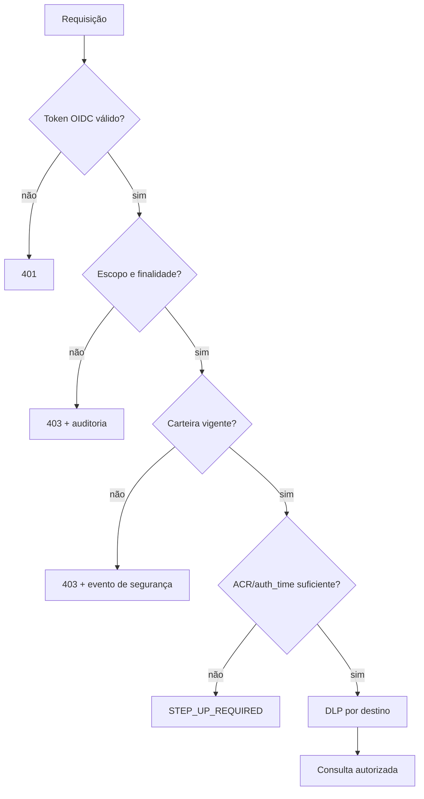

# Riscos de integração e controles

Registro de riscos residuais da arquitetura. Os controles abaixo são requisitos
de produção e têm evidência verificável.

## Matriz

| ID | Risco | P | I | Controle preventivo | Detecção/recuperação | Evidência |
| --- | --- | --- | --- | --- | --- | --- |
| R1 | Reentrega concorrente do webhook | M | C | inbox com unique `(provider,messageId)` antes de efeitos | métrica de duplicatas; replay seguro | teste de corrida |
| R2 | Reserva abandonada | M | A | lease, fencing token e CAS | retomar lease expirada | teste de crash |
| R3 | Perda de mensagem antes do ACK | B | C | ACK só após commit durável | idade/backlog da inbox | teste de falha de storage |
| R4 | Dupla escrita ITSM/WhatsApp divergente | M | C | outbox e efeitos independentes | reconciliadores e estados de entrega | teste de falha parcial |
| R5 | Timeout após commit externo | M | A | `operationId` por efeito | consultar destino antes de retry | teste de resposta perdida |
| R6 | ITSM indisponível | M | A | `conversationId` e auditoria independentes | reprojeção ordenada | teste de reconstrução |
| R7 | Resposta fora de ordem | M | A | fila por conversa, sequência e versão | `STALE` auditado e suprimido | teste de consulta lenta |
| R8 | RTV/persona falsificada | B | C | OIDC PKCE, MFA e identidade server-side | eventos IAM e vínculo de telefone | teste de claims adulterados |
| R9 | IDOR fora da carteira | B | C | ABAC deny-by-default antes do fan-out | decisão e recurso na auditoria | teste por recurso |
| R10 | CPF usado como autenticação | M | C | CPF é somente sinal; HMAC em KMS se necessário | alerta antifraude sem autorizar | revisão de política |
| R11 | Callback Teams falsificado/replay | M | C | bot autenticado, workload scope, nonce, expiração, CAS | evento duplicado retorna resultado anterior | testes de replay/token |
| R12 | Card Teams sem receptor | M | A | bot instalado + Universal Actions | handoff estagnado | teste ponta a ponta |
| R13 | Alucinação factual | M | A | renderer ou schema + `sourceField` + validador | fallback para template | corpus negativo |
| R14 | Vazamento por LLM/Teams/ITSM/WhatsApp | M | C | classificação DLP e minimização por destino | varredura e alerta segregado | testes de política |
| R15 | ITSM como auditoria editável | M | A | auditoria WORM separada | verificação de integridade | exercício de reconstrução |
| R16 | Fontes conflitantes/stale | M | A | matriz de ownership, `asOf`, versão e frescor | divergência por campo | teste de snapshots |
| R17 | Sucesso parcial incorreto | M | A | matriz de mínimos por intenção | razão estruturada | contract tests |
| R18 | Quebra de contrato | M | A | OpenAPI/JSON Schema imutáveis | producer/consumer tests | CI |
| R19 | Retenção ou finalidade inadequada | M | C | inventário, RIPD, prazos e exclusão propagada | revisão de acessos e descarte | relatório LGPD |
| R20 | Pedido duplicado | M | C | draft confirmado + `operationId` | reconciliação por ID | teste de timeout |

Legenda: probabilidade (`P`) e impacto (`I`): B = baixa, M = média, A = alta,
C = crítica.

## Regras de retry

| Operação | Retry automático | Condição |
| --- | --- | --- |
| leitura idempotente | sim | 429/5xx/timeout, com deadline e jitter |
| escrita com chave suportada | sim | mesma `operationId`, respeitando `Retry-After` |
| escrita sem chave, consulta conclusiva | condicional | repetir só após confirmar ausência |
| escrita sem chave, resultado incerto | não | reconciliação/manual |
| erro 4xx de validação/autorização | não | corrigir contrato ou credencial |
| callback Teams repetido | não reexecuta | retornar resultado persistido |

Backoff não torna uma escrita idempotente.

## Controles de segurança

- `rtvId`, ticket, tenant e destino vêm de estado server-side.
- Prompt e saída de LLM nunca participam da decisão de identidade.
- Evidência de segurança fica em trilha segregada, não em canal Teams geral.
- Tokens usam audiência e escopo mínimos e são rotacionados.

## Privacidade

| Fronteira | Permitido | Proibido por padrão |
| --- | --- | --- |
| OpenAI | entidades tokenizadas e fatos mínimos | CPF/CNPJ completos, telefone, score, histórico livre |
| Teams atendimento | protocolo, contexto mínimo e resposta | identificador completo e perfil financeiro |
| Teams segurança | evidência minimizada com ACL | exposição em canal geral |
| ITSM | resumo e IDs tokenizados | transcrição integral e `visibility=public` |
| WhatsApp | resultado necessário ao RTV autorizado | score interno e detalhe de segurança |
| Logs | IDs técnicos e classes | texto livre, segredo e documento completo |

Detalhes de finalidade, retenção e direitos estão em `governanca-lgpd.md`.

## SLIs e alertas

| SLI | Indicador | Alerta inicial |
| --- | --- | --- |
| aceite durável | ACK após commit / webhooks válidos | < 99,9% em 15 min |
| idade da inbox | p95 do evento não processado | > 60 s |
| duplicação evitada | conflitos unique / entradas | desvio de 3x baseline |
| efeito pendente | p95 por destino | > SLO do destino |
| entrega | delivered / accepted | queda de 10 p.p. |
| divergência | projeções inconsistentes | qualquer item > 15 min |
| respostas obsoletas | `STALE` / respostas | > 1% em 15 min |
| handoff estagnado | idade por estado | acima do SLA da fila |
| freshness | fontes fora da janela | > 5% por fonte |
| negações ABAC | por razão | desvio de 3x baseline |

Os valores são baselines iniciais e devem ser calibrados sem enfraquecer os
invariantes de segurança e durabilidade.

## Resposta a incidentes

| Evento | Ação automática | Ação operacional |
| --- | --- | --- |
| backlog crescente | reduzir fan-out, circuit breaker | investigar dependência |
| divergência ITSM/WhatsApp | reconciliar por `operationId` | revisar itens inconclusivos |
| replay Teams | rejeitar e auditar | verificar credencial/nonce |
| vazamento DLP | bloquear destino | acionar resposta LGPD |
| fonte stale | omitir/sinalizar bloco | restaurar fonte |
| falha de validador factual | template determinístico | revisar prompt/schema |
| permissão alterada | invalidar sessão/decisão | reautenticar usuário |

## Gate de produção

- [ ] Testes de concorrência, crash e reconciliação aprovados.
- [ ] OIDC/MFA, vínculo do telefone e step-up verificados.
- [ ] ABAC testado por ação, carteira, finalidade e fonte.
- [ ] Callback Teams autenticado, autorizado, não repetível e ponta a ponta.
- [ ] ITSM reconstruível a partir da trilha durável.
- [ ] Schemas e exemplos validados em contract tests.
- [ ] Validador factual e fallback determinístico exercitados.
- [ ] Políticas DLP por destino testadas.
- [ ] RIPD, contratos de operador, retenção e exclusão aprovados.
- [ ] Dashboards de backlog, entrega, divergência, handoff e freshness ativos.
