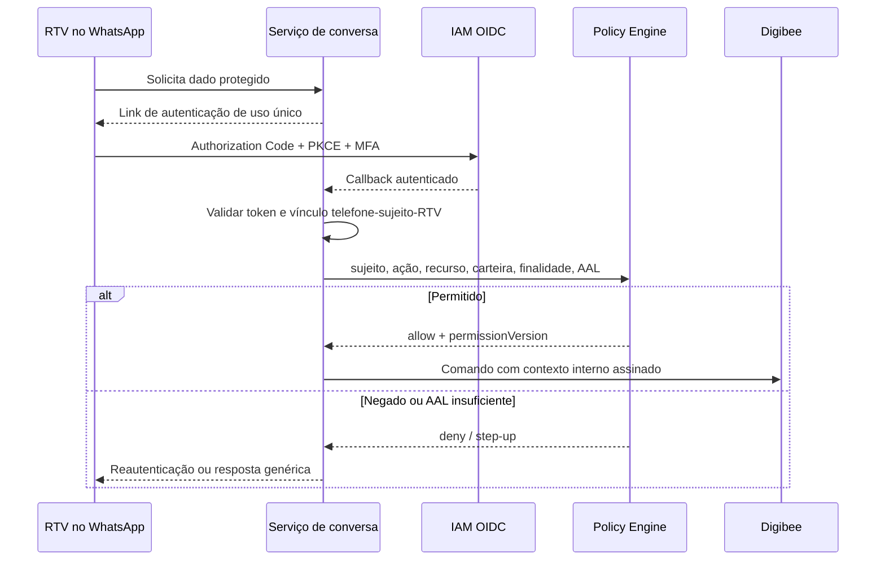

# Autenticação e autorização do RTV

Os três primeiros dígitos do CPF **não validam identidade** e **não autorizam acesso**. Existem somente mil prefixos possíveis; o dado pode ser conhecido ou inferido e não prova posse do CPF, identidade corporativa, legitimidade do telefone nem resistência a SIM swap ou aparelho compartilhado.

Se o prefixo for mantido, ele é apenas um sinal antifraude de baixa confiança. Este documento substitui a antiga regra de “validação do RTV pelo CPF”.

## Objetivos

- autenticar uma identidade corporativa imutável;
- vincular a sessão ao número de WhatsApp verificado e ao `rtvId`;
- autorizar cada ação e recurso pela carteira vigente;
- exigir autenticação reforçada para dados financeiros e mutações;
- impedir que Nina, LLM ou chamador selecionem a identidade;
- minimizar o tratamento de CPF.

## Fluxo de autenticação

1. Ao precisar de dados protegidos, a conversa envia ao usuário um link de autenticação de uso único.
2. O RTV autentica-se no provedor corporativo por OIDC Authorization Code + PKCE.
3. MFA é exigido conforme política corporativa.
4. O callback valida `state`, nonce, PKCE, assinatura, `iss`, `aud`, tenant e validade do token.
5. O backend resolve o `subjectId` imutável e busca o vínculo servidor-side com `rtvId` e número verificado.
6. A sessão curta é associada a `conversationId`, número tokenizado, `auth_time`, nível de autenticação e versão das permissões.
7. Cada operação reavalia autorização ABAC antes do fan-out.



## Vínculo de identidade

| Campo | Origem confiável | Uso |
| --- | --- | --- |
| `subjectId` | claim imutável do IAM | sujeito autenticado |
| `tenantId` | token validado/configuração | isolamento |
| `rtvId` | diretório corporativo, resolvido por `subjectId` | papel comercial |
| telefone | cofre de canal e processo de vínculo | entrega e ligação da sessão |
| carteira | TOTVS/fonte corporativa vigente | autorização por cliente |
| `auth_time` | token OIDC | idade da autenticação |
| nível de autenticação | `acr`/`amr` validados | decisão de step-up |
| versão das permissões | policy store | invalidação de sessão |

`rtvId`, telefone, tenant, destinatário e carteira não são aceitos de:

- texto do usuário;
- entidades extraídas pela LLM;
- saída do modelo;
- Adaptive Card;
- payload público do orquestrador.

O gateway constrói um contexto interno após validar as claims:

```json
{
  "subjectId": "sub_01J...",
  "tenantId": "tenant-br",
  "rtvId": "RTV-4412",
  "authTime": "2026-09-10T01:32:00Z",
  "authenticationLevel": "urn:company:aal2",
  "permissionVersion": 81,
  "purpose": "RTV_CUSTOMER_SERVICE"
}
```

Esse contexto é assinado ou transmitido por canal autenticado entre workloads e nunca é enviado à LLM.

## Política ABAC

A regra é negação por padrão:

```text
subject autenticado
AND sessão vinculada à conversa e ao número
AND ação permitida para o papel vigente
AND cliente pertence à carteira vigente
AND finalidade autorizada
AND nível de autenticação suficiente
AND versão de permissão ainda válida
```

| Operação | AAL mínimo | Regras adicionais |
| --- | --- | --- |
| Consulta cadastral básica | AAL2 | cliente na carteira; finalidade de atendimento |
| Pedido e entrega | AAL2 | pedido pertence a cliente autorizado |
| Limite, score e títulos | AAL2 recente ou AAL3 conforme política | step-up quando sessão exceder janela |
| Alteração cadastral | AAL3 | confirmação explícita e versão do recurso |
| Criação de pedido | AAL3 | rascunho confirmado e `operationId` |
| Handoff | AAL2 | contexto mínimo; evidência sensível segregada |

A autorização ocorre antes de consultar Lecom, Portal, TOTVS, Tarken, LoogAI ou ITSM. Quando a fonte suporta filtro de sujeito/carteira, a regra também é aplicada nela.

## Sessão

| Propriedade | Regra de referência |
| --- | --- |
| Escopo | `tenantId + environment + conversationId + subjectId` |
| Inatividade | 30 minutos |
| Máximo absoluto | 8 horas |
| Renovação | atividade renova apenas inatividade |
| Revogação | logout, vínculo alterado, permissão revogada, risco ou troca de número |
| Handoff ativo | conversa não expira; credencial do RTV pode exigir nova autenticação |
| Operação sensível | verificar `auth_time` e executar step-up |

Não se reutiliza sessão de uma conversa resolvida. Alteração da versão de permissões invalida decisões em cache.

## Prefixo do CPF como sinal antifraude

O prefixo não integra a condição de autorização. Se houver finalidade e base legal aprovadas, ele pode contribuir com um mecanismo de risco:

| Resultado | Efeito permitido |
| --- | --- |
| Match | Somente reduzir ou manter score de risco; não concede acesso |
| Divergência | Elevar score, solicitar MFA ou encaminhar revisão |
| Ausente | Seguir autenticação corporativa; não bloquear por si só |

Nunca se pede o prefixo como “senha” pelo WhatsApp. Nunca se persiste o prefixo junto com telefone e `rtvId` em logs comuns.

Quando uma correlação de CPF for indispensável, usar HMAC do CPF normalizado com chave versionada em KMS/HSM:

```text
cpfCorrelation = HMAC-SHA-256(kmsKeyVersion, cpfNormalizado)
```

Hash simples não é aceitável porque o espaço de CPFs é enumerável. O CPF completo só pode existir no sistema de origem autorizado e pelo tempo necessário à finalidade.

## Falhas e resposta ao usuário

| Código interno | Situação | Resposta externa | Retry |
| --- | --- | --- | --- |
| `AUTHENTICATION_REQUIRED` | sem sessão | solicitar login corporativo | após autenticar |
| `STEP_UP_REQUIRED` | AAL ou `auth_time` insuficiente | solicitar MFA | após step-up |
| `SESSION_EXPIRED` | TTL excedido | solicitar novo login | após autenticar |
| `SUBJECT_LINK_NOT_FOUND` | sujeito sem vínculo RTV | mensagem genérica e suporte | não automático |
| `FORBIDDEN` | ação/carteira/finalidade negada | mensagem genérica | não |
| `IDENTITY_RISK` | vínculo ou sinais divergentes | mensagem genérica e revisão | conforme decisão |

Erros HTTP seguem RFC 9457:

```json
{
  "type": "https://example.internal/problems/step-up-required",
  "title": "Autenticação adicional necessária",
  "status": 403,
  "detail": "A operação exige autenticação reforçada.",
  "code": "STEP_UP_REQUIRED",
  "traceId": "trc_01J..."
}
```

O WhatsApp não recebe motivo de segurança, existência de cliente, carteira, CPF ou detalhes da decisão.

## Auditoria e LGPD

A trilha imutável registra:

- sujeito tokenizado e tenant;
- `conversationId`, ação e recurso tokenizado;
- finalidade;
- nível e instante da autenticação;
- versão da política/permissões;
- decisão `ALLOW`, `DENY` ou `STEP_UP`;
- motivos codificados, sem dado bruto;
- timestamp RFC 3339 UTC e resultado.

Não registrar CPF, token OIDC, authorization code, verifier PKCE, nonce, telefone completo ou payload financeiro. Logs de segurança são segregados do ITSM e Teams.

Devem ser definidos base legal, finalidade, retenção, descarte, acesso, operadores, eventual transferência internacional e processo de direitos do titular. Dados derivados devem acompanhar exclusão e retenção da origem.

## Controles contra troca de aparelho/SIM

- vínculo inicial corporativo e auditado;
- notificação fora de banda em alteração de número;
- período de resfriamento ou revisão para operações sensíveis após alteração;
- revogação imediata das sessões anteriores;
- device/app attestation quando disponível, sem tratá-la como único fator;
- detecção de mudança abrupta e step-up;
- canal de recuperação separado do WhatsApp.

## Testes mínimos

1. Prefixo correto sem sessão OIDC não autoriza.
2. `rtvId` adulterado em payload não altera a identidade resolvida.
3. Cliente fora da carteira é negado antes de qualquer fan-out.
4. Token com `iss`, `aud`, tenant, assinatura ou validade incorretos é rejeitado.
5. Reuso de `state`, nonce ou authorization code é rejeitado.
6. Sessão expirada e permissão versionada invalidada exigem autenticação.
7. Crédito e mutação exigem step-up segundo `auth_time`.
8. Troca de número revoga sessões antigas.
9. HMAC usa chave KMS/HSM versionada; hash simples não aparece.
10. Logs, ITSM, Teams e LLM não contêm CPF ou contexto de autorização indevido.

## Critérios para produção

- fluxo OIDC + PKCE + MFA testado ponta a ponta;
- vínculo servidor-side sujeito–telefone–RTV com processo de recuperação;
- policy engine com negação por padrão e carteira atualizada;
- step-up para finanças e mutações;
- contexto de identidade inacessível à LLM;
- trilha imutável e alertas de negação/risco;
- RIPD, retenção e exclusão aprovados;
- testes de adulteração e acesso cruzado automatizados.
