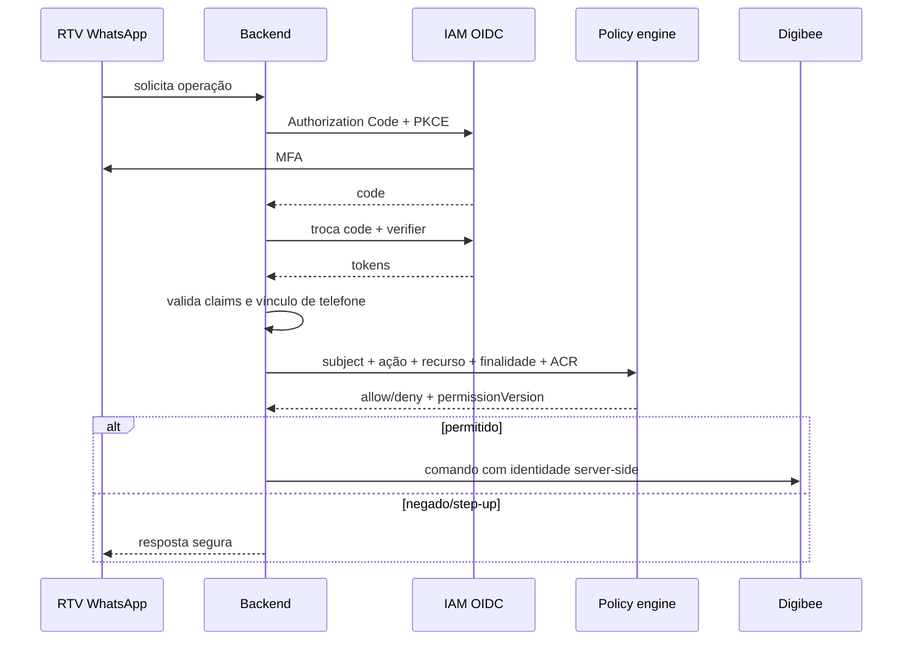

# Identidade e autenticação do RTV

> Os três primeiros dígitos do CPF não autenticam nem autorizam um RTV. Existem
> apenas mil combinações, o dado pode ser conhecido e não prova posse do
> telefone, identidade corporativa ou resistência a SIM swap.

## Controle de identidade

1. O RTV inicia autenticação corporativa OIDC Authorization Code + PKCE.
2. O IAM exige MFA e emite token de curta duração.
3. O backend valida assinatura, `iss`, `aud`, tenant, nonce, `nbf`, `exp`,
   `auth_time` e o nível `acr`.
4. O identificador imutável do colaborador é associado, no servidor, a
   `subjectId`, `rtvId`, tenant e vínculo de telefone.
5. A sessão registra a versão das permissões e expira após 30 minutos de
   inatividade ou 12 horas absolutas.
6. Crédito, dados financeiros e mutações exigem step-up MFA recente.
7. O policy engine autoriza cada recurso antes do fan-out.



## Atributos confiáveis

| Atributo | Fonte | Pode vir da LLM/cliente? |
| --- | --- | --- |
| `subjectId` | claim imutável do IAM | não |
| `rtvId` | diretório corporativo server-side | não |
| `tenantId` | issuer/claim validado | não |
| vínculo de telefone | cadastro verificado server-side | não |
| carteira vigente | serviço de território | não |
| intenção/entidades | LLM, tratadas como não confiáveis | sim |
| ticket e destinatário | estado da conversa | não |

Se `rtvId` aparecer no payload gerado pela Nina, o backend rejeita o campo ou o
ignora; nunca o usa para autorização.

## Política ABAC

```text
authenticated(subject)
AND token.tenant == resource.tenant
AND allowed(subject, action)
AND customer IN currentPortfolio(subject)
AND purpose IN permittedPurposes(action)
AND acr >= requiredAcr(action)
AND auth_time >= requiredRecency(action)
AND permissionVersion == currentPermissionVersion(subject)
```

A decisão é `deny` por padrão. Consultas por nome/documento também aplicam a
carteira antes de devolver candidatos, evitando enumeração.

## Respostas

| Caso | HTTP/problem type | Comportamento |
| --- | --- | --- |
| token ausente/inválido | `401 /problems/authentication-required` | iniciar autenticação |
| MFA/recência insuficiente | `403 /problems/step-up-required` | iniciar step-up |
| fora da carteira/finalidade | `403 /problems/forbidden` | negar, auditar, mensagem genérica |
| versão de permissão alterada | `409 /problems/permission-changed` | invalidar decisão e reautenticar |
| IAM indisponível sem sessão válida | `503 /problems/identity-unavailable` | não consultar dados |

Exemplo RFC 9457:

```json
{
  "type": "https://api.example.com/problems/step-up-required",
  "title": "Autenticação adicional necessária",
  "status": 403,
  "detail": "A operação exige autenticação multifator recente.",
  "instance": "/v1/orchestrations/01J7...",
  "traceId": "4bf92f3577b34da6a3ce929d0e0e4736"
}
```

Mensagens de WhatsApp não revelam se o cliente está fora da carteira nem a
regra que falhou.

## Uso opcional do CPF como sinal antifraude

O prefixo pode ser coletado somente quando finalidade, base legal e avaliação
de risco aprovarem. Ele:

- não altera uma decisão `deny` para `allow`;
- não substitui OIDC, MFA, vínculo de telefone ou ABAC;
- pode elevar risco, exigir step-up ou revisão humana;
- não é armazenado em logs ou ITSM;
- não é enviado à OpenAI, Teams ou WhatsApp.

Quando correlação de CPF for indispensável, usar
`HMAC-SHA-256(kmsKey, cpfNormalizado + tenantSalt)`, com chave não exportável em
KMS/HSM, rotação versionada e acesso auditado. Hash simples é proibido porque o
espaço de CPF é enumerável. Evitar persistir até mesmo o prefixo.

## SIM swap, aparelho compartilhado e revogação

- Mudança de número ou sinal de SIM swap invalida o vínculo e exige
  reverificação corporativa.
- Logout, desligamento, mudança de carteira ou revogação no IAM invalidam a
  sessão e sua cache de autorização.
- Sessões não são transferidas entre aparelhos.
- Operações sensíveis mostram confirmação vinculada à ação e expiram.

## Auditoria e privacidade

Registrar em trilha imutável:

- `subjectId` pseudonimizado, ação, recurso tokenizado e finalidade;
- decisão ABAC, política e versão;
- `acr`, idade da autenticação e versão de permissões;
- instante RFC 3339, `traceId`, resultado e motivo categórico.

Não registrar token, CPF, telefone completo, prompt, texto livre ou evidência de
segurança no ITSM. Retenção e direitos seguem `governanca-lgpd.md`.

## Testes mínimos

1. `rtvId` adulterado no payload não muda a identidade.
2. Cliente fora da carteira não aparece nem na desambiguação.
3. Token com issuer, audience ou tenant incorretos é rejeitado.
4. Sessão antiga exige step-up para crédito e mutações.
5. Mudança de carteira invalida decisão em cache.
6. Replay de code/nonce OIDC falha.
7. Prefixo correto de CPF, sozinho, nunca autoriza.
8. SIM swap/revogação invalida o vínculo.
